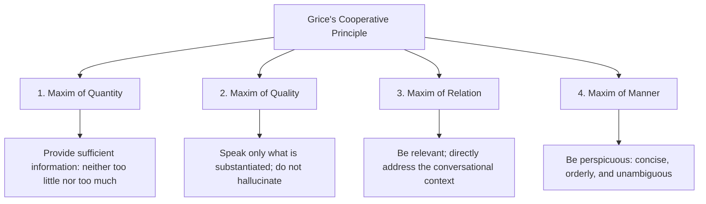

# Conversational Psychology & Cognitive Load

> Spoken dialogue is not merely text read aloud from a screen. It is a two-way psychological dance governed by cultural conventions, cooperative principles, and the strict limits of human working memory.


---

## 1. Gricean Maxims of Conversation

Linguistic philosopher Paul Grice formulated the **Cooperative Principle**, defined by four foundational maxims that govern natural human communication:



### Applying Gricean Maxims to VUI Design:

| Maxim | Common Voice AI Failure | Canonical UX Best Practice |
|-------|-------------------------|----------------------------|
| **1. Maxim of Quantity** | Verbose monologues; reading 200-word text blocks that induce cognitive fatigue. | Bound responses to **1–3 concise sentences** (< 30 words per turn). |
| **2. Maxim of Quality** | Hallucinations; stating inaccurate metrics, fabricated policies, or false confirmations with unearned confidence. | State boundaries transparently when confidence is low; offer verified lookup paths. |
| **3. Maxim of Relation** | Tangential responses; volunteering unsolicited advice or irrelevant options. | Deliver the direct answer first; offer contextual expansion only if requested. |
| **4. Maxim of Manner** | Technical jargon, raw HTTP error codes (`"HTTP 404 Error"`), or convoluted grammar. | Use natural spoken phrasing with active, straightforward sentence structures. |

---

## 2. Auditory Buffer Limits: Echoic Memory & Cowan's 4-Chunk Limit


While vision enables scanning, rereading, and spatial indexing, **auditory processing is strictly serial**:

- **Miller's Law (7 ± 2 items)**: Applies primarily to static, visually supported information.
- **Cowan's Law (4 ± 1 chunks)**: The true capacity limit of human working memory, particularly in pure audio environments lacking visual offloading.
- **Primacy & Recency Effects**:
  - In spoken lists, listeners remember the **first item** (*Primacy*) and the **last item** (*Recency*); intermediate options are quickly overwritten in working memory.

### Design Principles for Audio Lists:
1. **The Rule of Three**: Never present more than **three options** in a single voice turn.
   - *Violation*: `"We have 8 branches: District 1, District 3, District 5, District 7, Tan Binh, Binh Thanh, Go Vap, and Phu Nhuan."` (Immediate cognitive overload).
   - *UX Standard*: `"We have 8 locations. The closest to you are District 1 and District 3. Would you like to hear the remaining branches?"`
2. **Anchor Critical Information**: Position the most frequent action first, or anchor it at the end immediately before the call to action.
3. **Category First (Label before Action)**: Prime the user's mental schema before delivering the operational detail.
   - *Poor*: `"Press 1 for promo details on round-trip flights to Da Nang starting at $50."`
   - *Effective*: `"Da Nang flights from $50: Say 'Details' to view now."`

---

## 3. Turn-Taking Dynamics


In seminal research by Sacks, Schegloff, and Jefferson (1974), natural human conversation operates with a mean turn-transition gap of approximately **200 ms**:

```
Speaker A: "Nice weather today, isn't it?"  [~200 ms pause]
Speaker B: "Absolutely, very refreshing!"
```

- **Machine response too fast (< 100 ms)**: Feels robotic, interruptive, or unthoughtful, startling the user.
- **Machine response too slow (> 800 ms without auditory cues)**: Users suspect system freeze or dropped audio, prompting them to check in (`"Hello?", "Can you hear me?"`), which triggers destructive **audio collisions**.

### Conversational Latency Thresholds:
- **0–200 ms**: Immediate reflexes (backchannel tokens like *"Mm-hmm"*, *"Right"*).
- **200–400 ms**: The ideal conversational sweet spot for intelligent responses.
- **400–700 ms**: Acceptable latency for complex generative or database queries.
- **> 700 ms**: Requires an **Acoustic Filler** or holding tone (*"Let me look that up for you..."* or an ambient thinking chime).
