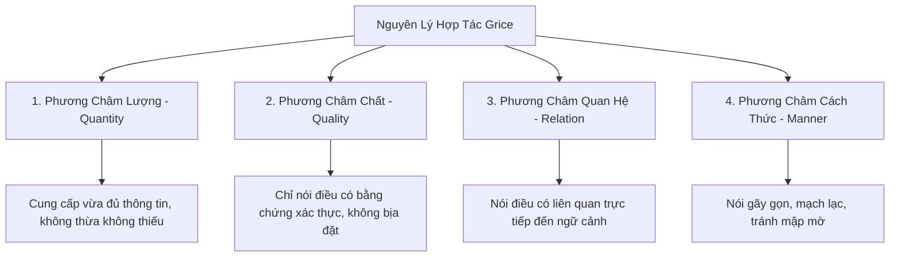

# Tâm Lý Học Hội Thoại & Giới Hạn Nhận Thức (Conversational Psychology & Cognitive Load)

> Giao tiếp qua giọng nói không phải là việc đọc to văn bản trên màn hình. Đó là một vũ điệu tâm lý học hai chiều tuân theo các quy ước văn hóa, phương châm hợp tác và dung lượng ghi nhớ nghiêm ngặt của não bộ.

---

## 1. Bốn Phương Châm Hội Thoại Của Grice (Gricean Maxims)

Triết gia ngôn ngữ học Paul Grice đã đúc kết **Nguyên lý Hợp tác (Cooperative Principle)** với 4 phương châm căn bản điều phối hành vi giao tiếp tự nhiên:



### Ứng Dụng 4 Phương Châm Vào Thiết Kế VUI:

| Phương Châm | Lỗi Thường Gặp Của AI Voice | Cách Thiết Kế Chuẩn UX |
|-------------|------------------------------|------------------------|
| **1. Maxim of Quantity** | Nói tràng giang đại hải, đọc cả đoạn văn bản 200 từ khiến người nghe mệt mỏi. | Giới hạn câu trả lời trong **1-3 câu ngắn** (dưới 30 từ cho mỗi lượt nói). |
| **2. Maxim of Quality** | Ảo giác (Hallucination), tự tin phát biểu thông tin sai lệch về số liệu hoặc chính sách. | Khi không chắc chắn, thừa nhận giới hạn và đề xuất cách tra cứu an toàn. |
| **3. Maxim of Relation** | Trả lời lạc đề, đưa thêm các lời khuyên không được yêu cầu. | Đi thẳng vào câu trả lời trực tiếp trước, mở rộng ngữ cảnh sau nếu người dùng muốn. |
| **4. Maxim of Manner** | Sử dụng thuật ngữ kỹ thuật, đọc mã lỗi (`"Lỗi HTTP 404"`), cú pháp lủng củng. | Sử dụng ngôn ngữ giao tiếp đời thường, cấu trúc câu chủ động ngắn gọn. |

---

## 2. Giới Hạn Bộ Nhớ Đệm Âm Thanh (Echoic Memory & Cowan's 4-Chunk Limit)

Trong khi thị giác cho phép con người quét lướt và xem lại nhiều lần thì **Kênh thính giác xử lý tuần tự (Serial Processing)**:

- **Quy luật Miller (7 ± 2)**: Áp dụng cho thông tin tĩnh có hỗ trợ thị giác.
- **Quy luật Cowan (4 ± 1 chunks)**: Dung lượng bộ nhớ làm việc thực tế của con người, đặc biệt khi tiếp nhận thông tin qua âm thanh mà không có màn hình hỗ trợ.
- **Tác động thứ tự (Primacy & Recency Effect)**:
  - Khi nghe một danh sách qua giọng nói, người dùng có xu hướng nhớ **mục đầu tiên** (*Primacy*) và **mục cuối cùng** (*Recency*), các mục ở giữa thường bị xóa sạch trong bộ nhớ ngắn hạn.

### Quy Tắc Thiết Kế Cho Danh Sách Âm Thanh (Audio Lists):
1. **Quy tắc Tối Đa 3 Lựa Chọn**: Trong một lượt nói bằng giọng nói, **không bao giờ cung cấp quá 3 lựa chọn**.
   - *Vi phạm*: `"Chúng tôi có 8 chi nhánh: Quận 1, Quận 3, Quận 5, Quận 7, Tân Bình, Bình Thạnh, Gò Vấp và Phú Nhuận."` (Não bộ bị quá tải ngay lập tức).
   - *Chuẩn UX*: `"Chúng tôi có 8 chi nhánh. Gần bạn nhất là Quận 1 và Quận 3. Bạn muốn nghe tiếp các quận khác không?"`
2. **Đưa thông tin quan trọng lên đầu hoặc cuối**: Đặt hành động phổ biến nhất ở vị trí số 1 hoặc chốt ở vị trí cuối cùng kèm câu hỏi hành động.
3. **Cấu trúc: Nhãn trước, Mô tả sau (Category First)**: Giúp người nghe kích hoạt khung nhận thức trước khi tiếp nhận chi tiết.
   - *Kém*: `"Nhấn 1 để nghe thông tin khuyến mãi chuyến bay đi Đà Nẵng giá 500k."`
   - *Tốt*: `"Chuyến bay Đà Nẵng giá 500k: Hãy nói 'Chi tiết' để xem ngay."`

---

## 3. Tâm Lý Học Luân Phiên Lượt Lời (Turn-Taking Dynamics)

Theo nghiên cứu kinh điển của Sacks, Schegloff và Jefferson (1974), cuộc trò chuyện tự nhiên của con người diễn ra với khoảng ngắt nghỉ trung bình giữa hai lượt nói chỉ khoảng **200ms**:

```
Người A: "Hôm nay trời đẹp nhỉ?"  [Nghỉ ~200ms]
Người B: "Đúng rồi, mát mẻ ghê!"
```

- Nếu máy phản hồi quá nhanh (**< 100ms**): Tạo cảm giác máy móc, cướp lời, thiếu sự "suy nghĩ", gây cảm giác giật mình.
- Nếu máy phản hồi quá chậm (**> 800ms** mà không có âm báo): Người dùng tưởng máy bị đơ hoặc micro bị ngắt, dẫn đến việc họ cất tiếng hỏi lại (`"Alo?", "Có nghe không?"`), gây ra xung đột va chạm âm thanh (*Audio Collision*).

### Bảng Ngưỡng Nhận Thức Thời Gian Trong Hội Thoại:
- **0 - 200ms**: Phản xạ tức thì (Backchannel cues như *"Dạ"*, *"Ừm"*).
- **200 - 400ms**: Khoảng trễ tự nhiên lý tưởng nhất cho câu trả lời thông minh.
- **400 - 700ms**: Chấp nhận được đối với các câu hỏi phức tạp.
- **> 700ms**: Bắt buộc phải có **Acoustic Filler** (*"Để mình kiểm tra một chút nhé..."* hoặc âm thanh đệm nhịp nhẹ nhàng).
