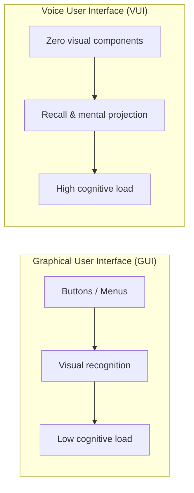

# Mental Models & Acoustic Affordance

> "In graphical user interfaces (GUIs), users see what they can do. In voice user interfaces (VUIs), users must imagine what the system can hear." — Cathy Pearl, *Designing Voice User Interfaces*.

---

## 1. The Nature of the Auditory Channel: Invisibility & Transience

Unlike desktop or mobile displays, sound possesses two inherent properties that govern user psychology:

1. **Invisibility (Zero Affordance)**: There are no buttons, scrollbars, or menus to explore. Users step into a cognitive void unless the system actively provides orientation.
2. **Transience**: Once spoken, words vanish instantly into physical space. Listeners cannot "scan back and re-read" as they would on paper or screen; they must retain information using transient auditory sensory memory (*Echoic Memory*).

---

## 2. The Gulf of Execution in VUI

Don Norman's *Gulf of Execution* describes the cognitive gap between a **user's intent** and the **actual actions required** to execute that intent on the system:

* **In GUI**: Spotting a magnifying glass icon -> knowing where to click and type -> narrow gulf.
* **In VUI**: A user wants to cancel an order -> They hesitate: should they say `"Cancel order"`, `"Delete my recent purchase"`, or `"Cancel the t-shirt I just bought"`? They fear system rejection or unrecoverable error states.

### Bridging the Gulf of Execution in VUI:
- **Verbal Breadcrumbs**: Seamlessly embed next-step affordances into system prompts without bloating dialog length.
  - *Poor*: `"Anything else you need?"` (Overly open-ended, induces user hesitation).
  - *Effective*: `"Your order is confirmed. Would you like your tracking number by text, or delivery details read aloud?"`
- **In-Context Exemplars**: When the user pauses or hesitates, provide one or two concise utterance models.

---

## 3. Acoustic Signifiers

Where GUIs rely on icons and colors to signal interactive states, VUIs utilize **Acoustic Signifiers** to convey system status directly to the listener's ears:

| System State | Canonical Auditory Cue | Recommended Frequency / Timbre | Psychological Impact & User Perception |
|--------------|------------------------|--------------------------------|----------------------------------------|
| **Ready / Awoken** | Ascending tone chime | ~400 Hz -> 800 Hz, <150 ms | "The system is awake and opening its microphone to listen." |
| **Thinking** | Ambient pulse | 200–300 Hz, 1.2 s cycle | "Speech received; processing logic in progress. Do not interrupt." |
| **Success** | Major chord chime | Warm timbre, non-piercing | "Action completed safely and verified." |
| **Failure / Reject** | Descending subtle tone | ~500 Hz -> 300 Hz, soft decay | "Something went wrong; conversational repair needed." |

> [!CAUTION]
> Avoid harsh or jarring alarm tones (such as piercing sirens or metallic buzzes). Auditory pathways connect directly to the *Amygdala*, triggering startle reflexes and cognitive freezing.

---

## 4. Mental Models: Tool vs. Human Partner

When interacting via speech, humans subconsciously activate **Social Actor Theory (Reeves & Nass)**:
- Users automatically attribute social presence, respect, and emotional intent to an entity that speaks fluently.
- **The Expectation Trap**: If a voice agent sounds overly human (natural breathing, chuckles, disfluencies) while its underlying reasoning remains rigid or brittle, users expect the competence of a human expert. When a minor edge case fails, user disillusionment is amplified exponentially (*The Uncanny Valley of Conversational Intelligence*).

### Core Design Principles:
1. **Identity Transparency**: The system must always acknowledge its identity as an AI assistant and never impersonate a human.
2. **Graceful Humility**: Avoid lengthy apologies during failures (refrain from `"I am terribly sorry for this dreadful inconvenience..."`); pivot immediately to actionable recovery paths.
