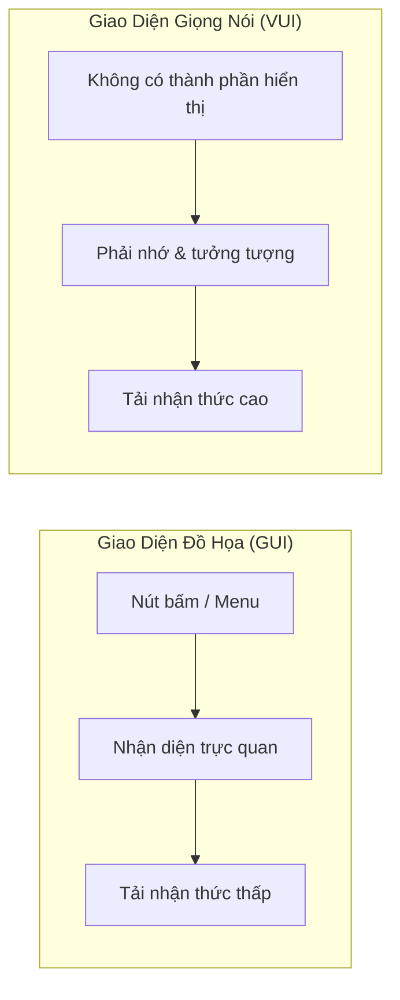

# Nền Tảng Tâm Lý & Khả Năng Thấu Thị Của Giọng Nói (Mental Models & Acoustic Affordance)

> "Trong giao diện đồ họa (GUI), người dùng nhìn thấy những gì có thể làm. Trong giao diện giọng nói (VUI), người dùng phải tưởng tượng ra những gì hệ thống có thể nghe." — Cathy Pearl, *Designing Voice User Interfaces*.

---

## 1. Bản Chất Của Kênh Âm Thanh: Vô Hình & Thoáng Qua (Invisibility & Transience)

Khác với màn hình máy tính hay điện thoại, âm thanh sở hữu hai đặc tính cố hữu chi phối toàn bộ tâm lý người dùng:

1. **Tính vô hình (Invisibility / Zero Affordance)**: Không có nút bấm, không có thanh cuộn, không có menu để khám phá. Người dùng bước vào một "khoảng tối nhận thức" nếu hệ thống không chủ động định hướng.
2. **Tính thoáng qua (Transience)**: Một từ ngữ khi được phát âm ra sẽ tan biến ngay lập tức trong không gian. Người nghe không thể "quét mắt đọc lại" như trên một trang giấy hay màn hình mà buộc phải ghi nhớ bằng bộ nhớ đệm âm thanh (*Echoic Memory*).

---

## 2. Vực Thẳm Thực Thi Trong VUI (The Gulf of Execution)

Khái niệm *Gulf of Execution* của Don Norman mô tả khoảng cách giữa **ý định của người dùng** và **hành động thực tế cần làm** trên hệ thống:

* **Trong GUI**: Nhìn thấy icon kính lúp -> biết chỗ gõ tìm kiếm -> khoảng cách hẹp.
* **Trong VUI**: Người dùng muốn huỷ đơn hàng -> Họ không biết nên nói: `"Hủy đơn hàng"`, `"Tôi muốn xóa đơn vừa đặt"`, hay `"Hủy cái áo thun vừa mua"`. Họ sợ bị hệ thống từ chối hoặc báo lỗi.

### Cách Thu Hẹp Vực Thẳm Thực Thi Trong VUI:
- **Lời mớm định hướng (Verbal Breadcrumbs)**: Luôn lồng ghép gợi ý hành động tiếp theo vào câu trả lời của trợ lý ảo mà không làm dài dòng câu nói.
  - *Kém*: `"Bạn cần gì nữa không?"` (Quá mơ hồ, khiến người dùng lúng túng).
  - *Tốt*: `"Đơn hàng của bạn đã được xác nhận. Bạn muốn nhận mã theo dõi qua tin nhắn hay nghe thêm chi tiết giao hàng?"`
- **Ví dụ mẫu tự nhiên (In-context Exemplars)**: Khi người dùng im lặng hoặc ngập ngừng, đưa ra 1-2 mẫu câu lệnh ngắn gọn.

---

## 3. Dấu Hiệu Âm Thanh (Acoustic Signifiers)

Nếu GUI dựa vào biểu tượng và màu sắc để báo hiệu trạng thái tương tác thì VUI sử dụng **Acoustic Signifiers** để gửi tín hiệu đến đôi tai người dùng:

| Trạng Thái Hệ Thống | Dấu Hiệu Âm Thanh Chuẩn | Tần Số / Âm Sắc Khuyên Dùng | Phản Ứng Tâm Lý Của Người Dùng |
|---------------------|--------------------------|------------------------------|---------------------------------|
| **Ready / Awoken**  | Âm bíp ngắn thăng dần (Ascending tone) | ~400Hz -> 800Hz, <150ms | "Máy đã thức dậy và đang mở micro nghe mình nói." |
| **Thinking**        | Âm thanh trầm tuần hoàn (Ambient pulse) | 200-300Hz, chu kỳ 1.2s | "Máy đã ghi nhận xong, đang tính toán, đừng ngắt lời." |
| **Success**         | Hợp âm 2 nốt trong trẻo (Major chord chime) | Âm sắc ấm, không chói | "Hành động đã hoàn tất an toàn." |
| **Failure / Reject**| Âm bíp giáng nhẹ (Descending subtle tone) | ~500Hz -> 300Hz, mềm mại | "Có điều gì đó chưa ổn, cần thử lại." |

> [!CAUTION]
> Tuyệt đối tránh sử dụng các âm thanh báo động chói tai (như tiếng còi báo động, âm sắc kim loại nhọn) vì kênh thính giác kết nối trực tiếp đến hạch hạnh nhân (*Amygdala*), gây phản ứng giật mình và ức chế nhận thức của người dùng.

---

## 4. Mô Hình Tâm Lý: Con Người vs Công Cụ (Tool vs Human Partner)

Khi giao tiếp bằng giọng nói, con người vô thức kích hoạt **Mô hình giao tiếp xã hội (Social Actor Theory - Reeves & Nass)**:
- Con người tự động gán phẩm chất xã hội, sự tôn trọng và cảm xúc cho một thực thể nói năng lưu loát.
- **Cái bẫy kỳ vọng quá mức (The Expectation Trap)**: Nếu giọng nói của AI quá giống người (ngắt nghỉ, thở, cười cợt) trong khi khả năng suy luận logic lại bị giới hạn, người dùng sẽ kỳ vọng hệ thống thông minh như một chuyên gia thực thụ. Khi gặp lỗi nhỏ, sự thất vọng sẽ tăng gấp nhiều lần (*Uncanny Valley of Conversational Intelligence*).

### Quy Tắc Thiết Kế Cốt Lõi:
1. **Minh bạch về danh tính**: Hệ thống luôn thừa nhận mình là một trợ lý ảo, không bao giờ nói dối là con người.
2. **Khiêm tốn nhưng đĩnh đạc**: Không xin lỗi dài dòng khi gặp lỗi (tránh `"Tôi vô cùng xin lỗi vì sự bất tiện khủng khiếp này..."`), mà tập trung ngay vào giải pháp thay thế.
