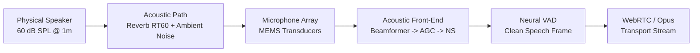
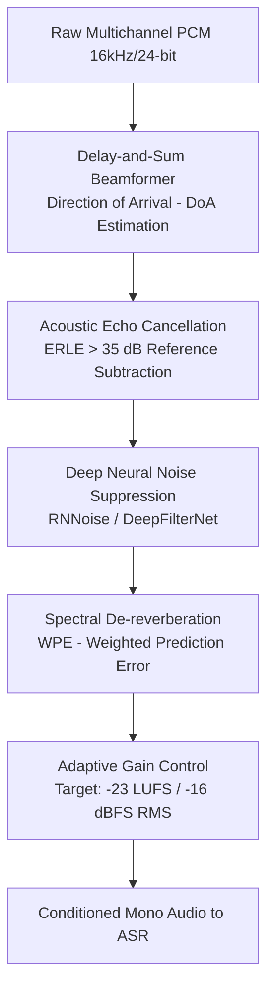

# Microphone Array, SNR & Acoustic Front-End (AFE)

> **Specification ID**: `SPEC-FND04`  
> **Status**: Production Ready  
> **Target Audience**: Audio DSP Engineers, Voice Architects, System Integrators  
> **Key Standards**: ITU-T P.863 (POLQA), ITU-T P.862 (PESQ), ANSI S3.5 (Speech Intelligibility Index)

---

## 1. The Physics of Audio Capture

Voice User Interfaces do not interact with text; they interact with sound pressure waves captured across fluctuating physical environments. No downstream LLM or ASR can recover phonemic data lost during acoustic capture.



---

## 2. Far-Field Acoustics & The Inverse Square Law

Sound pressure drops by $6\text{ dB}$ for every doubling of distance from the mouth to the microphone:

$$L_p(r) = L_p(r_0) - 20 \log_{10}\left(\frac{r}{r_0}\right)$$

### Critical Distance ($D_c$)
The distance where the direct acoustic path equals the reverberant field energy:

$$D_c \approx 0.057 \cdot \sqrt{\frac{V}{RT_{60}}}$$

- **Near-field ($< 0.5\text{m}$)**: Direct path dominates. High SNR ($> 20\text{ dB}$). Minimal room reflection.
- **Far-field ($> 1.5\text{m}$)**: Reverberant reflections dominate. Low SNR ($< 6\text{ dB}$). Severe multipath distortion.

---

## 3. Acoustic Front-End (AFE) Signal Chain



### 1. Beamforming (Spatial Filtering)
- **Geometry**: 2-mic to 6-mic circular or linear arrays.
- **Steering**: Estimates Direction of Arrival (DoA) within $50\text{ms}$ and creates a directional spatial cone towards the primary speaker, attenuating off-axis noise by $12\text{--}18\text{ dB}$.

### 2. Automatic Gain Control (AGC)
- Normalizes quiet whispers ($45\text{ dB SPL}$) and excited shouts ($78\text{ dB SPL}$) into a uniform acoustic dynamic window.
- **Attack time**: $\le 10\text{ms}$ (rapid compression on sudden loud bursts).
- **Decay time**: $300\text{--}500\text{ms}$ (smooth expansion to avoid pumping ambient noise).

### 3. Noise Suppression (NS)
- Traditional spectral subtraction creates "musical noise" artifacts.
- Production standard: Lightweight RNNs (RNNoise) running on edge DSPs or client WebRTC engines, maintaining speech formant integrity.

---

## 4. Speech Quality Benchmarks

| Metric | Measurement Protocol | Acceptable Target | Hard Fail Threshold |
|---|---|---|---|
| **SNR (Signal-to-Noise Ratio)** | Acoustic test chamber | $\ge 15\text{ dB}$ | $< 6\text{ dB}$ |
| **POLQA (ITU-T P.863)** | Perceptual Objective Listening Quality | $\ge 4.0\text{ MOS}$ | $< 3.2\text{ MOS}$ |
| **RT60 (Reverberation Time)** | Room impulse decay | $< 400\text{ms}$ | $> 800\text{ms}$ |
| **THD (Total Harmonic Distortion)** | $1\text{kHz}$ sine @ $94\text{ dB SPL}$ | $< 1.0\%$ | $> 3.0\%$ |
| **Peak Audio Level** | Integrated loudness | $-16\text{ dBFS} \pm 2\text{ dB}$ | $> -1.0\text{ dBFS}$ (Clipping) |

---

## 5. Production Case Study: Kitchen Appliance Far-Field Failure

### Scenario
A smart refrigerator voice assistant fails when the user speaks from $1.8\text{m}$ while the exhaust range hood operates at $65\text{ dB SPL}$ noise.

```
[Physical Reality]
User Speech Level: 58 dB SPL @ 1.8m
Exhaust Hood Noise: 65 dB SPL @ 1.2m
Acoustic SNR at Microphone: -7 dB (Noise is 7 dB louder than user!)
```

### The Buggy Implementation
- Single omnidirectional MEMS mic with static software gain.
- ASR received drowned audio, hallucinating words or failing to trigger wake-word ($82\%$ error rate).

### The Production Fix
1. **Hardware**: Upgraded to 3-mic linear array with $40\text{mm}$ inter-element spacing.
2. **DSP**: Enabled MVDR (Minimum Variance Distortionless Response) beamformer steered at $0^\circ \pm 30^\circ$.
3. **Noise Profile**: Injected stationary motor-noise filter profile into front-end spectral suppressor.
4. **Result**: Effective SNR boosted by $+16\text{ dB}$; WER dropped from $82\%$ to $4.8\%$.
