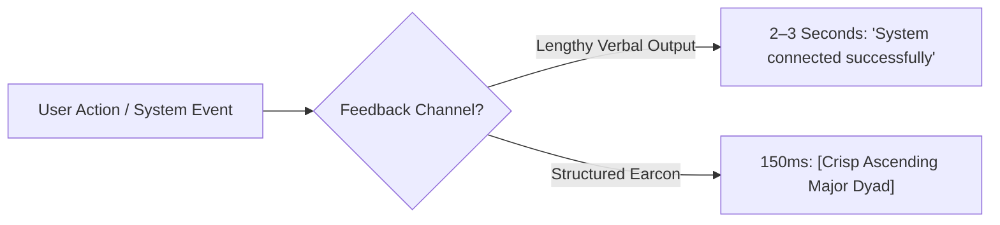

# Earcons & Sonic Feedback Design

> In an interface with zero pixels, sound is your only design material. A production VUI leverages earcons to communicate system status up to 4x faster than speech.

---

## 1. Auditory Icons vs. Earcons

* **Auditory Icons (Everyday Real-World Metaphors)**: Caricatures of natural everyday sounds mapped directly to digital actions (e.g., the paper crumple sound when moving a document to the macOS Trash).
* **Earcons (Structured Symbolic Motifs)**: Brief, abstract musical or synthetic audio structures (pitch, rhythm, timbre, register) codified to represent digital states, transitions, or events (e.g., Slack's incoming message knock, macOS system boot chime).




---

## 2. The 4 Core Acoustic States in VUI

A standard VUI design system must define a cohesive acoustic vocabulary across 4 core operational states:

| State | Max Duration | Acoustic Characteristics | Cognitive Objective | Real-World Exemplar |
|---|---|---|---|---|
| **1. Wake / Listening** | 100 – 150ms | Ascending pitch, bright, crisp timbre | Confirms the microphone is live; prompts user to speak with confidence. | Google Assistant wake chime on "Hey Google". |
| **2. Thinking / Processing** | 1.5s interval (Ambient pulse) | Low frequency (150–250Hz), attenuated (-18 dBFS) | Maintains cognitive presence during backend retrieval; prevents premature user abandonment. | Subtle rhythmic breathing pulse or cyclic low hum. |
| **3. Acknowledged / Success** | 150 – 250ms | Harmonic major chord, crisp resolved decay | Validates successful execution without redundant verbal chatter (*"Done"*). | Apple Pay crisp confirmation chime upon NFC tap. |
| **4. Error / Blocked** | 200 – 300ms | Descending interval, rounded low-mid resonance, non-abrasive | Flags an operational block without inducing alarm or cognitive fatigue. | macOS subtle negative thump on incorrect password entry. |

---

## 3. Sonic UX Design Rules

1. **The Under-300ms Rule**: Status earcons must strictly terminate within 300ms. Lingering acoustic tails collide with incoming user speech or drag down interaction velocity.
2. **Auditory Fatigue Prevention**:
   - High-frequency events (e.g., opening a mic hundreds of times daily) must use mellow harmonic overtones; avoid piercing pure sine waves that trigger listening fatigue.
   - Dynamically attenuate volume if an identical earcon triggers repeatedly across a tight temporal window.
3. **Contextual Acoustics**:
   - **Automotive Environments**: Notch out 100–300Hz bands (where tire roll and engine cabin rumble concentrate).
   - **In-Ear Headphones**: Employ gentle stereo/spatial diffusion; prevent sharp transient spikes from causing acoustic shock.
4. **Multimodal Haptic Pairing**:
   - On handheld/wearable surfaces (smartphones, smartwatches), lock earcons to synchronized haptic transients (<20ms phase delta) to maximize perceived tactile immediacy.

---

## 4. Audio Level & Frequency Reference for Voice Designers


```
 0 dBFS   ───────────────────────────────────────────── [Clipping Ceiling — Strictly Forbidden]
-6 dBFS  ═════════════════════════════════════════════ [Emergency Alerts / Safety-Critical]
-12 dBFS ───────────────────────────────────────────── [Primary TTS Dialogue Voice]
-16 dBFS ───────────────────────────────────────────── [Earcons: Confirmation & Listening Onset]
-24 dBFS ───────────────────────────────────────────── [Background Thinking / Ambient Pulse]
-∞ dBFS  ───────────────────────────────────────────── [True Acoustic Silence]
```


