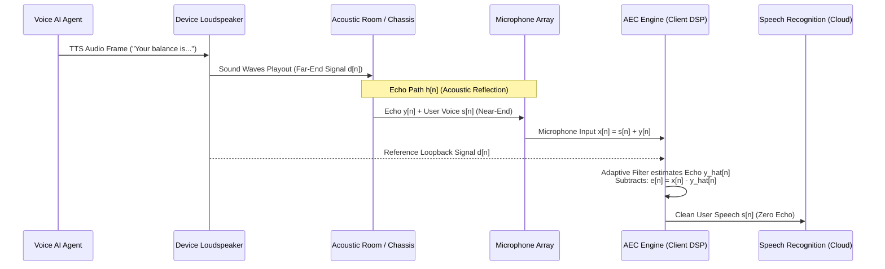
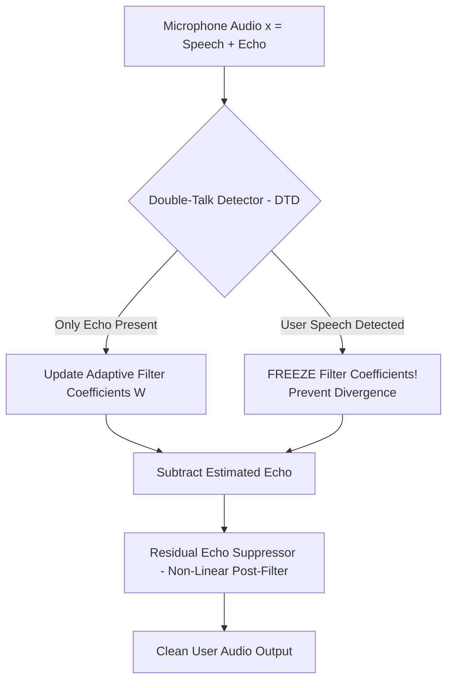

# Acoustic Echo Cancellation (AEC) & Full-Duplex Audio Control

> **Specification ID**: `SPEC-PAT05`  
> **Status**: Production Ready  
> **Target Audience**: Audio DSP Engineers, WebRTC Specialists, Client-Side Runtime Engineers  
> **Key Standards**: ITU-T G.168 (Digital Network Echo Cancellers), ITU-T P.340

---

## 1. The Echo Problem in Voice AI

In any full-duplex voice system where speech plays out of a loudspeaker while the microphone remains active, the microphone captures both the user's voice and the system's own output audio.



If AEC fails:
1. **Self-Interruption (False Barge-in)**: The agent hears its own voice, misinterprets it as user interruption, and abruptly halts its own speech.
2. **Acoustic Feedback Loop**: The audio amplifies continuously, generating a high-pitched howling screech.
3. **Context Poisoning**: Transcripts record duplicate sentences spoken by the AI as if the user said them.

---

## 2. Mathematical Framework: ERL, ERLE & $A_{TOTAL}$

```
                  ┌───────────────────────────────┐
                  │    Echo Path Loss Budget      │
                  └───────────────────────────────┘
      Loudspeaker Output                   Microphone Input
          [+80 dB SPL]                        [+68 dB SPL]
               │                                   │
               ▼                                   ▼
               └────────── ERL: 12 dB ─────────────┘
                                                   │
                                                   ▼
                                         AEC Adaptive Filter
                                                   │
                                                   ▼
               ┌────────── ERLE: 42 dB ────────────┘
               │
               ▼
       Clean Output to ASR
          [+26 dB SPL]
```

### 1. Echo Return Loss (ERL)
Physical attenuation between loudspeaker and microphone determined by hardware chassis geometry and distance:

$$ERL = 10 \log_{10} \left( \frac{P_{\text{speaker}}}{P_{\text{mic, echo}}} \right) \text{ dB}$$

- **Target**: $10\text{--}18\text{ dB}$. On thin laptops or compact smart speakers, ERL can drop to $< 6\text{ dB}$ (severe acoustic coupling).

### 2. Echo Return Loss Enhancement (ERLE)
The linear attenuation achieved algorithmically by the adaptive filter:

$$ERLE = 10 \log_{10} \left( \frac{P_{\text{mic, echo}}}{P_{\text{residual echo}}} \right) \text{ dB}$$

- **Production Target**: $\ge 35\text{ dB}$ under stationary conditions.

### 3. Total Attenuation ($A_{\text{TOTAL}}$)
$$A_{\text{TOTAL}} = ERL + ERLE \ge 50\text{ dB}$$

---

## 3. The Double-Talk Dilemma

The fundamental challenge in full-duplex conversation occurs during **Double-Talk**—when both human and agent speak simultaneously.



### Filter Divergence Trap
If the adaptive filter updates its tap weights while the user is speaking, it attempts to model the user's voice as echo. The filter immediately diverges, destroying the user's voice and letting echo blast through.

**Production Solution**:
- Implement a normalized cross-correlation Double-Talk Detector (DTD).
- Freeze weight updates within $10\text{ms}$ of near-end speech onset.

---

## 4. Hardware vs Software AEC Performance

| Dimension | Browser WebRTC AEC3 | Hardware DSP AEC (XMOS/Cirrus) | Apple VoiceProcessingIO |
|---|---|---|---|
| **Convergence Time** | $150\text{--}300\text{ms}$ | $< 50\text{ms}$ | $< 80\text{ms}$ |
| **Max Delay Drift** | $\pm 120\text{ms}$ buffer window | Hardware clock locked ($0\text{ms}$ drift) | OS driver synchronized |
| **Nonlinear Handling** | Good (software post-filter) | Exceptional (speaker modeling) | Exceptional (Metal/Neural) |
| **CPU Footprint** | $4\text{--}12\%$ single core | $0\%$ Host CPU | $< 1\%$ Host CPU |

---

## 5. Production Case Study: False Barge-in Loop on Laptop WebRTC

### The Bug
Users of an enterprise web voice agent reported that the assistant would speak for 1 second, then stutter and cut off:
```
AI: "I found your reservation for next..." [CUT OFF]
AI: "Sorry, what did you say?"
```

### Telemetry Investigation
1. WebRTC `getStats()` revealed `echoReturnLossEnhancement` was only $8\text{ dB}$ (abysmal).
2. The user was on an M-series MacBook with internal microphone placed $2.5\text{cm}$ from the speaker grill.
3. System audio playout latency was $180\text{ms}$ due to browser audio buffer configuration, while AEC reference signal arrived with $40\text{ms}$ delay.
4. **Root Cause**: A $140\text{ms}$ reference signal misalignment exceeded WebRTC's filter tap window. The AEC failed to cancel the echo, causing the VAD to trigger a false user interruption.

### The Fix
```javascript
// Enforce hardware-accelerated acoustic echo cancellation with synchronized reference
const audioConstraints = {
  audio: {
    echoCancellation: { ideal: true },
    noiseSuppression: { ideal: true },
    autoGainControl: { ideal: true },
    googEchoCancellation: { ideal: true },
    googAutoGainControl: { ideal: true },
    channelCount: 1,
    sampleRate: 48000
  }
};
```
Additionally, calibrate the playout reference stream offset in the WebRTC audio track to ensure reference tap alignment within $< 15\text{ms}$.
