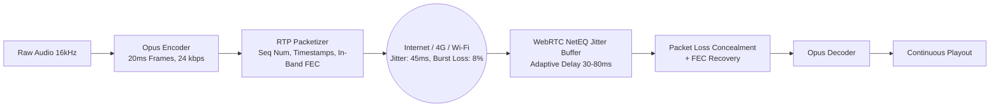
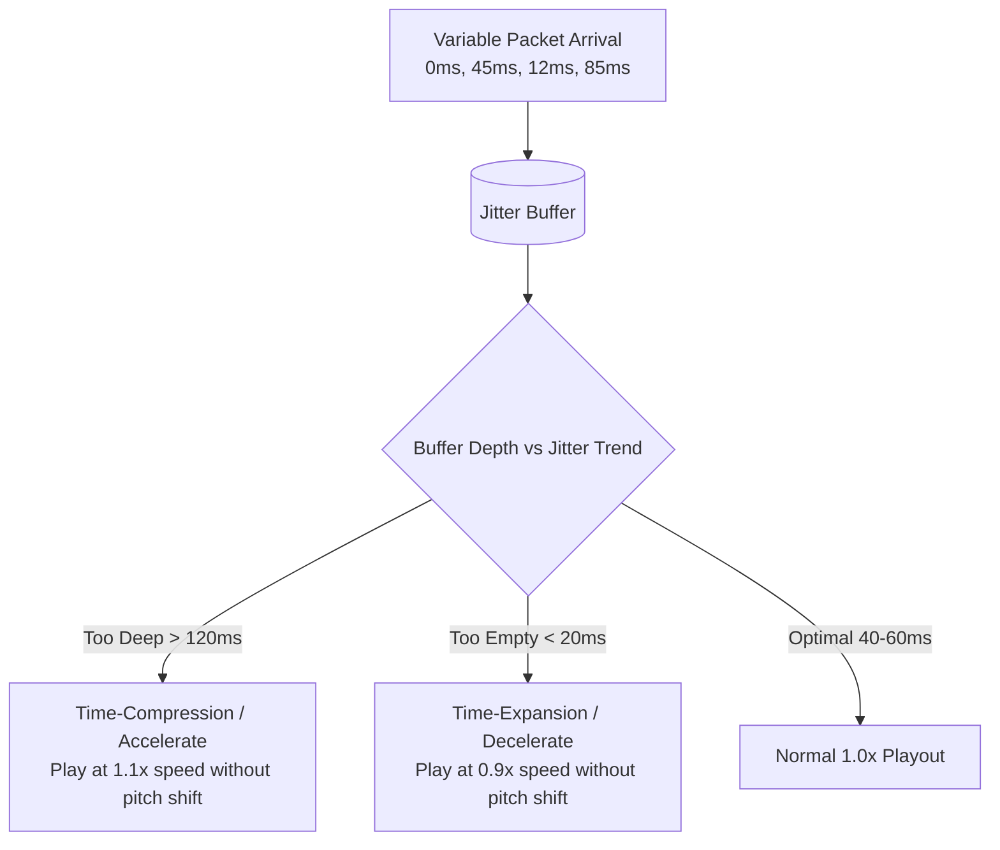

# Opus Codec, RTP Streaming & Adaptive Jitter Resilience

> **Specification ID**: `SPEC-PAT06`  
> **Status**: Production Ready  
> **Target Audience**: WebRTC Engineers, Telephony Architects, DevOps & Network Specialists  
> **Key Standards**: RFC 6716 (Opus Audio Codec), RFC 7587 (RTP Payload Format for Opus), RFC 3550 (RTP)

---

## 1. The Volatility of Real-Time Audio Transport

Unlike video or web content which tolerates multi-second buffering, conversational voice breaks down when transport latency exceeds $150\text{ms}$ or packet loss exceeds $5\%$.



---

## 2. The Opus Codec Architecture (RFC 6716)

Opus unifies two distinct acoustic engines:
1. **SILK**: Optimized for human speech (linear predictive coding, wideband $16\text{kHz}$, bitrates $12\text{--}24\text{ kbps}$).
2. **CELT**: Optimized for music and high-frequency sound (MDCT transform coding, fullband $48\text{kHz}$).

```
0            8 kHz                  16 kHz                  24 kHz (48 kHz Sample Rate)
┌──────────────────────────────────────┬───────────────────────────────┐
│        SILK Engine (Speech)          │      CELT Engine (Music)      │
│  - Vocal tract modeling              │  - Harmonic rich preservation │
│  - In-band FEC protection            │  - Transient dynamics         │
└──────────────────────────────────────┴───────────────────────────────┘
```

### Production Encoding Parameters for Voice AI

| Parameter | Recommended Setting | Rationale |
|---|---|---|
| **Sample Rate** | $24\text{kHz}$ (Superwideband) or $48\text{kHz}$ (Fullband) | $16\text{kHz}$ is minimum; $24\text{kHz}$ provides pristine human timbre. |
| **Bitrate** | $24\text{--}32\text{ kbps}$ VBR (Variable Bitrate) | Optimal balance between speech clarity and bandwidth economy. |
| **Frame Duration** | $20\text{ms}$ | The universal standard. $10\text{ms}$ adds header overhead; $40\text{ms}$ increases latency. |
| **FEC (Forward Error Correction)** | `inbandfec=1` | Encodes redundant lower-bitrate payload of previous frame into current packet. |
| **Packet Loss Expectation** | `packetlossperc=10` | Tells encoder to allocate $\sim 15\%$ budget to redundant FEC data. |
| **DTX (Discontinuous Transmission)** | `usedtx=1` | Suppresses transmission during silence; reduces bandwidth by up to $60\%$. |

---

## 3. Packet Loss Concealment (PLC) & In-Band FEC

When packet $N$ is dropped by an LTE cell tower handover:

```
[Timeline of Received RTP Packets]
Frame N-1 (Received) ──> [ Frame N: DROPPED! ] ──> Frame N+1 (Received with FEC for N)
                              │
                              ▼
                 [ NetEQ Recovery Strategy ]
         Has FEC in N+1?  ──► YES: Decode FEC payload (Near-perfect recovery)
                          ──► NO:  Synthesize pitch period extrapolation (PLC)
```

1. **In-Band FEC**: Frame $N+1$ contains a compressed representation of Frame $N$. If Packet $N$ is lost, the decoder extracts Frame $N$ from Packet $N+1$ with zero acoustic glitch.
2. **PLC (Packet Loss Concealment)**: If consecutive frames are lost ($N, N+1$), the decoder synthesizes audio by repeating the pitch waveform from $N-1$ while attenuating volume by $2.5\text{ dB}$ per frame.

---

## 4. Adaptive Jitter Buffer Mechanics (WebRTC NetEQ)

Network packets do not arrive at uniform $20\text{ms}$ intervals. They bunch up and arrive in bursts.



- **Time-Compression**: Drops micro-chunks during vowels to drain accumulated buffer delay invisibly.
- **Time-Expansion**: Extends pitch periods during vowels to prevent buffer starvation without adding robotic gaps.

---

## 5. Discontinuous Transmission (DTX) & Comfort Noise (CNG)

Turning off transmission during silence creates a catastrophic UX failure if not handled properly: **The "Dead Line Panic"**. When audio transmission stops, callers hear absolute digital zero ($- \infty\text{ dB}$), assume the call dropped, and say *"Hello? Are you there?"*.

### Production Rules
1. Never transmit digital zero during agent listening pauses.
2. The client must synthesize **Comfort Noise (CNG)** matching the room's ambient spectral noise profile at $-54\text{ dBFS}$.
3. When agent turns end, send SID (Silence Insertion Descriptor) packets every $400\text{ms}$ to refresh the CNG noise generator.

---

## 6. Production Case Study: Cellular Handover Voice Degradation

### Incident
Callers using an AI sales assistant on mobile phones while driving experienced severe robotic pitch warbling every $45\text{--}60\text{ seconds}$.

### Technical Diagnostics
1. RTP stream telemetry indicated $0\%$ packet loss on average, but periodic $250\text{ms}$ packet freezes during 5G $\leftrightarrow$ LTE cell tower handovers.
2. The server was configured with a static $30\text{ms}$ jitter buffer.
3. Every handover caused catastrophic buffer starvation, followed by a sudden dump of 12 queued packets, which the player played out in fast-forward chipmunk bursts.

### Architectural Remediation
```json
{
  "webrtc": {
    "audio": {
      "jitterBufferTargetMs": 50,
      "jitterBufferMaxMs": 180,
      "jitterBufferFastAccelerate": true
    }
  },
  "opus": {
    "bitrate": 28000,
    "cbr": false,
    "fec": true,
    "packetLossPerc": 15,
    "frameDuration": 20
  }
}
```
**Outcome**: During cell tower handovers, NetEQ softly expanded audio frames by $15\%$, bridging the $250\text{ms}$ gap without voice distortion or call disconnects.
