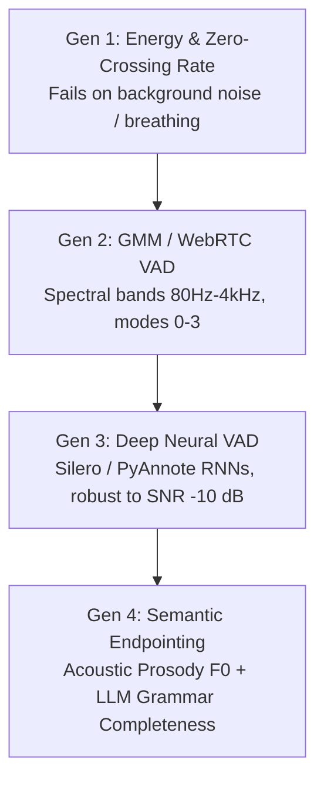
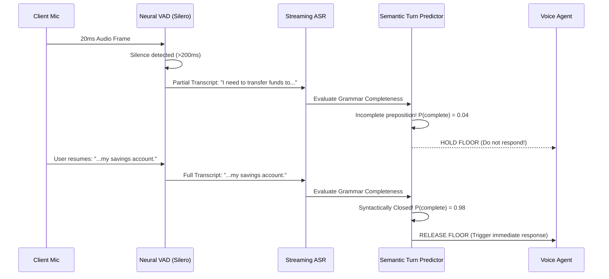

# Semantic Voice Activity Detection (VAD) & Turn Endpointing

> **Specification ID**: `SPEC-PAT07`  
> **Status**: Production Ready  
> **Target Audience**: Speech Scientists, Machine Learning Engineers, Conversational Flow Designers  
> **Key Standards**: WebRTC VAD C-Interface (RFC 7656), Silero VAD v5, NIST Speech Processing

---

## 1. The Endpointing Dilemma

Endpointing is the single most delicate parameter in conversational voice design:
- **Too aggressive ($< 350\text{ms}$)**: Cuts off slow speakers, elderly users, and anyone pausing to think.
- **Too conservative ($> 800\text{ms}$)**: Guarantees sluggish, awkward dead air on every conversational turn.

```
User says: "I want to schedule an appointment for... [450ms cognitive pause] ...tomorrow at 2."
                                                ▲
                                                │
[Static Energy VAD]: Triggers at 300ms! ────────┘
[Result]: AI cuts in: "Sorry, what day did you say?" (Broken Turn Failure)
```

---

## 2. The 4 Generations of VAD Technology



### WebRTC VAD Aggressiveness Modes

The standard WebRTC VAD operates on $10\text{ms}$, $20\text{ms}$, or $30\text{ms}$ frames with 4 operating modes:

| Mode | Strictness | Speech Retention | Noise Rejection | Ideal Context |
|---|---|---|---|---|
| **Mode 0** (Quality) | Lowest | $99.5\%$ | Low (passes fan noise) | Quiet studio, high-end USB headsets |
| **Mode 1** (Low Bitrate) | Low | $98.0\%$ | Moderate | Standard desktop web apps |
| **Mode 2** (Aggressive) | High | $94.0\%$ | High | Open office, speakerphone |
| **Mode 3** (Very Aggressive) | Highest | $88.0\%$ | Very High (may clip whispers) | Factory floor, noisy transit |

---

## 3. Acoustic Prosody as a Turn-Yielding Cue

Humans do not signal the end of a turn solely through silence; they signal it using **fundamental frequency ($F_0$) pitch contours**:

```
1. Statement Turn-Yield (Falling Pitch):
   "I need to cancel my flight."  ──► Pitch drops -35 Hz on "flight"
   [ACTION]: Shorten VAD hangtime to 250ms! User has finished.

2. Question Turn-Yield (Rising Pitch):
   "Is the doctor available?"    ──► Pitch rises +45 Hz on "available"
   [ACTION]: Shorten VAD hangtime to 200ms! User expects immediate answer.

3. Mid-Turn Hesitation (Flat Pitch / Sustained Vowel):
   "I want to book... ummm..."   ──► Flat pitch contour, sustained vowel formant
   [ACTION]: Extend VAD hangtime to 850ms! User is holding conversational floor.
```

---

## 4. Semantic Endpointing Architecture

Modern S2S engines (OpenAI Realtime, LiveKit Agents, Deepgram Nova-3) combine acoustic neural detection with an autoregressive language model predicting **Syntactic Turn Closure**:



---

## 5. Production Configuration Schema

```yaml
endpointing_engine:
  mode: hybrid_semantic
  acoustic_layer:
    vad_provider: silero_v5
    threshold: 0.55
    speech_start_debounce_ms: 60
    min_speech_duration_ms: 150
  dynamic_hangtime:
    baseline_hangtime_ms: 450
    pitch_fall_hangtime_ms: 250
    pitch_rise_hangtime_ms: 200
    hesitation_hangtime_ms: 900
  semantic_layer:
    model: token_closure_classifier
    confidence_threshold: 0.85
    max_wait_ceiling_ms: 2000
```

---

## 6. Production Case Study: Number Dictation Cutoff

### Scenario
An insurance voice agent asks: *"Please state your 9-digit policy number."*
$42\%$ of callers were prematurely interrupted after speaking the first 3 or 4 digits.

### Root Cause
Callers naturally group numbers into 3-digit clusters with $400\text{--}550\text{ms}$ pauses between clusters (*"5-0-2... [450ms] ...9-1-8... [500ms] ...3-4-1"*). The static VAD had a fixed $350\text{ms}$ hangtime timeout.

### The Production Fix
1. When entering an active slot-filling state for expected entities (e.g., credit card, phone number, policy number), dynamically switch VAD profile:
   - Set `hangtime_ms` to $750\text{ms}$.
   - Add regex pattern verification: do not fire `turn_complete` until expected digit count is satisfied or maximum silence timeout ($3,000\text{ms}$) expires.
2. Premature cutoff rate dropped from $42\%$ to $0.8\%$.
