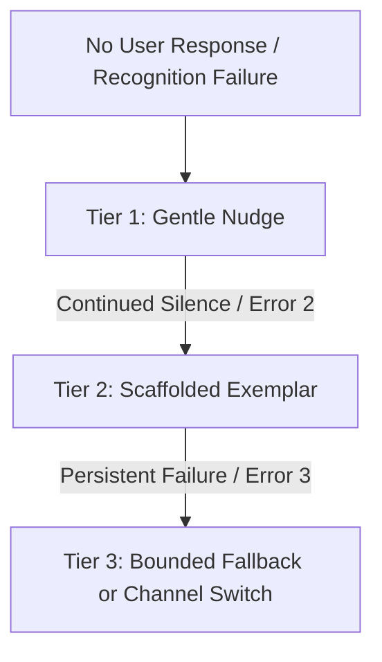

# Conversational Repair & Error Recovery Architecture

> In human communication, slips of the tongue and misunderstandings occur constantly yet rarely derail dialogue because humans rely on "Conversational Repair." An exceptional VUI is not one that never misinterprets, but one that recovers and repairs breakdowns gracefully.

---

## 1. Error Taxonomy in Voice User Interfaces

| Error Category | Root Cause | User Experience & Impact |
|---|---|---|
| **1. No Input (Silence / Timeout)** | User is formulating thoughts, ambient noise drowns out speech, or user is uncertain of what to say. | User feels hesitant, awkward, or pressured. |
| **2. Low Confidence (Acoustic Ambiguity)** | High ambient noise, soft speech amplitude, heavy regional accent, or microphone clipping. | User suspects system freeze or unresponsiveness. |
| **3. Misrecognition (ASR Entity Distortion)** | STT transcribes incorrect phonetic tokens (e.g., *"Austin"* transcribed as *"Boston"*). | User experiences surprise or annoyance at incorrect actions. |
| **4. Unhandled Intent (Out-of-Domain)** | System transcribes tokens accurately, but business logic or tooling lacks an executable handler. | User encounters mismatched product expectations and friction. |

---

## 2. 3-Tier Progressive Re-prompting

When silence occurs or the system fails to parse user intent, never repeat an identical prompt three consecutive times. Apply an escalating scaffolding strategy that progressively narrows the parameter space:




### Exemplar Dialogue: Hotel Reservation Flow

- **Error 1 (Tier 1 — Gentle Nudge)**:
  - *Objective*: Signal that the system is actively waiting without imposing cognitive pressure.
  - *Prompt*: `"Which city would you like to book a hotel in?"`
- **Error 2 (Tier 2 — Scaffolded Exemplar)**:
  - *Objective*: Constrain input scope and model an explicit phrasing template.
  - *Prompt*: `"You can say a destination like Seattle, Chicago, or San Francisco."`
- **Error 3 (Tier 3 — Safe Fallback / Channel Switch)**:
  - *Objective*: Break the failure loop and provide an immediate, safe exit path.
  - *Prompt*: `"It looks like our connection is choppy. I've sent a hotel selection link directly to your phone screen, or would you like me to connect you with a specialist?"`

---

## 3. The "Never Blame the User" Principle

A critical failure mode in conversational UX is transferring cognitive burden or fault onto the speaker via defensive or accusatory prompts:

* ❌ **Strictly Prohibited (Anti-Patterns)**:
  - `"You are speaking too softly; I can't hear you."` (Accusatory; penalizes user acoustics).
  - `"Invalid command syntax."` (Developer exception leakage).
  - `"I have no idea what you're saying."` (Hostile, abrasive).
* ✅ **Production VUI Patterns**:
  - `"Sorry, background noise made that hard to catch. Could you repeat your destination?"` (System assumes responsibility for environmental constraints).
  - `"I didn't catch that completely. Would you like to check flight schedules or compare airfares?"` (Provides constructive forward paths).

---

## 4. Conversational Repair Patterns

### Pattern 1: Implicit Confirmation
Deployed when entity confidence is high (>85%). Keeps dialogue velocity high while allowing effortless self-repair if an error slipped through:
```
User: "Send $50 to Mom."
Agent: "Sending $50 to Mom. Would you like to use your Checking or Savings account?"
(If recipient was misrecognized, user simply barges in: "No, send it to Dad!")
```

### Pattern 2: Explicit Confirmation
Deployed when confidence falls into moderate thresholds (50–75%) or prior to high-stakes, irreversible operations (wire transfers, record deletion):
```
Agent: "You would like to transfer $5,000 to John Doe, is that correct?"
User: "Yes."
Agent: "Transfer completed successfully."
```

### Pattern 3: Disambiguation (Option Narrowing)
Deployed when colliding entities or polysemic references are detected:
```
User: "Call Alex."
Agent: "Would you like to call Alex from Marketing or Alex Rivera?"
User: "Alex from Marketing."
Agent: "Calling Alex from Marketing..."
```
