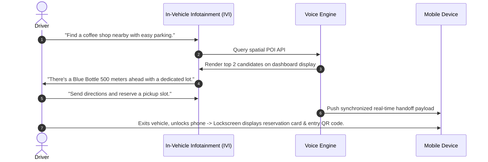
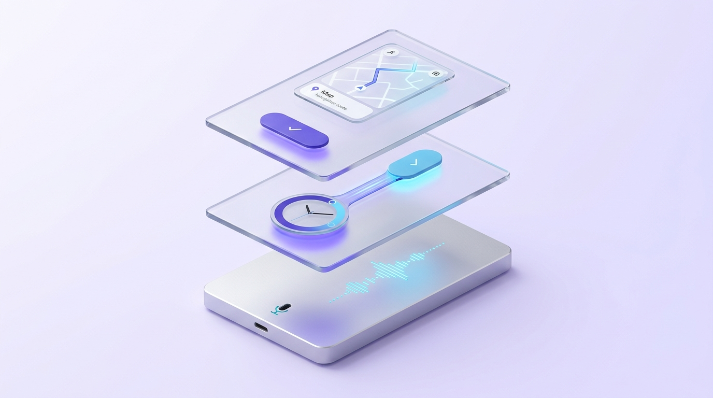

# Multimodal Voice + Screen Handshake Architecture

> "The optimal interface is neither pure voice nor pure visual. It is the synchronized orchestration of four human faculties: Mouth speaks, Ear listens, Eye scans, Hand touches." — Cheryl Platz, *Design Beyond Devices*.

---

## 1. Contextual Attention Matrix

Deciding whether to route information via the auditory or visual channel is governed entirely by user availability across eye and hand modalities:

```
                          EYES-FREE                                EYES-BUSY
          ┌────────────────────────────────────────┬────────────────────────────────────────┐
HANDS-    │ MULTIMODAL SWEET SPOT                  │ AUDIO-FIRST / PURE VOICE               │
FREE      │ (Smart Display / Tablet on Stand)      │ (Driving, Cooking, Running)            │
          │ -> Voice command, glance at details,   │ -> 100% Acoustic feedback, zero        │
          │    touch only to scroll/filter         │    demands on screen glance            │
          ├────────────────────────────────────────┼────────────────────────────────────────┤
HANDS-    │ VOICE-ACCELERATED GUI                  │ CRITICAL ATTENTION LOCKOUT             │
BUSY      │ (Keyboard Input, Holding Infant)       │ (Surgery, Heavy Equipment Operation)   │
          │ -> Voice commands, glance to verify    │ -> Emergency audio warnings only; zero │
          │                                        │    visual or cognitive distractions    │
          └────────────────────────────────────────┴────────────────────────────────────────┘
```


*Real-world case: In-cabin automotive voice & visual dashboard (Volkswagen ID.4 running wireless Apple CarPlay). Visual cards offload navigation, media metadata, and turn-by-turn routing while voice coordinates hands-busy/eyes-busy driving.*

---

## 2. Visual Offloading Rules

When the system features an accompanying visual surface (Smart TVs, Smartphones, Automotive Infotainment Displays, Smart Displays like Echo Show or Nest Hub):

### Rule 1: Voice Summarizes & Prompts, Screen Carries Density
* ❌ **Anti-Pattern (Echo Chamber / Screen Reading)**:
  - The voice assistant reads aloud 10 lines of text already displayed. Users read visually 3x faster than auditory speech; reading aloud induces extreme impatience and cognitive friction.
* ✅ **Production UX (Complementary Division of Labor)**:
  - **Voice (Executive Summary & Actionable Call)**: *"I found 3 morning flights matching your schedule. The lowest fare is $120 on Delta."*
  - **Screen (Structured Comparison Card)**: Card displaying departure times, flight numbers, stops, and baggage allowances across all 3 options.

### Rule 2: When Visual Offloading is Mandatory
1. **Tabular Data or Side-by-Side Comparisons**: Spec sheets, pricing tiers, side-by-side product metrics.
2. **Lists Exceeding 3 Items**: Restaurant search results, contact lists, multi-day weather forecasts.
3. **Sensitive & PII Data**: Credit card numbers, account balances, one-time passcodes (broadcasting over speakers in public violates privacy and security).
4. **Complex Spatial Navigation**: Multi-lane highway interchanges and dense urban intersections requiring 2D/3D spatial mapping.

---

## 3. The Cross-Device Handoff Protocol

When users transition across physical contexts and form factors (e.g., driver issues voice command to connected vehicle, arrives at destination, steps out and checks mobile device):






### Cross-Device Design Standards

- **State Continuity**: If a user initiates a workflow on a smartwatch, they can finalize authorization or payment on their phone without restarting the session.
- **Visual Anchors**: When a voice assistant speaks about a specific item in a list, the companion display must synchronously highlight its container (glow border, elevation shift) to lock visual attention to auditory pacing.
