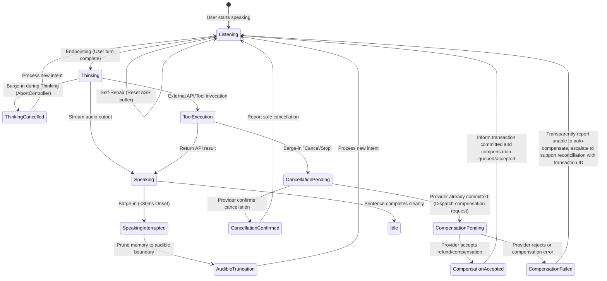
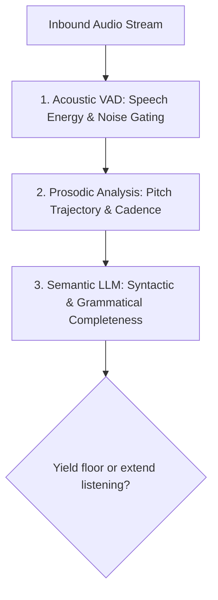

# Turn-Taking, Barge-In & State Rollback Architecture

> The defining boundary between a "broadcasting machine" and a "genuine conversationalist" is the ability to sense when the interlocutor speaks and yield the floor instantaneously.

---

## 1. Full-Duplex vs. Half-Duplex Interaction

For decades, legacy VUI systems (such as telephone IVRs and push-to-talk radios) operated in **Half-Duplex** mode:
- One party speaks while the other is forced into listen-only mode.
- The user's microphone is muted during audio output playback.
- This creates severe cognitive friction whenever the system misreads intent or delivers verbose prompts.

In modern Voice AI architectures (Speech-to-Speech models such as OpenAI Realtime API and Gemini Live), the engineering gold standard is **Full-Duplex**:
- Microphones continuously sample inbound audio while speakers stream outbound audio.
- Robust **Acoustic Echo Cancellation (AEC)** prevents the system from feeding its own output back into the automatic speech recognition (ASR) pipeline.

### 4-State Interruption Matrix

Barge-in is not confined to the assistant's playback phase (`Speaking`). A production voice agent must handle interruptions across all 4 lifecycle states:

| System State | User Interruption Behavior | Technical & UX Response |
|---|---|---|
| **1. Listening** | Mid-utterance self-repair (*"Book a flight to Austin... wait, make that Boston"*). | Flush local ASR buffer, extract latest entity, extend silence endpoint timeout by +600ms. |
| **2. Thinking** | User changes mind or appends intent (*"Actually, never mind searching"*). | Immediately abort LLM inference stream via `AbortController` signal, ingest new prompt tokens, and minimize billable token usage. |
| **3. Speaking** | User interrupts ongoing text-to-speech (TTS) playback. | Fire Interruption-Onset (<80ms), sever outbound audio stream, and execute Audible Boundary Truncation. |
| **4. Tool/API Execution** | User issues *"Stop!"* while system executes external mutation (e.g., payment, booking). | Transition to `CancellationPending`. Transmit abort signal to downstream provider and reconcile: If provider cancels successfully -> confirm cancellation. If provider committed -> transition to `CompensationPending`. Never assert a refund is active until the provider confirms receipt; if rejected or failed, route to human support reconciliation with reference transaction ID. |

---

## 2. Classic Barge-In Failure Modes

### Anti-Pattern 1: The Barrel-Ahead Agent
- **Symptom**: The user repeats *"Wait"*, *"Stop"*, or *"That's incorrect"*, yet the assistant relentlessly barrels through a 2-minute spoken list.
- **UX Consequence**: Cognitive overload, intense user helplessness, and immediate session termination.

### Anti-Pattern 2: The Neurotic / Jumpy Agent
- **Symptom**: Voice Activity Detection (VAD) is over-sensitized. A sigh, throat clear, distant child cry, or backchannel affirmation (*"Mm-hmm"*) abruptly cuts audio playback, triggering: *"I'm sorry, what did you just say?"*.
- **UX Consequence**: Disrupts conversational cadence and fragments the user's train of thought into a frustrating, stuttered exchange.

---

## 3. Semantic End-of-Turn Detection

To prevent hyper-sensitive cutoffs and sluggish response latencies, production Voice UX discards static silence timers in favor of a **3-tier signal analysis pipeline**:

1. **Acoustic VAD (Energy & Waveform Filtering)**: Confirms genuine vocal formant energy while filtering non-vocal transients (keyboard clicks, passing sirens).
2. **Prosodic Analysis (Pitch Trajectory & Intonation)**:
   - **Rising Pitch at Word Boundary**: Indicates hesitation or mid-sentence formulation (*"I'd like to reserve a table for... um..."*). The system dynamically pads the silence timeout by 800ms – 1.2s.
   - **Falling Pitch with Decisive Cadence**: Indicates turn completion. The system yields the floor and begins response streaming within 250ms.
3. **Semantic Completion (Grammatical Context)**:
   - Language model evaluates incomplete syntax: `"I want to transfer funds to John in the amount of..."` -> Grammatically incomplete clause; yielding or barging in is strictly prevented.

---

## 4. State Rollback Protocol

When barge-in occurs, how does the system reconcile memory buffers and conversational state?

- **Naive Anti-Pattern**: The assistant appends its full, planned response text into conversation history. On subsequent turns, the LLM hallucinates context from statements the user never actually heard.
- **Audible Boundary Rollback Protocol**:
  1. **Identify Truncation Point**: Pinpoint the exact audio frame and token where playback was severed.
  2. **Memory Pruning (Audible Boundary Truncation)**: Truncate dialogue context to reflect only the audio fragments physically heard by the user.
  3. **New Intent Dominance**: Ingest the interrupting utterance as the dominant intent, superseding stale task arguments or branching into a nested sub-dialogue.

### Barge-In Performance Telemetry

| Telemetry Metric | Definition | Production UX Target |
|---|---|---|
| **Barge-In Stop Latency** | Duration from initial user vocalization to complete speaker output cutoff | **< 100ms** (optimal < 60ms) |
| **False Interruption Rate** | Percentage of cutoffs triggered by ambient noise, coughs, or respiration | **< 2%** |
| **Cut-off Frustration Score** | User dissatisfaction rating resulting from premature assistant cutoffs | **< 5 / 100** |

---

## 5. Non-Bargeable Compliance & Safety Prompts

While full barge-in capability is paramount across 95% of interactions, **3 critical scenarios mandate temporary barge-in lockout** to ensure life safety and legal compliance:

1. **Emergency & Life-Safety Alerts**:
   - *Example*: Imminent vehicle collision warnings (*"Brake immediately!"*), fire evacuations, or acute medical instructions.
2. **High-Value / Irreversible Financial Authorizations**:
   - *Rule*: **Mandatory Explicit Confirmation**. Never auto-execute following a countdown tone.
   - *Example*: *"You are authorizing a transfer of $5,000 to John Doe. Do you confirm this transaction?"*
3. **Regulatory & Legal Disclaimers**:
   - *Example*: Statutorily mandated medication warnings, loan APR disclosures, and non-negotiable terms.

### Technical Safeguards for Non-Bargeable Sequences

- **Core Rule**: Inhibit standard intent switching (preventing the agent from abandoning mandatory disclosures mid-flight), **WHILE KEEPING AN ACTIVE CANCELLATION LISTENER ON THE MICROPHONE**.
- If the user vocally commands *"CANCEL"*, *"ABORT"*, or *"STOP"*, the system **instantly halts the workflow** and mutes output. Never disable the microphone or revoke user agency.
- Pair auditory prompts with visual boundary rings (Visual Alert) and synchronized haptic pulses to deliver multimodal reinforcement.
