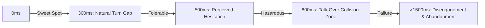
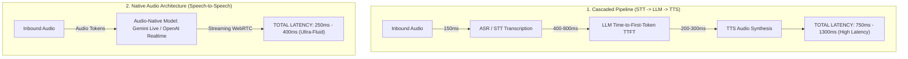
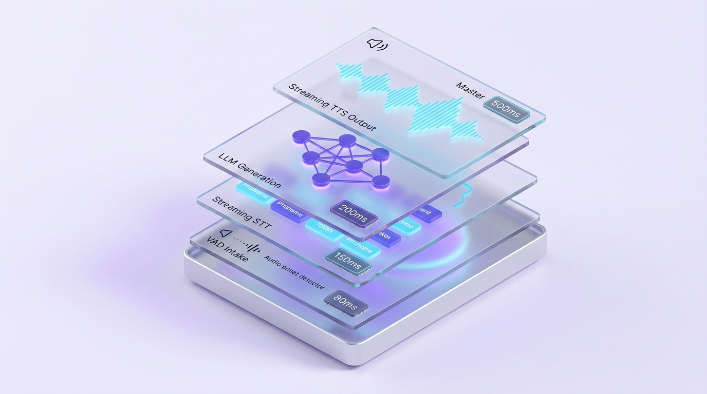
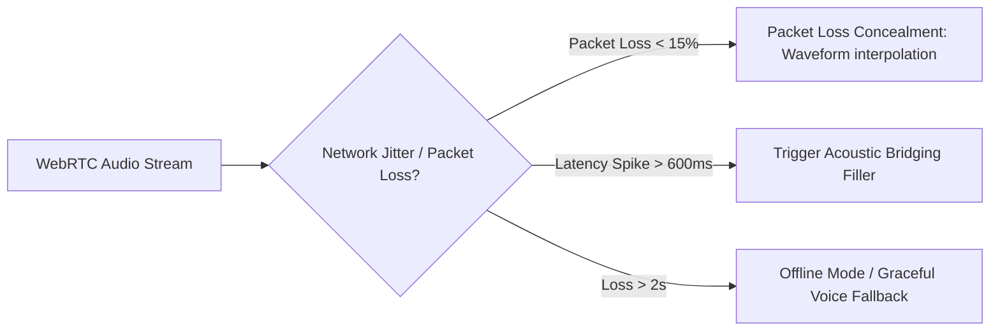

# Latency Budgets & Conversational Pacing

> In Graphical User Interfaces (GUI), a 1-second delay is merely a spinner on a screen. In Voice User Interfaces (VUI), one second of absolute silence constitutes Dead Air—triggering immediate user anxiety that the connection dropped or the assistant crashed.

---

## 1. The Conversational Latency Cliffs

Based on psychoacoustic research and behavioral analysis of real-time vocal interaction:

### Psychoacoustic Response Thresholds:

1. **0 – 300ms (The Conversational Sweet Spot) `[FACT]`**:
   - Matches organic human conversational reflex (~200ms average gap between speakers).
   - The user suspends disbelief, interacting naturally with minimal cognitive friction; trust and engagement peak.
2. **300 – 500ms (Noticeable but Tolerable)**:
   - Users perceive a subtle pause, but remain patient for complex queries or retrieval tasks.
3. **500 – 800ms (The Talk-Over Danger Zone) `[RULE]`**:
   - The user's internal timer assumes packet loss or non-receipt (*"Did it hear me?"*).
   - Users reflexively re-prompt (`"Hello?", "Are you there?"`), colliding with delayed assistant speech output (*Audio Collision*).
4. **> 800ms (The Disengagement Cliff)**:
   - Conversational illusion collapses, forcing users into a stilted walkie-talkie mental model.

---

## 2. Technical Architectures: Cascaded vs. Native Speech-to-Speech

---

## 3. Conversational Fillers & Bridging Strategies

When executing latency-intensive background operations (e.g., banking transactions or heavy vector search/RAG requiring 1.5s–3s), Voice UX Designers deploy **Audio Bridging** `[RECOMMENDATION]`:

### 1. Instant Acoustic Acknowledgment (Micro-Acks)
- Within **150ms** post-utterance, trigger a subtle earcon or short verbal acknowledgment:
  - *"Sure,"*
  - *"Got it,"*
  - *"One moment,"*
- Confirms the audio packet was received and prevents redundant user repetition.

### 2. Informative Fillers
- Replace silence with an explicit action statement:
  - *"Checking your current account balance..."*
  - *"Searching available flights for tomorrow..."*

### 3. Subtle Ambient Pulse
- If operations exceed 2 seconds, emit a low-frequency periodic tone (~200Hz) at -24 LUFS.
- Every 3 seconds without resolution, issue a progressive status update: *"Still reaching the reservation server, thanks for holding on..."*

---

## 4. Latency Budget Breakdown

Reference latency distribution designed to maintain an end-to-end target under **400ms** `[RULE]`:

| Pipeline Stage | Target Latency | Technical & UX Optimization Strategy |
|---|---|---|
| **Client Audio Capture & VAD** | 50ms | Local on-device VAD (WebAssembly / Silero VAD) |
| **Network Transport (WebRTC)** | 60ms | Real-time WebRTC media/data tracks over UDP |
| **Model Time-to-First-Audio (TTFA)** | 200ms | Native Speech-to-Speech streaming or speculative small LLM |
| **Audio Buffering & Playback** | 40ms | Client-side Adaptive Jitter Buffer |
| **TOTAL TARGET** | **350ms** | Industry-standard natural conversational cadence |

---

## 5. Network Jitter & Packet Loss Concealment (PLC)

Real-world mobile environments (fringe cellular reception, elevators, underground transit) induce network jitter spikes from 60ms to 400ms+:

### Technical Mitigation Strategies:
1. **Packet Loss Concealment (PLC) `[FACT]`**: Uses waveform interpolation algorithms to synthesize missing speech audio frames, eliminating audio clipping or jarring digital pops.
2. **Adaptive Jitter Buffer `[RECOMMENDATION]`**:
   - **Stable Network**: Contract buffer to **20–30ms** to minimize turn-taking latency.
   - **Unstable Network**: Expand buffer dynamically to **80–100ms** to prioritize phonetic intelligibility over raw speed.
3. **Graceful Fallback `[RULE]`**: If throughput drops below 30kbps, immediately terminate companion visual/video streams and dedicate all available bandwidth to maintaining voice streaming (Opus Codec at 16kbps).
