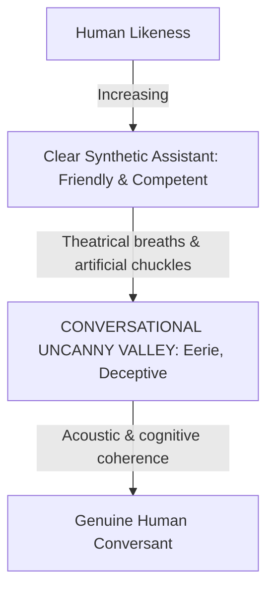

# Voice Persona, Tone & Empathy Tuning

> "A voice product can never be neutral. From the very first syllable emitted by a speaker, listeners automatically construct a mental archetype: the speaker's perceived age, gender, education, competence, personality, and emotional posture." — Erika Hall, *Conversational Design*.


---

## 1. The Persona Attribute Matrix

When defining a Voice Persona, the design team must explicitly plot the voice across two foundational bipolar axes:

```
                  FORMAL / PROFESSIONAL
                            ▲
                            │
                            │   (Banking, Healthcare, Legal)
                            │
CALM / STEADY               ┼───────────────► PLAYFUL / ENERGETIC
(Meditation, Long-form)     │                 (Gaming, Sports, Edutainment)
                            │
                            ▼
                    CASUAL / APPROACHABLE
                    (Everyday Lifestyle Assistant)
```

### Persona Blueprint Specification:
- **Representative Name**: (e.g., *Aura, Lyra, Kora*).
- **Archetype**: *The Trusted Companion* vs. *The Expert Guide*.
- **Vocabulary Tier**: Everyday conversational lexicon (80%), domain-specific academic/professional terminology (20%). Prohibit obscure regional idioms, transient internet slang, and robotic jargon.
- **Pronoun & Address Conventions**:
  - Direct second-person address ("you" / "I") for natural conversational parity.
  - In localized contexts (e.g., Vietnamese): Standardize on *"Mình - Bạn"* for balanced equality, or *"Tôi - Quý khách"* for private wealth banking. Avoid age-presumptive pronouns (*"Em - Anh/Chị"*) unless explicit demographic consent is established.

---

## 2. Uncanny Valley & The ELIZA Trap

### The ELIZA Effect
- Originating from Weizenbaum's 1966 ELIZA chatbot: Humans display a cognitive bias to anthropomorphize systems, projecting genuine consciousness, empathy, and affection onto statistical pattern engines.
- **Critical Risk `[RULE]`**: Users may divulge confidential credentials, project emotional dependencies during psychological crises, or place blind trust in medical/financial suggestions generated by probabilistic models.

### Conversational Uncanny Valley
- Occurs when synthetic speech achieves hyper-realistic acoustic fidelity (micro-breaths, tongue clicks, contextual giggles) while linguistic comprehension remains brittle, repetitive, or emotionally detached from user distress.
- Generates visceral feelings of **eeriness, revulsion, and perceived deception**.



### Design Heuristics to Avoid Anthropomorphic Traps:
1. **Natural Timbre Without Deception `[RULE]`**: Strive for fluid prosody and high intelligibility, but eliminate theatrical sighs, synthetic clearing of throats, or gratuitous chuckles.
2. **Transparent AI Disclosure `[RULE]`**: Never deceive users regarding machine identity. When asked *"Are you human?"*, state unambiguously: *"I'm an AI voice assistant designed to help you accomplish tasks quickly and efficiently."*
3. **Functional Empathy Over Performative Empathy `[RECOMMENDATION]`**:
   - ❌ *Performative*: *"Oh no, that completely breaks my heart, I am crying with you right now..."* (Algorithms do not experience biological sorrow).
   - ✅ *Functional*: *"I'm sorry to hear that happened. Let's immediately walk through the steps to lock your card and secure your account."*

---

## 3. Prosodic Emotional Adaptation


State-of-the-art voice agents (such as Hume AI EVI) detect acoustic affective cues in user vocal streams and modulate synthesis prosody in real time:

| User Emotional State | Acoustic Cues | VUI Response Strategy | Agent Prosody & Speech Rate |
|---|---|---|---|
| **Stressed / Frustrated** | Elevated pitch variance, rapid speech rate, high amplitude | Calm, concise, decisive statements; direct path to resolution | Moderate loudness (-14 LUFS), tempo decelerated by 10–15%, grounded warm fundamental frequency ($F_0$) |
| **Fatigued / Hesitant** | Lowered pitch, drawn-out pauses, frequent sighing | Gentle, patient pacing; lengthen VAD silence timeout threshold | Slower cadence, softened melodic contours, avoiding sharp high-frequency energy |
| **Rushed / Urgent** | Clipped monosyllabic utterances, hurried cadence | Ultra-concise responses, strip pleasantries, deliver critical data immediately | Tempo accelerated by 10%, crisp articulation and punchy phonetics |
