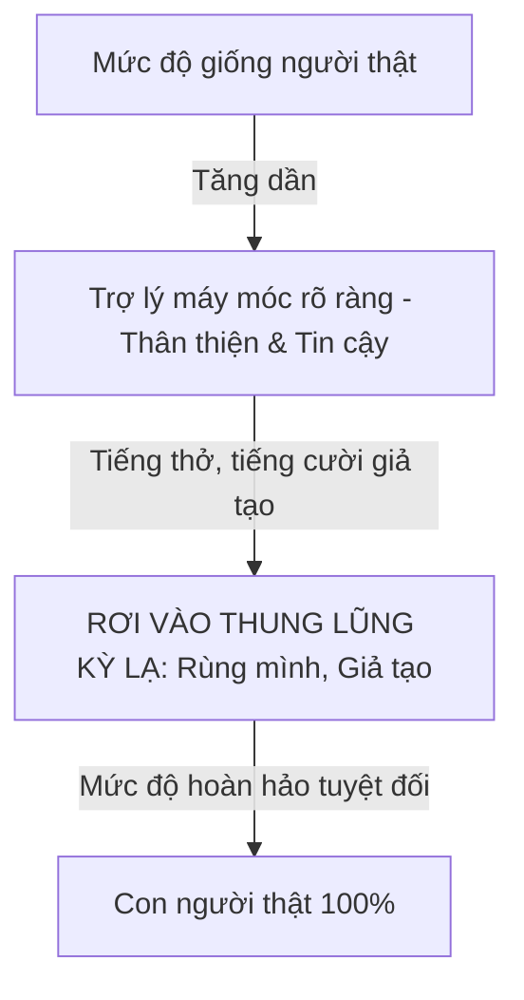

# Thiết Kế Nhân Cách & Âm Điệu Giọng Nói (Voice Persona, Tone & Empathy Tuning)

> "Một sản phẩm bằng giọng nói không bao giờ có thể 'vô cảm'. Ngay từ giây đầu tiên loa cất tiếng, người dùng đã tự động vẽ nên một hình ảnh nhân vật trong đầu: độ tuổi, giới tính, học thức, tính cách và thái độ của người đang nói." — Erika Hall, *Conversational Design*.

---

## 1. Bản Đồ 4 Trục Nhân Cách (The Persona Attribute Matrix)

Khi xây dựng Voice Persona cho sản phẩm, đội ngũ thiết kế phải xác định rõ vị trí của giọng nói trên 4 trục tính cách đối lập:

```
                  CHUYÊN NGHIỆP / TRỊNH TRỌNG (Formal)
                                  ▲
                                  │
                                  │   (Ngân hàng, Y tế, Pháp lý)
                                  │
TRẦM TĨNH / ĐỀM ĐẠM               ┼───────────────► NĂNG ĐỘNG / VUI VẺ
(Calm / Steady)                   │                 (Playful / Energetic)
(Trợ lý thiền định, Đọc sách)      │                 (Game, Thể thao, Trẻ em)
                                  │
                                  ▼
                    GẦN GŨI / THÂN THIỆN (Casual)
                    (Trợ lý cuộc sống hàng ngày)
```

### Bảng Định Nghĩa Thuộc Tính Persona (Persona Blueprint):
- **Tên đại diện**: (Ví dụ: *Aura, Lyra, Kora*).
- **Vai trò xã hội (Archetype)**: Người đồng hành tin cậy (*The Trusted Companion*) hay Người hướng dẫn chuyên nghiệp (*The Expert Guide*).
- **Vốn từ vựng (Vocabulary Tier)**: Ngôn ngữ bình dị đời thường (80%), từ vựng học thuật (20%), tuyệt đối không dùng từ lóng quá đà hoặc tiếng địa phương khó hiểu.
- **Cách xưng hô chuẩn mực**:
  - Tiếng Việt: *"Mình - Bạn"* (phổ quát, thân thiện, bình đẳng) hoặc *"Tôi - Quý khách"* (ngân hàng cao cấp). Tránh *"Em - Anh/Chị"* nếu chưa rõ độ tuổi của người dùng.

---

## 2. Tránh "Thung Lũng Kỳ Lạ" & Hiệu Ứng ELIZA (Uncanny Valley & ELIZA Trap)

### Hiệu Ứng ELIZA (The ELIZA Effect)
- Xuất phát từ chatbot ELIZA năm 1966: Con người có xu hướng nhân hóa quá mức, tin rằng cỗ máy có tâm hồn, có tình cảm và sự thấu cảm thực sự chỉ vì nó nói những câu ngọt ngào.
- **Mối nguy hại**: Người dùng chia sẻ những bí mật thầm kín, khủng hoảng tâm lý nghiêm trọng, hoặc tin tưởng mù quáng vào lời khuyên tài chính/y tế của một mô hình xác suất.

### Thung Lũng Kỳ Lạ Của Đàm Thoại (Conversational Uncanny Valley)
- Xảy ra khi giọng nói tổng hợp quá giống người thật (có tiếng thở nhẹ, tiếng chép miệng, tiếng cười khúc khích) nhưng nội dung câu trả lời lại ngô nghê, lặp đi lặp lại hoặc vô cảm trước nỗi đau của người dùng.
- Tạo ra cảm giác **rờn rợn, giả tạo và lừa dối**.



### Quy Tắc Thiết Kế Tránh Bẫy Uncanny Valley:
1. **Âm sắc trong trẻo, tự nhiên nhưng không giả vờ làm người**: Giữ độ mượt mà cao, nhưng không thêm thắt các tiếng thở dài, tiếng nấc hay cười trừ mang tính kịch nghệ rẻ tiền.
2. **Minh bạch bản chất AI**: Luôn trung thực khi được hỏi: *"Bạn có phải là người thật không?"* -> Đáp: *"Mình là trợ lý ảo được thiết kế để hỗ trợ bạn hoàn thành công việc một cách nhanh nhất."*
3. **Thấu cảm chức năng (Functional Empathy) thay vì Thấu cảm giả tạo**:
   - ❌ *Giả tạo*: *"Ôi trời ơi, nghe tin đó mình đau lòng phát khóc lên được, trái tim mình tan nát cùng bạn..."* (Máy làm gì có tim).
   - ✅ *Chức năng*: *"Mình rất tiếc khi nghe bạn gặp phải sự cố này. Bây giờ mình sẽ hướng dẫn bạn từng bước để khóa thẻ và bảo vệ tài khoản ngay lập tức."*

---

## 3. Ma Trận Thích Ứng Cảm Xúc (Prosodic Emotional Adaptation)

Một Voice Agent thông minh (như Hume AI EVI) có khả năng phân tích cảm xúc trong giọng nói của người dùng và điều chỉnh âm sắc tương ứng:

| Trạng Thái Cảm Xúc Người Dùng | Dấu Hiệu Âm Học | Chiến Lược Phản Hồi VUI | Âm Lượng & Tốc Độ Nói Của Agent |
|--------------------------------|-----------------|--------------------------|----------------------------------|
| **Căng thẳng / Giận dữ** | Cao độ tăng vọt, tốc độ nói nhanh dồn dập, âm lượng lớn | Bình tĩnh, câu từ ngắn gọn, dứt khoát, đi thẳng vào giải pháp | Âm lượng vừa phải (-14dB), nhịp chậm lại 10-15%, giọng trầm ấm |
| **Buồn bã / Mệt mỏi** | Giọng trầm, nói ngập ngừng, thở dài | Nhẹ nhàng, kiên nhẫn, tăng thời gian chờ ngắt lời (VAD wait) | Tốc độ chậm, cao độ êm dịu, không dùng các nốt cao chói |
| **Vội vã / Bận rộn** | Câu lệnh ngắn cụt lủn, giọng gấp gáp | Siêu ngắn gọn, bỏ hết câu xã giao, chỉ trả lời dữ liệu | Tốc độ nhanh hơn 10%, âm sắc rõ ràng, mạch lạc |
