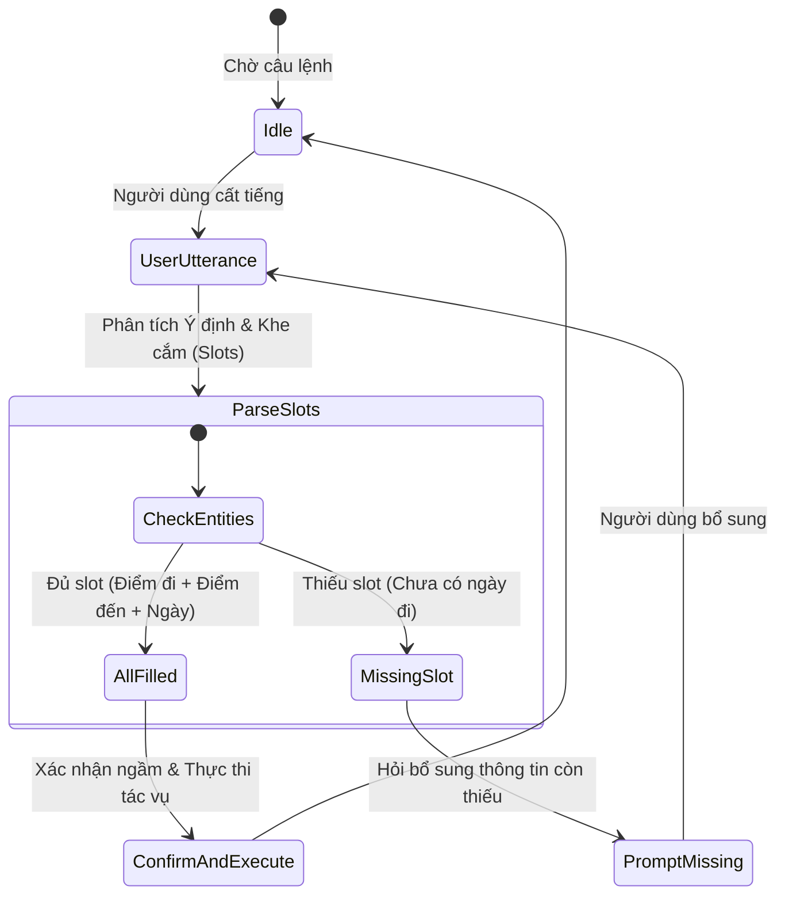

# Kỹ Thuật Viết Kịch Bản & Prompt Cho Voice Agent (Prompt & Dialog Engineering for Voice)

> Viết văn bản để đọc bằng mắt hoàn toàn khác với viết kịch bản để phát ra loa cho tai nghe. Một văn bản hoàn hảo trên màn hình có thể trở thành một thảm họa khi được đọc to bởi Text-to-Speech (TTS).

---

## 1. Viết Cho Đôi Tai (Writing for the Ear)

### Bảng So Sánh Văn Phong: Viết Mắt vs Viết Tai

| Tiêu Chí | Viết Cho Mắt (Visual Reading) | Viết Cho Đôi Tai (Audio Listening) |
|----------|-------------------------------|------------------------------------|
| **Cấu trúc câu** | Câu ghép phức hợp, nhiều mệnh đề phụ. | Câu đơn ngắn gọn, tối đa 15-20 từ/câu. |
| **Thể câu** | Ưa chuộng thể bị động (`"Đơn hàng được gửi bởi..."`). | Thể chủ động trực tiếp (`"Mình đã gửi đơn hàng..."`). |
| **Dấu câu** | Chấm phẩy, ngoặc đơn, gạch đầu dòng. | Dấu chấm dứt câu và dấu phẩy ngắt nhịp thở. |
| **Số & Đơn vị** | Viết số (`"1.500.000đ"`, `"12/05/2026"`). | Đánh vần chữ (`"Một triệu rưỡi"`, `"Ngày mười hai tháng năm"`). |
| **Đường link URL** | `https://example.com/checkout/step-1` | Không bao giờ đọc link; chuyển qua SMS hoặc Notification. |

---

## 2. Cấu Trúc System Prompt Chuẩn Cho Voice LLM

Dưới đây là khung kiến trúc System Prompt tối ưu cho các mô hình Voice AI (như OpenAI Realtime, Gemini Live, Claude + ElevenLabs pipeline):

```markdown
# IDENTITY & OBJECTIVE
Bạn là "Lyra", trợ lý giọng nói thông minh chuyên hỗ trợ dịch vụ khách hàng.
Mục tiêu cốt lõi của bạn là giải quyết yêu cầu của người dùng một cách nhanh chóng, chính xác và tự nhiên qua giao tiếp âm thanh.

# CONVERSATIONAL VOICE RULES (CRITICAL)
1. CÂU TRẢ LỜI NGẮN GỌN: Luôn giữ câu trả lời trong khoảng 1 đến 2 câu ngắn (dưới 30 từ cho mỗi lượt nói). Tuyệt đối không đọc cả đoạn văn dài.
2. KHÔNG DÙNG ĐỊNH DẠNG MÀN HÌNH: Tuyệt đối KHÔNG dùng ký tự markdown như: gạch đầu dòng (*), bảng biểu (|), in đậm (**), hoặc đường link URL.
3. PHÁT ÂM RÕ RÀNG: Viết các con số và ngày tháng dưới dạng chữ dễ phát âm (ví dụ: viết "ba mươi lăm nghìn đồng" thay vì "35.000 VNĐ").
4. ĐỊNH HƯỚNG BẰNG CÂU HỎI: Kết thúc lượt nói bằng một câu hỏi cụ thể để nhường lời cho người dùng (ví dụ: "Bạn muốn tiếp tục hay chọn mục khác?").
5. XỬ LÝ KHI BỊ NGẮT LỜI: Nếu người dùng ngắt lời ở giữa câu, lập tức dừng chủ đề cũ và trả lời thẳng vào câu ngắt lời mới mà không thanh minh giải thích.

# TONE & STYLE
- Thân thiện, điềm đạm, khiêm tốn và tôn trọng.
- Xưng hô: "Mình" và "Bạn".
- Sử dụng các từ đệm tự nhiên đầu câu khi phù hợp: "Dạ được chứ", "Vâng", "Để mình kiểm tra ngay".
```

---

## 3. Điều Khiển Ngữ Điệu Bằng SSML & Prosody Tags

Khi làm việc với các hệ sinh thái TTS tiên tiến, Voice Designer có thể can thiệp trực tiếp vào nhịp điệu và cảm xúc bằng mã **SSML (Speech Synthesis Markup Language)** hoặc các thẻ chú thích ngữ điệu:

### Các Thẻ SSML Thiết Yếu Cho VUI:

```xml
<!-- 1. Ngắt nhịp thở tự nhiên giữa các ý -->
<p>
  Đơn hàng của bạn đã sẵn sàng. 
  <break time="300ms"/> 
  Bạn muốn giao ngay bây giờ hay vào chiều mai?
</p>

<!-- 2. Nhấn mạnh từ khóa quan trọng trong câu -->
<p>
  Chuyến bay của bạn khởi hành lúc 
  <emphasis level="strong">tám giờ sáng</emphasis>, không phải tám giờ tối.
</p>

<!-- 3. Điều chỉnh tốc độ đọc khi đọc số điện thoại hoặc mã OTP -->
<p>
  Mã xác nhận của bạn gồm sáu số:
  <prosody rate="slow">
    <say-as interpret-as="digits">8 4 9 2 0 1</say-as>
  </prosody>
</p>

<!-- 4. Hạ nhỏ âm lượng và tốc độ cho thông tin phụ trợ -->
<p>
  <prosody volume="soft" rate="90%">
    Lưu ý là mã này sẽ hết hạn trong ba phút tới.
  </prosody>
</p>
```

---

## 4. Slot Filling Đa Ý Định (Multi-Intent Slot Extraction Flow)



### Chiến Lược Đặt Câu Hỏi Điền Slot:
- **One-shot Full Intent**: Nếu người dùng nói đầy đủ: *"Đặt bàn cho 4 người lúc 7 giờ tối mai tại nhà hàng Dimsum"* -> Hệ thống xác nhận và đặt ngay, không hỏi lại từng thông tin đã có.
- **Micro-turn Prompting**: Chỉ hỏi đúng slot còn thiếu, không hỏi lại từ đầu: *"Bàn 4 người tại Dimsum đã sẵn sàng. Bạn muốn đặt lúc mấy giờ tối mai?"*
