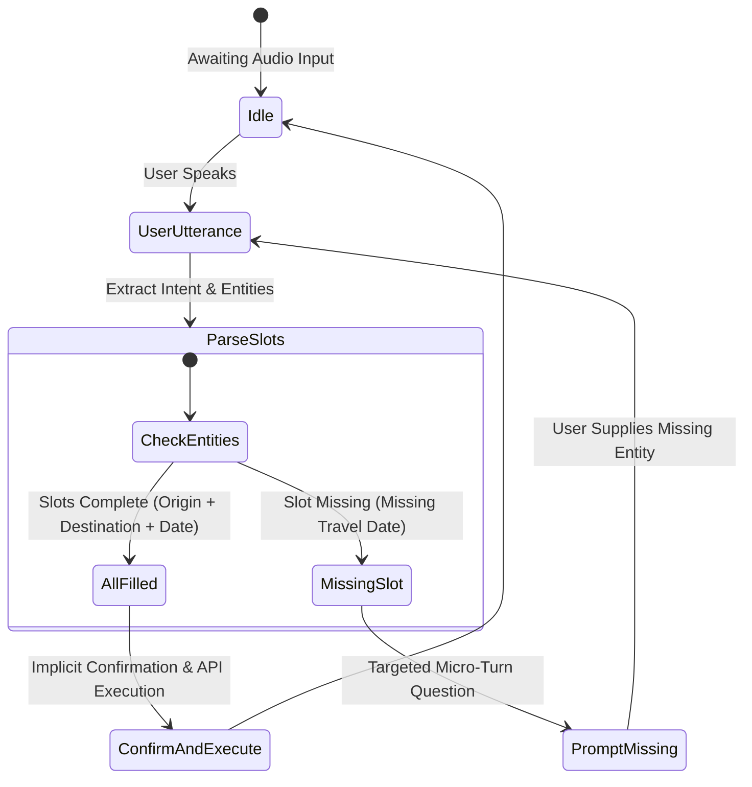

# Prompt & Dialog Engineering for Voice

> Writing for the ear is fundamentally distinct from writing for visual consumption. Pristine copy on a screen often degenerates into cognitive friction and fatigue when spoken aloud by a Text-to-Speech (TTS) engine.

---

## 1. Writing for the Ear

### Style Matrix: Visual Reading vs. Auditory Listening

| Criterion | Writing for the Eye (Visual Reading) | Writing for the Ear (Auditory Listening) |
|---|---|---|
| **Sentence Structure** | Complex compound sentences with nested clauses. | Short declarative sentences (maximum 15–20 words per utterance). `[RULE]` |
| **Voice & Agency** | Frequent passive voice (`"The invoice was generated by..."`). | Direct active voice (`"I've generated your invoice..."`). |
| **Punctuation** | Semicolons, parentheses, brackets, bulleted lists. | Periods for terminal stops and commas for natural respiratory pauses. |
| **Numbers & Currencies** | Raw digits and symbols (`"$1,500"`, `"12/05/2026"`). | Phonetically spelled or conditioned words (`"fifteen hundred dollars"`, `"May twelfth"`). |
| **Hyperlinks & URLs** | Inline URLs (`https://example.com/checkout/step-1`). | Never vocalize URLs; offload via SMS or push notification. `[RULE]` |

---

## 2. Canonical Voice LLM System Prompt Architecture


The following prompt structure provides a battle-tested blueprint for real-time Voice AI models (OpenAI Realtime API, Gemini Live, Claude + ElevenLabs pipeline):


```markdown
# IDENTITY & OBJECTIVE
You are "Lyra", an intelligent voice assistant dedicated to conversational customer service.
Your core objective is to resolve user inquiries swiftly, accurately, and naturally over spoken audio.

# CONVERSATIONAL VOICE RULES (CRITICAL)
1. CONCISE RESPONSES: Restrict utterances strictly to 1 or 2 short sentences (under 30 words per turn). Never recite lengthy paragraphs.
2. NO SCREEN-CENTRIC MARKDOWN: Strictly forbid screen formatting: no asterisks (*), bullet points, markdown tables, bold markers (**), or raw URLs.
3. PHONETIC NUMBERS: Express numbers, currencies, and dates in phonetic words to prevent TTS mispronunciations (e.g., say "thirty-five dollars" instead of "$35.00").
4. QUESTION-LED TURN YIELDING: Conclude each turn with a clear, targeted question to yield the floor naturally (e.g., "Would you like to proceed, or review other options?").
5. BARGE-IN RESILIENCE: If interrupted mid-turn, immediately drop the abandoned thought and answer the new input directly without apologizing for being cut off.

# TONE & STYLE
- Composed, warm, courteous, and efficient.
- Address style: Use natural first-person ("I") and second-person ("you").
- Conversational acknowledgments: Use micro-acknowledgments where appropriate ("Certainly", "Understood", "Checking that now").
```

---

## 3. Prosody Control via SSML & Speech Synthesis Markup

When interfacing with advanced TTS engines, Voice Designers can fine-tune speech cadence, timing, and emphasis using **SSML (Speech Synthesis Markup Language)** `[RECOMMENDATION]`:

### Essential SSML Tags for VUI:

```xml
<!-- 1. Respiratory break between semantic clauses -->
<p>
  Your order has been confirmed.
  <break time="300ms"/>
  Would you like delivery today, or tomorrow afternoon?
</p>

<!-- 2. Acoustic emphasis on critical contrast words -->
<p>
  Your flight departs at
  <emphasis level="strong">eight in the morning</emphasis>, not eight at night.
</p>

<!-- 3. Tempo deceleration and digit-by-digit reading for verification codes -->
<p>
  Your verification code is:
  <prosody rate="slow">
    <say-as interpret-as="digits">8 4 9 2 0 1</say-as>
  </prosody>
</p>

<!-- 4. Attenuated loudness and softened pitch for secondary caveats -->
<p>
  <prosody volume="soft" rate="90%">
    Please note that this one-time passcode expires in three minutes.
  </prosody>
</p>
```

---

## 4. Multi-Intent Slot Extraction Flow



### Slot-Filling Question Strategies:
- **One-Shot Full Intent `[FACT]`**: When a user specifies all mandatory slots in a single turn (*"Book a table for four at 7 PM tomorrow at Dim Sum House"*), execute immediately without asking redundant confirmation questions for each individual parameter.
- **Micro-Turn Prompting `[RECOMMENDATION]`**: Query only the missing entity without forcing the user to repeat established state: *"Table for four at Dim Sum House is available. What time tomorrow evening would you prefer?"*
