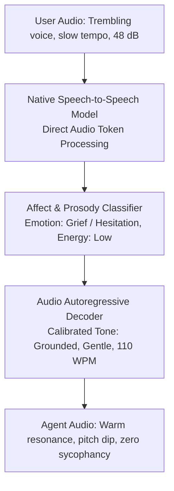
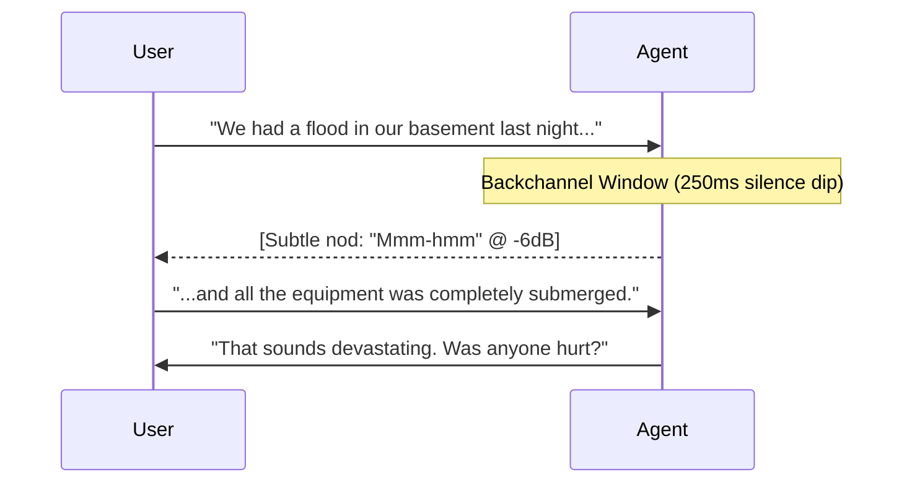

# Speech-to-Speech (S2S) Prosody, Affect & Expressive Audio Control

> **Specification ID**: `SPEC-CDS04`  
> **Status**: Production Ready  
> **Target Audience**: Conversational Designers, Prompt Engineers, AI Voice Directors, Speech Scientists  
> **Key Standards**: IPA (International Phonetic Alphabet), SSML 1.1 (W3C), Native S2S Audio Tokenization

---

## 1. Beyond the "Chatbot Voice": Acoustic Prosody

In traditional cascaded pipelines (STT $\rightarrow$ LLM $\rightarrow$ TTS), emotional inflection is flattened into text tokens, then synthesized through static acoustic voice profiles. Native Speech-to-Speech (S2S) architectures preserve and synthesize acoustic prosody directly:



---

## 2. The 6 Acoustic Dimensions of Prosody

| Dimension | Physical Unit | Conversational Effect | Production Target |
|---|---|---|---|
| **Fundamental Frequency ($F_0$)** | Hertz (Hz) | Pitch elevation conveys excitement or stress; pitch dip conveys authority or calm. | Baseline: $110\text{--}130\text{ Hz}$ (baritone) / $190\text{--}220\text{ Hz}$ (mezzo-soprano). |
| **Tempo / Speech Rate** | Words Per Minute (WPM) | Rapid speech ($>180$) conveys urgency or impatience; slow speech ($<120$) conveys gravity or clarity. | Default: $135\text{--}150\text{ WPM}$. Medical/Elderly: $115\text{--}125\text{ WPM}$. |
| **Acoustic Energy / Loudness** | dBFS RMS / LUFS | Perceived volume and intimacy. Whispering vs projecting. | Integrated target: $-18\text{ LUFS} \pm 1.5\text{ dB}$. |
| **Pitch Contour Variation ($\Delta F_0$)** | Semitones (ST) | Monotone ($< 1.5\text{ ST}$) sounds robotic/depressed; dynamic ($> 5\text{ ST}$) sounds expressive. | Optimal conversational warmth: $2.5\text{--}4.0\text{ ST}$. |
| **Jitter & Shimmer** | % cycle perturbation | Micro-instability in vocal folds; conveys vulnerability, age, or anxiety. | Natural voice baseline: Jitter $< 1.0\%$, Shimmer $< 3.0\%$. |
| **Pause Architecture** | Milliseconds (ms) | Rhythmic cadence between syntactic clauses. | Clause pause: $180\text{--}250\text{ms}$. Emphatic pause: $400\text{--}600\text{ms}$. |

---

## 3. Emotional Mirroring vs Affective Complementarity

The single greatest mistake in expressive voice design is **Saccharine Toxic Positivity**—responding with perky, cheerful customer-service enthusiasm when a user is in acute distress.

```
                  ┌──────────────────────────────────────────────┐
                  │          The Affect Response Matrix          │
                  └──────────────────────────────────────────────┘

 User State          Unacceptable Response            Calibrated Production Response
────────────────────────────────────────────────────────────────────────────────────────
 Grief / Loss        "Awesome! I'd love to help      Slow tempo (115 WPM), lowered pitch (-3 ST),
 "My dad passed."     with the death certificate!"     soft vocal onset, gentle empathy.
                     (Toxic Positivity)               "I'm very sorry for your loss. Let's take
                                                       this one step at a time."

 Anger / Rage        "I completely understand your   Steady, grounded cadence, zero exclamation
 "Your app stole      frustration, sir!!"             intonation, short factual statements.
 my money!"          (Defensive placation)            "I am looking directly at that transaction now.
                                                       Let's resolve this."

 Panic / Crisis      "Oh no, that sounds really      Authoritative, crisp, calm, steady volume.
 "He can't breathe!"  scary! Let me search..."        "Paramedics are being dispatched now.
                     (Matching panic with panic)       Keep him sitting upright."
```

### The Law of Affective Complementarity
- **Never match high-arousal negative emotion (rage, panic) with identical emotion.**
- **Provide an acoustic anchor**: Ground the conversation with stable pitch, lower fundamental frequency, and unhurried tempo.

---

## 4. Paralinguistic Tokens & Backchanneling

Natural conversations feature involuntary acoustic tokens that signify active listening without stealing the conversational floor:



### Production Backchannel Rules
1. **Backchannel Volume**: Must be mixed $-6\text{ dB}$ below normal speaking voice.
2. **Floor Non-Custody**: A backchannel ("mm-hmm", "right", "I see") must NOT flip the conversational state machine into `agent_speaking` mode. The client mic must remain $100\%$ unmuted and un-ducked.
3. **Trigger Threshold**: Fire a backchannel only after $3\text{--}5\text{ seconds}$ of uninterrupted user narrative when an acoustic pause ($200\text{ms}$) coincides with a semantic clause boundary.

---

## 5. Production Case Study: Bereavement Notification in Telephony

### Incident
An elderly widow called a pension provider to notify them of her husband's passing. The bot responded:
```
Bot (Upbeat 165 WPM): "Great! Thanks for calling! I can certainly assist you with closing that account today! What was his social security number?"
```
The caller broke down in tears and hung up, filing a formal regulatory complaint with the insurance commissioner.

### The Architectural Redesign
1. **Acoustic Sentiment Hook**: When acoustic classifier detects low energy ($<-28\text{ dBFS}$), slow rate ($<100\text{ WPM}$), or bereavement keywords, immediately lock the voice profile into **`compassionate_grounded`**.
2. **Prompt Instruction**:
   ```
   [VOICE STYLE: compassionate_grounded]
   - Speak at 120 words per minute.
   - Lower vocal pitch by 2 semitones.
   - Eliminate all cheerful pleasantries, exclamation points, and promotional adjectives.
   - Acknowledge grief simply and pause for 500ms before asking administrative questions.
   ```
3. **Redesigned Turn**:
   ```
   Bot (Soft, 118 WPM, 450ms initial pause): "I'm so sorry for your loss. Take your time. Whenever you're ready, could you share his full name or account number?"
   ```
