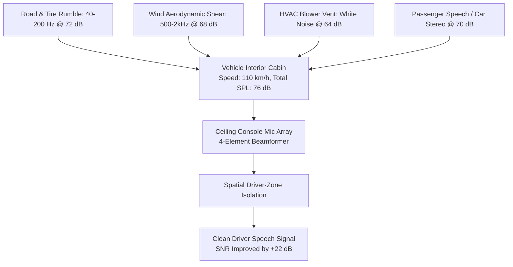
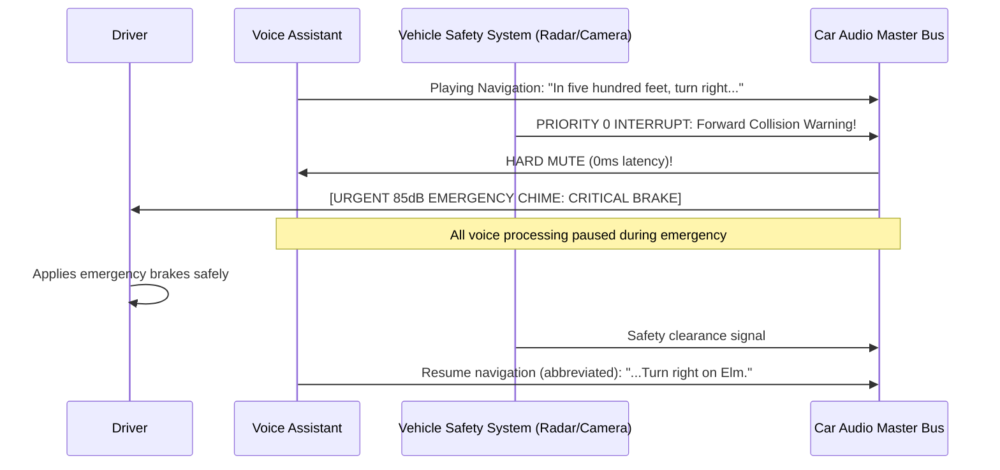

# Automotive Voice UX, Driver Distraction (ISO 15005) & Cabin Acoustics

> **Specification ID**: `SPEC-VRT03`  
> **Status**: Production Ready  
> **Target Audience**: Automotive HMI Designers, In-Cabin Software Architects, Safety Certification Leads  
> **Key Standards**: ISO 15005:2026 (Dialogue Management for Transport Systems), NHTSA Driver Distraction Guidelines (DOT HS 811 785)

---

## 1. Safety-Critical Context: Driving as a Primary Task

In an automotive vehicle, interacting with a voice assistant is strictly a **secondary or tertiary task**. Driving is the primary, safety-critical task.

```
       Driving Task (Primary)                  Voice Assistant (Secondary)
┌───────────────────────────────────────┐      ┌─────────────────────────┐
│ Eyes on road, hands on wheel,         │      │ Audio prompts <= 12 wds │
│ situational hazard vigilance          │◄────►│ Zero visual glance req  │
└───────────────────────────────────────┘      └─────────────────────────┘
                   │
                   ▼ (NHTSA Safety Rule)
  Total Eyes-Off-Road Time (TEORT) <= 2.0s per glance / <= 12.0s total task
```

---

## 2. In-Cabin Acoustic Noise Profile

The automotive interior is one of the most acoustically hostile consumer environments:



### Multi-Zone Acoustic Isolation
1. **Driver Zone Priority**: The microphone array steers a directional beam solely towards the driver's head ($0^\circ \text{ azimuth}, +45^\circ \text{ elevation}$).
2. **Passenger Rejection**: Conversations between rear passengers or front passengers are attenuated by $\ge 18\text{ dB}$, preventing unintentional commands.
3. **HVAC Airflow Deflection**: Microphones must incorporate physical wind screens to prevent turbulent air from dashboard vents hitting the MEMS diaphragms.

---

## 3. ADAS System Preemption & Priority Hierarchy

When the vehicle's Advanced Driver Assistance System (ADAS) detects an imminent hazard, the voice assistant must yield instantly:



### Audio Priority Hierarchy
- **Level 0 (Safety Critical)**: Collision alerts, lane departure chimes, pedestrian warnings $\rightarrow$ **Instant Hard Mute of all media & voice**.
- **Level 1 (Operational)**: Turn-by-turn navigation alerts, incoming phone calls.
- **Level 2 (Conversational Assistant)**: Voice AI responses, weather, messaging.
- **Level 3 (Entertainment)**: Music, podcasts, radio.

---

## 4. Prompt Brevity Guidelines Under Vehicle Motion

The verbosity of voice prompts must dynamically scale according to vehicle velocity:

| Vehicle State | Maximum Words Per Prompt | Audio Interaction Allowed | Visual Display Screen Support |
|---|---|---|---|
| **Parked ($0\text{ km/h}$)** | Up to $25\text{ words}$ | Full conversational dialog | Detailed lists, maps, touch buttons active |
| **City Driving ($1\text{--}50\text{ km/h}$)** | $\le 16\text{ words}$ | Single-intent voice commands | High-contrast 2-option cards ($> 32\text{pt}$ font) |
| **Highway ($> 80\text{ km/h}$)** | $\le 8\text{ words}$ | Direct confirmation only | **Zero visual glance required** (Blank or map only) |

---

## 5. Production Case Study: Radio Talk Show False Wake-Word

### Incident
While driving at $105\text{ km/h}$, the driver was listening to a sports podcast on the car stereo. The podcast host said: *"Hey, seriously, that coach needs to get fired."*
The car assistant misheard *"Hey, seriously"* as the wake word *"Hey Siri"*, abruptly ducked the audio, and vocalized:
*"Who would you like to call?"*
The driver was startled, glanced down at the touchscreen in confusion, and drifted out of their highway lane.

### Root Cause
1. **Wake Word False Acceptance**: The wake-word engine was running in high-sensitivity mode ($0.35$ threshold) without spatial speaker verification.
2. **Acoustic Loopback Failure**: The car stereo audio was not properly registered as a reference signal in the hardware AEC loop, allowing the car's own speakers to trigger the microphone.

### The Automotive Production Standard
```yaml
automotive_voice_policy:
  spatial_driver_focus:
    require_driver_seat_doa: true
    reject_cabin_speakers_aec_erle_db: 45
  wake_word_calibration:
    highway_speed_threshold: 0.72
    require_phonetic_acoustic_match: 0.85
  anti_distraction:
    speed_exceeds_80kmh:
      disable_screen_touch_menus: true
      max_prompt_words: 8
      require_yes_no_confirmation: true
```
