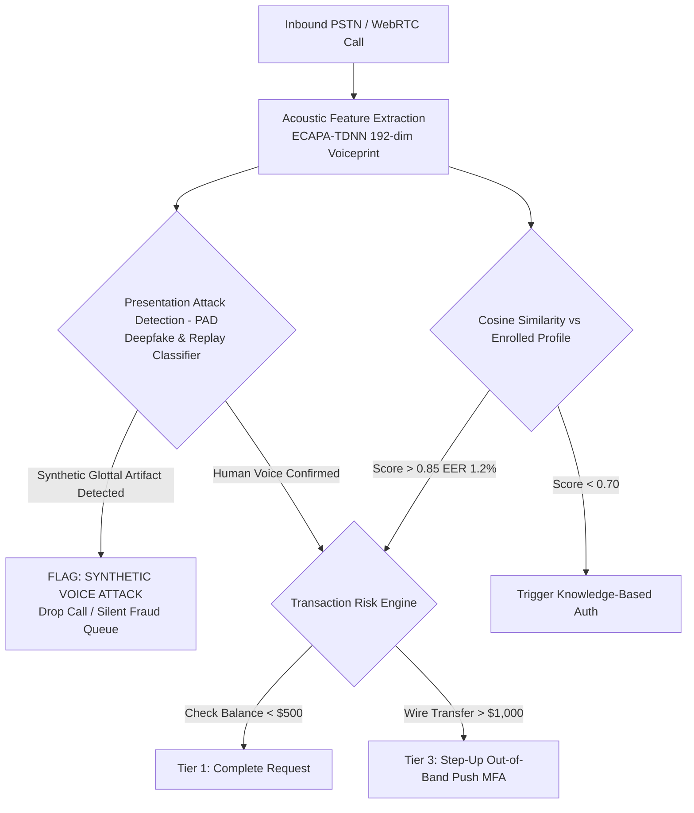

# Banking Voice Biometrics, Anti-Spoofing & Financial Fraud Prevention

> **Specification ID**: `SPEC-VRT02`  
> **Status**: Production Ready  
> **Target Audience**: FinTech Security Architects, Biometrics Engineers, Fraud Operations Leads  
> **Key Standards**: NIST SRE (Speaker Recognition Evaluation), ISO/IEC 30107 (Biometric Presentation Attack Detection), FFIEC Authentication Guidance

---

## 1. The Voice as a Financial Credential

Voice biometrics convert human vocal tract geometry into mathematical embeddings (x-vectors, d-vectors). However, with the emergence of sub-second neural voice cloning, **voice alone can never serve as a single factor for high-risk financial authorizations**.



---

## 2. Quantitative Biometrics Metrics

```
  Error Rate %
      ▲
      │       FAR (False Acceptance Rate)       FRR (False Rejection Rate)
      │       \                                   /
      │        \                                 /
      │         \                               /
      │          \                             /
      │           \                           /
      │            \                         /
      │             \       EER ≈ 1.2%      /
      │              \          ▼          /
      │───────────────\─────────┼─────────/─────────────────
      │                \        │        /
      │                 \       │       /
      │                  \      │      /
      │                   \     │     /
      └────────────────────▼────┴────▼──────────────────────► Threshold
                         Liberal   Strict
```

- **FAR (False Acceptance Rate)**: Probability an impostor is authenticated. FinTech target: $< 0.01\%$.
- **FRR (False Rejection Rate)**: Probability a legitimate customer is rejected. Target: $< 2.5\%$.
- **Equal Error Rate (EER)**: The intersection point. Production standard for banking: $\text{EER} \le 1.2\%$.

---

## 3. Anti-Spoofing: Presentation Attack Detection (PAD)

### 1. Replay Attacks
- **Mechanism**: Attacker plays a smartphone recording of the victim's voice into the telephone handset.
- **Detection**: Acoustic analysis detects room impulse response (RIR) reverberation convolution and speaker transducer non-linear distortion at $3\text{--}4\text{kHz}$.

### 2. Deepfake & Synthetic Voice Attacks
- **Mechanism**: Attacker uses a diffusion or autoregressive neural voice cloner to generate speech in real-time.
- **Detection**:
  - Phase discontinuity detection across high frequencies ($>6\text{kHz}$).
  - Micro-tremor vocal fold dynamics: Real vocal cords exhibit biomechanical jitter ($0.5\text{--}1.0\%$); AI speech is unnaturally smooth.
  - Challenge-Response Liveness: The bot prompts a dynamic, unpredictable phonemic phrase: *"Please say: The velvet frog jumped over forty blue fences."*

---

## 4. Multi-Tier Step-Up Authentication Matrix

| Transaction Risk Tier | Action Example | Authentication Requirement | Fallback on Failure |
|---|---|---|---|
| **Tier 1 (Informational)** | Check balance, review last 5 transactions | Passive Voice Biometrics ($> 0.80$) + ANI Match (Caller ID verification) | 4-digit Telephone PIN |
| **Tier 2 (Low Financial)** | Internal transfer between own accounts $< \$500$ | Passive Voice Biometrics ($> 0.88$) + Dynamic Liveness Phrase | In-App Push Notification approval |
| **Tier 3 (High Financial)** | Wire transfer $> \$1,000$, new payee addition, address change | Passive Biometrics + Out-of-Band Push MFA on banking app | Mandatory transfer to Senior Fraud Specialist |

---

## 5. Production Case Study: AI Deepfake Wire Transfer Attempt

### Incident
A fraudster spoofed the ANI (Caller ID) of a high-net-worth client and called the VIP banking line requesting an emergency $\$45,000$ wire transfer to an offshore escrow account.
The voice sound was virtually indistinguishable to the human ear from the actual account holder.

### Forensic Telemetry
1. The voice biometrics engine reported a cosine similarity match score of $0.91$ (very high acoustic similarity).
2. However, the **Presentation Attack Detection (PAD)** engine flagged the audio with a synthetic confidence of $0.98$:
   - Lack of vocal tract glottal pulse asymmetry.
   - Spectral silence between words lacked realistic microphone ambient room noise (pure digital silence).
3. The Transaction Risk Engine intercepted the wire order.

### The Automated Defense Sequence
```yaml
fraud_incident_response:
  step_1: "Suppress all verbal indication of suspicion. Do not accuse the caller."
  step_2: "Play reassuring neutral filler: 'Certainly, verifying the international wire limit now...'"
  step_3: "Dispatch an out-of-band biometric challenge to the registered mobile banking app."
  step_4: "Require FaceID confirmation on the registered iPhone."
  step_5: "Caller failed mobile challenge within 90 seconds."
  step_6: "Account immediately placed on security hold; silent alert sent to Global Fraud Operations."
```
