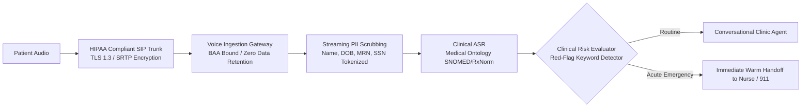
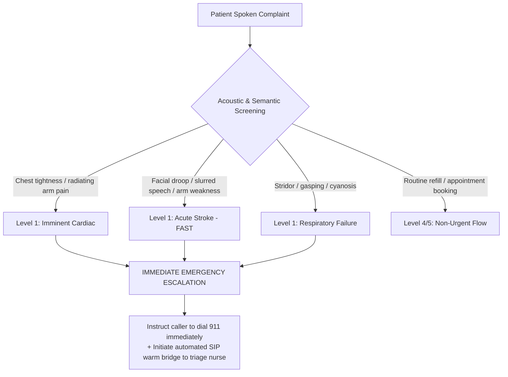

# Healthcare Clinical Triage, HIPAA Compliance & Emergency Protocols

> **Specification ID**: `SPEC-VRT01`  
> **Status**: Production Ready  
> **Target Audience**: Healthcare AI Architects, Clinical Informaticists, HIPAA Compliance Officers  
> **Key Standards**: HIPAA Security Rule (45 CFR Part 160/164), HITECH Act, Emergency Severity Index (ESI v4)

---

## 1. Regulatory Context: Voice in Healthcare

Under the Health Insurance Portability and Accountability Act (HIPAA), voice audio containing identifiable health information constitutes **electronic Protected Health Information (ePHI)**.



### Mandatory Legal Safeguards
1. **Business Associate Agreement (BAA)**: Every third-party vendor in the audio chain (SIP provider, STT, LLM, TTS) must execute a signed BAA.
2. **Zero Audio Retention**: Raw audio recordings cannot be stored on vendor servers for model training.
3. **Audit Trail**: Every access, transcription, and clinician handoff must generate an immutable, tamper-evident audit log with SHA-256 verification.

---

## 2. Real-Time PII & Clinical Entity Redaction

Patients frequently speak medical history and credentials in a single continuous stream. Sensitive entities must be redacted at the streaming token layer:

```
Raw Spoken Utterance:
"My name is Margaret Davis, born March 4th 1952, and my insulin dose is 40 units."

Streaming Redacted Transcript:
"[PATIENT_NAME: Margaret Davis], born [DOB: 1952-03-04], taking [MEDICATION: insulin] [DOSAGE: 40 units]."
```

### Ephemeral Storage Policy
- **Memory Buffers**: Audio packets held in volatile RAM only for the duration of the transcription window ($< 500\text{ms}$).
- **Log Sinks**: Server logs store only pseudonymized UUIDs: `patient_id: "urn:uuid:7f3a9..."`. Raw audio streams must never touch disk.

---

## 3. Clinical Triage & The Red-Flag Circuit Breaker

Voice AI in clinical settings must never diagnose, prescribe, or provide medical clearance. It operates strictly under **Emergency Severity Index (ESI)** classification:



### The 5 Cardinal Rules of Medical Voice Safety
1. **Upfront Identity & Limits**: Turn 1 must state: *"I'm an automated clinic assistant. If you are experiencing a life-threatening emergency, please hang up and call 911 immediately."*
2. **Never Triage Downward**: If a patient reports ambiguous chest pressure with indigestion, always assume cardiac until ruled out by a licensed clinician.
3. **Phonetic Medical Verification**: Never accept loose fuzzy matching on drug names. Distinguish acoustic look-alikes (*Celebrex* vs *Celexa*, *Zantac* vs *Zyrtec*).
4. **Number Spell-Back**: Always read back dosages with unit clarification: *"You stated four-zero units of insulin. Is that forty units?"*
5. **Fail-Safe Transfer**: If caller comprehension fails twice, execute an unconditional warm transfer to human triage.

---

## 4. Production Case Study: Medication Dosage Mishearing

### Incident
A patient called an automated prescription refill line requesting:
*"I need my clonidine refilled, point one milligrams."*
The generic ASR misrecognized the speech as:
*"I need my Klonopin refilled, 1.0 milligrams."*
The bot scheduled a refill for a ten-fold overdose of a controlled psychiatric sedative instead of an antihypertensive.

### Forensic Investigation
1. The ASR was a generic off-the-shelf consumer model lacking medical lexicon weighting.
2. The acoustic model failed to capture the unstressed word *"point"* due to low microphone gain.
3. No confirmation read-back was presented to the patient.

### The Corrective Production Architecture
```yaml
clinical_safety_rules:
  medical_lexicon: RxNorm_v2026
  acoustic_model_boost:
    - [clonidine, 0.95]
    - [klonopin, 0.95]
  verification_protocol:
    require_spell_back: true
    require_indication_check: true
    mandatory_readback_template: "You requested a refill for Clonidine, zero point one milligrams, for blood pressure. Please say Yes to confirm."
  pharmacist_routing_rules:
    sound_alike_look_alike_flag: true
    trigger_mandatory_pharmacist_review: true
```
