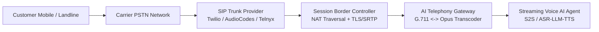
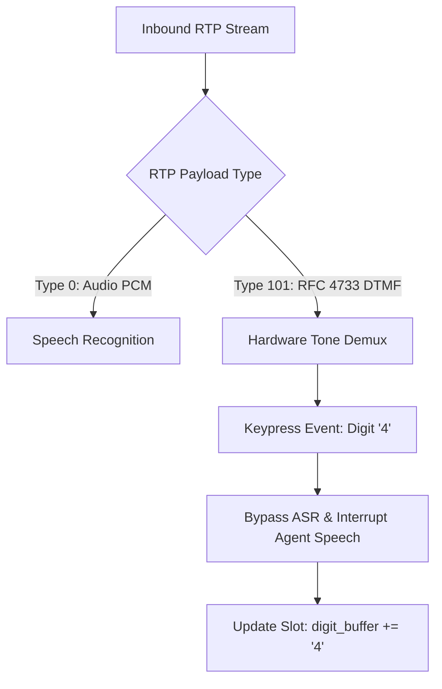
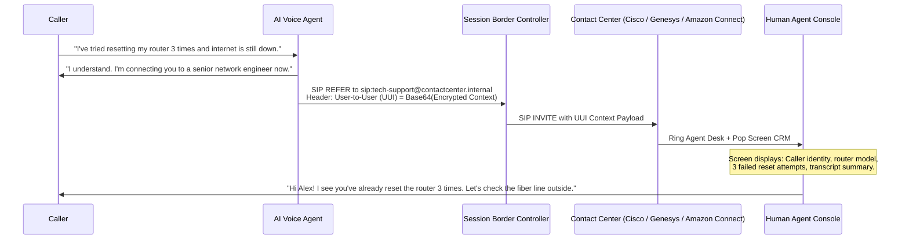

# Telephony SIP Trunking, PSTN Integration & Modern AI IVR

> **Specification ID**: `SPEC-VRT04`  
> **Status**: Production Ready  
> **Target Audience**: Telephony Architects, VoIP Engineers, Contact Center Solution Designers  
> **Key Standards**: RFC 3261 (SIP), RFC 4566 (SDP), RFC 4733 (DTMF Audio Telephony Events), ITU-T G.711

---

## 1. The Reality of Enterprise Telephony

While consumer voice apps leverage modern WebRTC with fullband Opus audio ($48\text{kHz}$), enterprise contact centers originate on legacy Public Switched Telephone Networks (PSTN) band-limited to **$8\text{kHz}$ narrowband audio ($300\text{--}3,400\text{ Hz}$)**.



---

## 2. Audio Transcoding & Frequency Mismatch

```
Frequency Spectrum Comparison:
0 Hz            300 Hz                  3,400 Hz                        8,000 Hz
┌──────────────────┬───────────────────────┬───────────────────────────────┐
│ Silence          │ PSTN G.711 Narrowband │ Acoustic Energy Lost in PSTN  │
│ Cutoff           │ Speech Passband       │ (Fricatives 's', 'f', 'th')   │
└──────────────────┴───────────────────────┴───────────────────────────────┘

0 Hz                                                                   24,000 Hz (Opus)
┌──────────────────────────────────────────────────────────────────────────────┐
│                    Modern Voice AI Superwideband / Fullband                  │
└──────────────────────────────────────────────────────────────────────────────┘
```

### Acoustic Engineering for PSTN
- **Fricative Confusion**: In $8\text{kHz}$ audio, consonants like *"s"* ($4\text{--}7\text{kHz}$) and *"f"* ($2\text{--}4\text{kHz}$) lose their high-frequency spectral markers, causing ASR models trained on pristine $16\text{kHz}$ audio to misrecognize names and street addresses.
- **Transcoding Standard**: Use G.711 $\mu$-law in North America/Japan; G.711 A-law in Europe/international.
- **Acoustic Upsampling**: Apply neural bandwidth extension to reconstruct missing upper harmonics before feeding into modern neural ASR models.

---

## 3. Dual-Tone Multi-Frequency (DTMF) Fallback (RFC 4733)

In loud environments (bus stops, airports) or when entering sensitive credentials (credit card, SSN), callers prefer or require keypad entry.



### Production Rules for DTMF
1. **Always Hybrid**: Every voice prompt requesting numbers must accept voice AND keypad concurrently: *"Please say or enter your 6-digit verification code."*
2. **Instant Audio Mute on Keypress**: The first DTMF tone must halt agent TTS playback within $\le 50\text{ms}$.
3. **Out-of-Band Packaging**: DTMF tones must never be decoded through acoustic ASR; they must arrive via RFC 4733 RTP payload packets to prevent tone corruption.

---

## 4. The Warm Transfer Protocol (SIP REFER & UUI)

The cardinal sin of enterprise IVR is the **Cold Blind Transfer**, where a caller explains their problem for 3 minutes to an AI bot, gets transferred to a human, and is immediately greeted with: *"Can you tell me your name and why you are calling today?"*.



### Metadata Passed in SIP User-to-User Information (UUI)
```json
{
  "session_id": "call-99214-af8b",
  "verified_caller_ani": "+14155550198",
  "customer_tier": "VIP_PLATINUM",
  "intent_resolved": "TECHNICAL_SUPPORT_ROUTER_FAIL",
  "bot_transcript_summary": "Customer attempted 3 manual hardware power cycles. Line status reports link-down on port 4.",
  "sentiment_score": "frustrated_calm",
  "authentication_level": "voiceprint_and_pin_verified"
}
```

---

## 5. Production Case Study: High Call Abandonment on Cold Transfers

### Incident
A national telecom enterprise deployed an AI conversational IVR. Customer Satisfaction (CSAT) scores plummeted by $28\text{ points}$, and call abandonment surged during transfers.

### Root Cause Analysis
1. The AI IVR held callers for an average of $2.8\text{ minutes}$ collecting account numbers, problem descriptions, and billing addresses.
2. Upon routing to human customer service, the SIP bridge dropped all session state and executed an unannounced SIP `BYE` followed by carrier blind transfer.
3. Callers waited on hold listening to generic music, and when the human agent answered, the agent had zero knowledge of the previous conversation.
4. $41\%$ of callers hung up within $30\text{ seconds}$ of being asked to repeat their information.

### The Solution Architecture
- Implemented SIP `REFER` with encrypted User-to-User Information (UUI) headers containing the complete structured intent summary and transcript.
- Built a CTI (Computer Telephony Integration) screen-pop webhook in Salesforce Service Cloud.
- **Result**: Average Handle Time (AHT) dropped by $92\text{ seconds}$ per transferred call; CSAT rebounded by $+34\text{ points}$.
