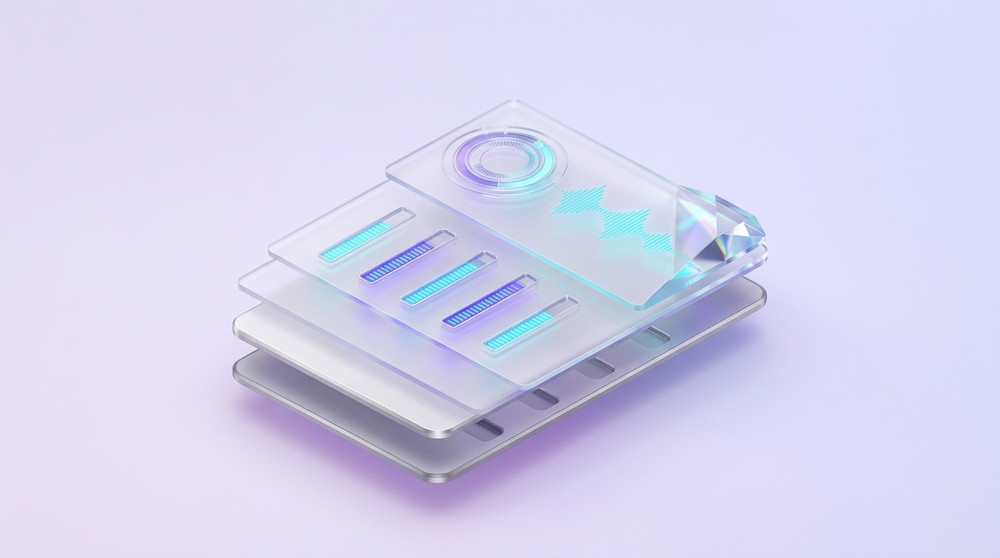
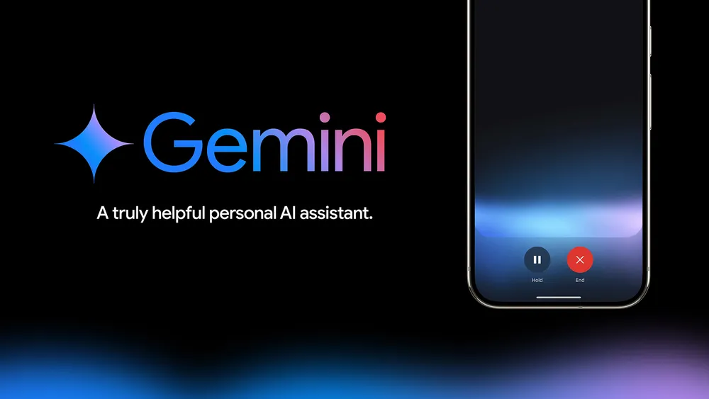
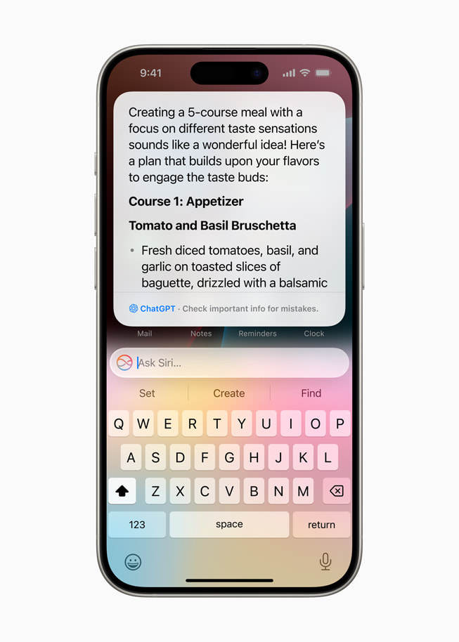
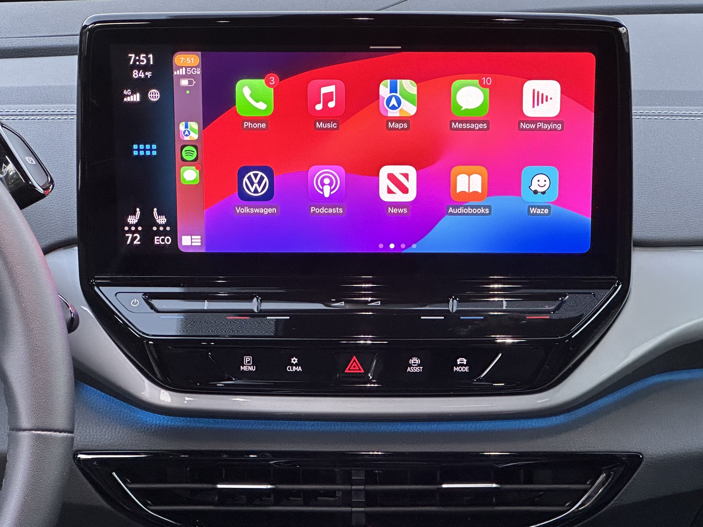

# Industry Benchmarks & Case Studies

> In-depth analysis of user experience (UX), conversational architecture, core breakthroughs, and residual constraints across five landmark Voice User Interfaces: OpenAI Advanced Voice, Google Gemini Live, Apple Intelligence Siri, Hume AI EVI, and Automotive VUI (Tesla/CarPlay).

---

## 1. Architectural & Performance Comparison Matrix

| Evaluation Dimension | OpenAI Advanced Voice | Google Gemini Live | Apple Intelligence Siri | Hume AI EVI | Tesla / CarPlay VUI |
|----------------------|-----------------------|--------------------|-------------------------|-------------|---------------------|
| **Core Architecture** | Speech-to-Speech (GPT-4o) | Speech-to-Speech (Gemini 2 / Live) | On-Device + Private Cloud Compute (Hybrid) | Empathic LLM + Prosodic EVI | Cascaded NLU / Intent Matching |
| **Average Latency** | ~320ms | ~300ms | 400–600ms | ~350ms | 250ms (Local in-vehicle commands) |
| **Barge-In Handling** | Sub-100ms acoustic cutoff; immediate playback halt upon speech onset | Ultra-low latency; supports multimodal barge-in interruptions | Moderate; relies primarily on physical buttons or screen tap | Exceptional; distinguishes hesitation from deliberate interruption | Coarse; typically requires waiting for turn completion |
| **Prosody & Affect** | Highly expressive, natural chuckles, whispers, and emotional modulation | Composed, calm, balanced intellectual pacing | Neutral, polished, functional executive assistant tone | State-of-the-art prosodic emotion sensing and mirroring | Terse, mechanical, strictly functional execution |
| **Primary Operating Context** | Open-ended conversation, language tutoring, creative exploration | Multimodal search, real-time camera spatial reasoning | Deep operating system actions (in-app intent execution) | Affective support, customer empathy, mental wellness | Eyes-busy, hands-busy driving environments |

---

## 2. In-Depth System Teardowns

### 1. OpenAI Advanced Voice Mode (GPT-4o)
* **UX Breakthroughs**:
  - Eliminates the cascaded STT-to-TTS seam entirely. The model natively processes user pitch, vocal timbre, speech rate, and breath intake.
  - On-demand prosodic modulation: shifts seamlessly between suspenseful narrative pacing, bedtime storytelling, or intimate whispers based on prompt nuances.
* **Residual UX Bottlenecks**:
  - Occasional false-positive barge-in triggered by non-linguistic user vocalizations such as laughter, coughs, or sharp exhalations.
  - Stringent safety filtering and synthetic voice constraints to prevent unauthorized biometric voice cloning and celebrity impersonation.

### 2. Google Gemini Live

*Official case: Google Gemini Live full-duplex conversational voice UI with real-time multimodal reasoning.*

* **UX Breakthroughs**:
  - **Simultaneous Multimodality (Real-Time Voice + Video Streaming)**: Users can direct their device camera at a mechanical issue or diagram while holding a fluid, natural voice conversation to diagnose root causes.
  - Deep, native grounding in the Google Knowledge Graph and workspace ecosystem (Google Maps, Calendar, Gmail, YouTube).
* **Residual UX Bottlenecks**:
  - Speaker diarization friction in noisy public environments, where ambient background voices can occasionally be mistaken for primary user intents.

### 3. Apple Intelligence Siri (Next Generation)

*Official case: Apple Intelligence Siri conversational interface integrating onscreen context and ChatGPT integration (Apple Newsroom).*

* **UX Breakthroughs**:
  - **Glowing Edge Display (Acoustic Visual Signifier)**: Replaces the isolated floating orb with an edge-to-edge organic light wave pulsating to speech rhythm, integrating system state directly into the physical hardware chassis.
  - **On-Screen Context Awareness**: Resolves deictic references deterministically (`"Send this photo to Nam"` -> automatically identifies the active image in the foreground viewport).
* **Residual UX Bottlenecks**:
  - Open-ended conversational agility and prosodic fluidity remain bounded compared to dedicated native Speech-to-Speech models.

### 4. Hume AI Empathic Voice Interface (EVI)

*Official case: Hume AI Empathic Voice Interface (EVI) real-time prosodic and affective speech visualizer.*

* **UX Breakthroughs**:
  - **Prosodic Emotion Graph**: Analyzes 48 distinct acoustic nuances in human speech (confusion, frustration, enthusiasm, anxiety).
  - Dynamically modulates assistant pitch, tempo, and vocal warmth to de-escalate tension or align empathetically with user emotional states.
* **Residual UX Bottlenecks**:
  - Susceptible to the "Uncanny Valley" if synthetic emotional expressiveness is exaggerated or misapplied to serious, factual inquiries.

### 5. Automotive VUI (Tesla Voice & Apple CarPlay)

*Real-world case: Volkswagen ID.4 wireless Apple CarPlay in-cabin voice and touchscreen visual integration.*

* **UX Breakthroughs**:
  - **Safety-First Ergonomics**: Engineered strictly for high-cognitive-load *Eyes-Busy, Hands-Busy* operational environments.
  - Ultra-terse spoken feedback (strictly under 10 words per confirmation).
  - Directional roof-mounted beamforming microphone arrays engineered to reject cabin tire hum and aerodynamic wind shear.
* **Residual UX Bottlenecks**:
  - Rigid slot-filling grammar; struggles with multi-turn conversational branching or ambiguous conversational repair.
