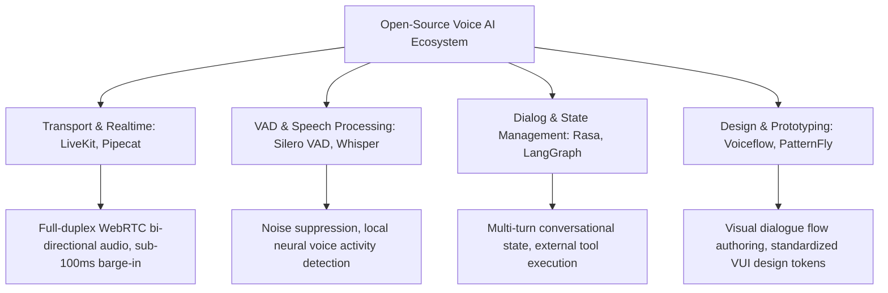
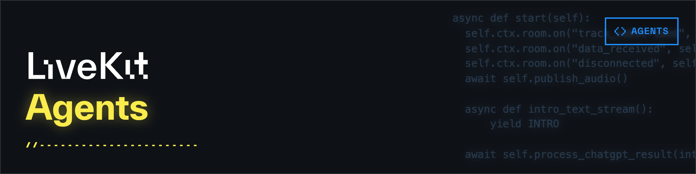

# Open-Source Repositories & Tooling

> Comprehensive survey of leading open-source GitHub frameworks, libraries, and design toolkits engineered for implementing, simulating, and validating Voice UX in production environments.

---

## 1. Open-Source Voice UX Ecosystem Architecture

---

## 2. In-Depth Analysis of 5 Landmark Frameworks

### 1. LiveKit Agents ([github.com/livekit/agents](https://github.com/livekit/agents))

* **Core Purpose**: Industry-standard framework for building real-time, bi-directional full-duplex conversational voice agents over WebRTC.
* **Core Value for UX Designers**:
  - Delivers **seamless, sub-100ms barge-in** latency, truncating downstream playback tracks the instant user speech onset is detected.
  - Built-in multi-device audio clock synchronization and carrier-grade Acoustic Echo Cancellation (AEC).
  - Flexible orchestration across architectural tiers: supports cascaded pipelines (Deepgram + Claude/GPT + Cartesia) as well as native Speech-to-Speech backends (OpenAI Realtime API).

### 2. Pipecat AI ([github.com/pipecat-ai/pipecat](https://github.com/pipecat-ai/pipecat))

* **Core Purpose**: Open-source Python/WebRTC framework specializing in multi-stage audio, video, and multimodal conversational pipelines.
* **Core Value for UX Designers**:
  - Event-driven, modular flow-based architecture enabling granular pipeline interception.
  - Native support for **Conversational Fillers** (automatically injecting subtle earcons or bridging phrases when backend processing latency exceeds 600ms).
  - Synchronized coordination between companion Webview graphic surfaces and bi-directional audio dialogue streams.

### 3. Voiceflow Platform & Pattern Library
* **Core Purpose**: Collaborative design, rapid prototyping, and visual dialogue simulation platform for conversational products.
* **Core Value for UX Designers**:
  - Enables designers to craft complex, branching conversational logic and error states without writing code.
  - Generates high-fidelity interactive voice prototypes for Wizard of Oz experiments and empirical usability testing prior to production implementation.

### 4. Silero VAD ([github.com/snakers4/silero-vad](https://github.com/snakers4/silero-vad))
* **Core Purpose**: Ultra-lightweight (~1MB) deep learning Voice Activity Detection model for real-time speech boundary classification.
* **Core Value for UX Designers**:
  - Executes directly on-device in browser runtimes (WASM/ONNX) or mobile hardware with <10ms inference latency.
  - Delivers precise onset and offset speech boundary detection, reliably filtering out ambient keyboard typing, background coughs, and transient acoustic noise.

### 5. PatternFly Conversation Design Guidelines (Red Hat)
* **Core Purpose**: Enterprise open-source design system standardizing conversational UI components, dialog states, and human-computer interactions.
* **Core Value for UX Designers**:
  - Standardizes acoustic and visual signifiers: ambient "thinking" indicators, interactive confirmation cards, and respectful, non-blaming error states.
  - Provides rigorous conversational design specifications and design tokens for enterprise-scale Conversational AI deployments.
