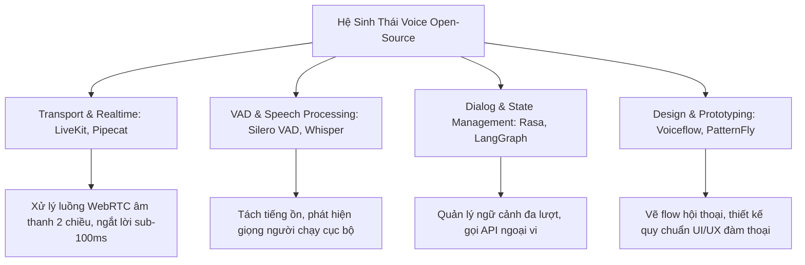

# Khảo Sát Các Framework & Thư Viện Mã Nguồn Mở (Open-Source Repositories & Tooling)

> Tổng hợp các công cụ, framework mã nguồn mở hàng đầu trên GitHub phục vụ việc hiện thực hóa và kiểm thử các thiết kế Voice UX trong môi trường sản phẩm thực tế.

---

## 1. Bản Đồ Hệ Sinh Thái Mã Nguồn Mở Cho Voice UX

---

## 2. Phân Tích 5 Framework Nổi Bật

### 1. LiveKit Agents ([github.com/livekit/agents](https://github.com/livekit/agents))
* **Mục đích**: Framework chuẩn mực để xây dựng Voice AI Agents đàm thoại hai chiều thời gian thực qua giao thức WebRTC.
* **Giá trị cốt lõi cho UX Designer**:
  - Hỗ trợ cơ chế **Barge-in mượt mà** với độ trễ phản ứng dưới 100ms.
  - Tự động đồng bộ âm thanh đa thiết bị và xử lý chống tiếng vọng (AEC) cấp độ công nghiệp.
  - Tích hợp linh hoạt với mọi mô hình AI: từ chuỗi STT-LLM-TTS (Deepgram + Claude/GPT + Cartesia) đến các mô hình Speech-to-Speech như OpenAI Realtime API.

### 2. Pipecat AI ([github.com/pipecat-ai/pipecat](https://github.com/pipecat-ai/pipecat))
* **Mục đích**: Framework mã nguồn mở bằng Python/WebRTC chuyên xây dựng các đường ống (pipelines) tương tác bằng giọng nói và video đa phương thức.
* **Giá trị cốt lõi cho UX Designer**:
  - Cung cấp kiến trúc module hóa theo dạng dòng chảy sự kiện (Flow-based events).
  - Tích hợp sẵn cơ chế **Conversational Fillers** (tự động phát âm bíp hoặc từ đệm khi tác vụ xử lý vượt quá 600ms).
  - Khả năng phối hợp linh hoạt giữa luồng hiển thị Webview và luồng âm thanh đàm thoại.

### 3. Voiceflow Platform & Pattern Library
* **Mục đích**: Nền tảng thiết kế, tạo mẫu nhanh (Prototyping) và kiểm thử kịch bản hội thoại trực quan.
* **Giá trị cốt lõi cho UX Designer**:
  - Cho phép Designer dựng các luồng hội thoại phân nhánh phức tạp mà không cần viết code.
  - Hỗ trợ tạo prototype giọng nói tương tác trực tiếp để làm các bài test người dùng (Usability Testing) trước khi kỹ sư bắt tay vào code.

### 4. Silero VAD ([github.com/snakers4/silero-vad](https://github.com/snakers4/silero-vad))
* **Mục đích**: Mô hình Deep Learning siêu nhẹ (~1MB) chuyên nhận diện hoạt động giọng nói (Voice Activity Detection).
* **Giá trị cốt lõi cho UX Designer**:
  - Chạy trực tiếp trên trình duyệt hoặc chip di động với độ trễ cực thấp (<10ms).
  - Giúp thiết kế VUI nhận biết chính xác khi nào người dùng bắt đầu mở lời và khi nào dừng lại, loại bỏ triệt để tiếng ồn gõ phím hoặc tiếng chó sủa ở hậu cảnh.

### 5. PatternFly Conversation Design Guidelines (Red Hat)
* **Mục đích**: Hệ thống thiết kế doanh nghiệp chuẩn hóa các mẫu tương tác đàm thoại.
* **Giá trị cốt lõi cho UX Designer**:
  - Quy chuẩn hóa các trạng thái hiển thị: chỉ báo "đang suy nghĩ", thẻ xác nhận hành động, và các thông báo lỗi văn minh.
  - Cung cấp mẫu tài liệu đặc tả thiết kế (Design Specs) cho các dự án Conversational AI quy mô lớn.
