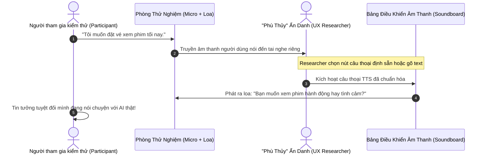
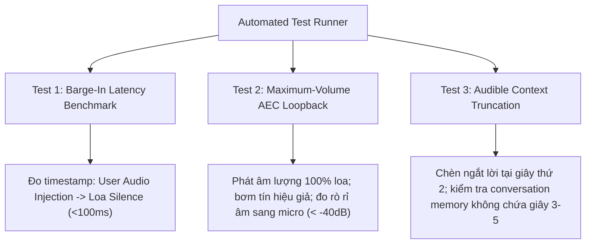

# Quy Trình Kiểm Thử Khả Dụng VUI (Wizard of Oz Usability Protocol & Metrics)

> Phương pháp "Phù thủy xứ Oz" (*Wizard of Oz - WoZ*) là tiêu chuẩn vàng trong nghiên cứu trải nghiệm Voice UX: Một chuyên viên nghiên cứu bí mật đóng vai cỗ máy AI để tương tác với người dùng trước khi đội ngũ kỹ thuật viết dù chỉ một dòng code.

---

## 1. Thiết Lập Mô Hình Phù Thủy Xứ Oz (WoZ Setup Architecture)

### Các Thành Phần Cần Chuẩn Bị:
1. **Phòng cách âm hoặc bàn thử nghiệm riêng biệt**: Người tham gia không nhìn thấy Researcher.
2. **Hệ thống TTS giả lập**: Researcher gõ phím hoặc chọn nhanh các mẫu câu đã thu âm sẵn để phát ra loa phòng thử nghiệm.
3. **Kịch bản nhiệm vụ (Task Prompts)**: Giao nhiệm vụ tự nhiên cho người dùng (ví dụ: *"Bạn hãy thử dùng giọng nói để đổi giờ chuyến bay sáng mai sang buổi chiều"*).

---

## 2. Kịch Bản Điều Phối Kiểm Thử 4 Giai Đoạn (4-Stage Testing Script)

### Giai Đoạn 1: Làm Quen & Phá Băng (Warm-up - 5 phút)
* **Mục tiêu**: Giúp người tham gia quen với việc nói chuyện vào một cái loa hoặc thiết bị vô hình.
* **Lời dặn Researcher**: *"Hôm nay bạn sẽ trải nghiệm một hệ thống trợ lý giọng nói mẫu. Hãy nói tự nhiên như đang nói chuyện bình thường. Nếu có gì bất tiện, đó là lỗi của hệ thống, hoàn toàn không phải lỗi của bạn."*

### Giai Đoạn 2: Nhiệm Vụ Luồng Suôn Sẻ (Happy Path Tasks - 10 phút)
* Yêu cầu người dùng thực hiện các tác vụ đơn giản: tra cứu thời tiết, đặt báo thức, tìm địa điểm ăn uống.
* **Quan sát**: Người dùng dùng từ ngữ gì? Họ có dùng cú pháp gò bó không? Tốc độ nói như thế nào?

### Giai Đoạn 3: Cố Tình Chèn Tình Huống Gây Lỗi (Edge Case & Error Stress Test - 15 phút)
* **Kỹ thuật WoZ**: "Phù thủy" cố tình kích hoạt lỗi:
  - Cố tình im lặng 4 giây (kiểm tra phản ứng khi không có phản hồi).
  - Cố tình nói sai 1 chi tiết nhỏ (kiểm tra xem người dùng sửa máy như thế nào).
  - Cố tình nói dông dài (xem người dùng có ngắt lời - barge-in không).

### Giai Đoạn 4: Phỏng Vấn Hậu Kiểm Thử (Debrief & Post-Interview - 10 phút)
* Đặt câu hỏi đo lường cảm xúc:
  - *"Bạn cảm thấy giọng điệu của trợ lý như thế nào? Có lúc nào bạn thấy khó chịu hay bực mình không?"*
  - *"Có khoảnh khắc nào bạn không biết mình phải nói gì tiếp theo không?"*

---

## 3. Các Chỉ Số Định Lượng Đánh Giá Trải Nghiệm VUI (Voice UX Metrics)

| Chỉ Số | Tên Tiếng Anh | Công Thức / Định Nghĩa | Ngưỡng Đạt Chuẩn (Benchmark) |
|--------|---------------|------------------------|------------------------------|
| **Tỷ Lệ Hoàn Thành Tác Vụ** | Task Completion Rate (TCR) | `(Số tác vụ thành công / Tổng số tác vụ) * 100` | **> 85%** |
| **Số Lượt Đàm Thoại Trung Bình** | Average Turns per Task (ATT) | Số lần người và máy qua lại để chốt xong 1 việc | Càng gần con số tối ưu càng tốt (thường 2 - 4 lượt) |
| **Tỷ Lệ Va Chạm Ngắt Lời** | Barge-in Friction Rate | Tỷ lệ số lần người dùng ngắt lời nhưng máy không nhận ra | **< 5%** |
| **Tỷ Lệ Lạc Luồng Đàm Thoại** | Conversational Dead-end Rate | Số lần người dùng phải kêu cứu hoặc bắt đầu lại từ đầu | **< 3%** |
| **Tỷ Lệ Lỗi Ý Niệm** | Concept Error Rate (CER) | Tỷ lệ hệ thống hiểu sai bản chất ý định (nghiêm trọng hơn lỗi chính tả WER) | **< 5%** |

---

## 4. Thang Đo Cảm Nhận Khả Dụng Âm Thanh (SAS - Subjective Acoustic Usability Scale)

Sau khi kiểm thử, người tham gia đánh giá 5 câu hỏi theo thang điểm từ 1 (Hoàn toàn không đồng ý) đến 5 (Hoàn toàn đồng ý):

1. *"Trợ lý ảo phản hồi nhanh chóng và đúng lúc."*
2. *"Các câu trả lời ngắn gọn, súc tích và dễ nhớ."*
3. *"Tôi dễ dàng ngắt lời hoặc đổi ý mà không gặp khó khăn gì."*
4. *"Khi có hiểu lầm, trợ lý ảo giúp tôi sửa lại vấn đề rất dễ dàng."*
5. *"Tôi cảm thấy thoải mái và tự nhiên khi giao tiếp bằng giọng nói với hệ thống này."*

👉 **Điểm trung bình mục tiêu**: **≥ 4.2 / 5.0**.

---

## 5. Quy Trình Kiểm Thử Kỹ Thuật Tự Động (Automated Technical Benchmark Testing)

Bên cạnh phương pháp Wizard of Oz tập trung vào cảm nhận con người, hệ thống **bắt buộc phải có kịch bản kiểm thử tự động bằng máy (Automated CI/CD Test Suite)** để xác thực 3 thuộc tính kỹ thuật mà con người không thể đo bằng mắt thường:

### Chi Tiết 3 Bài Test Kỹ Thuật Bắt Buộc:

| Bài Test | Phương Pháp Kiểm Tra | Tiêu Chuẩn Vượt Qua (Pass Criteria) |
|---|---|---|
| **Auto-T1: Barge-in Stop Latency** | Bơm file âm thanh ngắt lời giả lập vào luồng WebRTC khi bot đang nói câu 10 giây. Đo chênh lệch thời gian giữa packet âm thanh đầu tiên của user và packet cuối cùng của bot. | `p50 < 80ms`, `p95 < 100ms` |
| **Auto-T2: Max-Volume AEC Loopback** | Cho loa phát nhạc và phát giọng nói TTS ở mức 100% volume trong phòng kín. Micro thu âm liên tục và kiểm tra qua bộ lọc AEC. | Tín hiệu tự lọt vào micro phải `< -40dBFS`; không kích hoạt false-positive VAD. |
| **Auto-T3: Context Truncation Assert** | Bot đang đọc danh sách: *"1, 2, 3, 4, 5"*. Giả lập ngắt lời ngay khi từ *"2"* vừa phát xong. Kiểm tra object session state trong database. | Lịch sử đàm thoại `context.messages` chỉ chứa *"1, 2"*; hoàn toàn vắng mặt *"3, 4, 5"*. |
