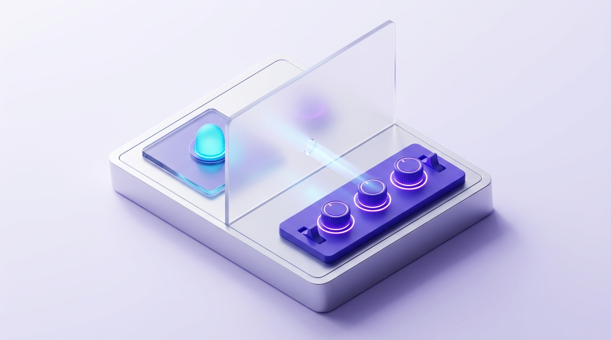
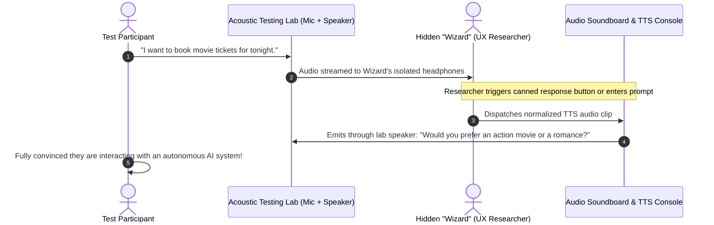
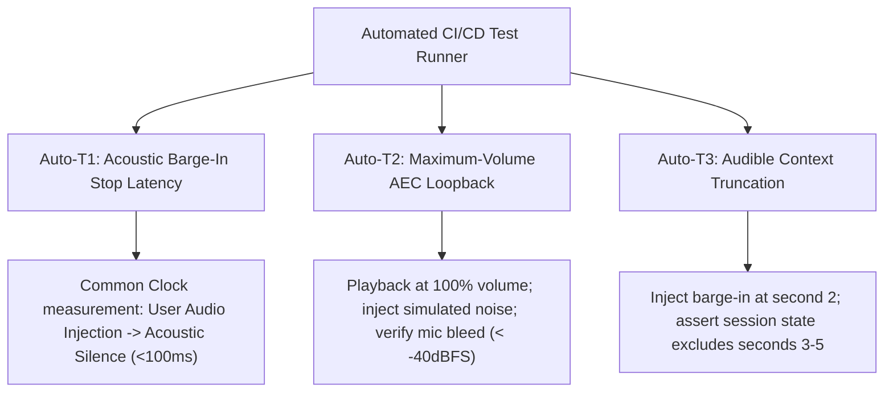

# VUI Usability Testing Protocol & Metrics

> The "Wizard of Oz" (WoZ) methodology represents the gold standard in Voice UX empirical research: a hidden researcher simulates the conversational AI system, interacting with participants in real time before engineers write a single line of production code.

---

## 1. Wizard of Oz Architecture & Setup

### Essential Hardware & Software Components:
1. **Acoustic Isolation**: Participant and Researcher are physically separated; the participant cannot see or directly hear the Wizard's physical actions.
2. **Simulated Soundboard & Fast TTS Console**: Researcher triggers pre-recorded audio snippets via keyboard macros or types text prompts that are immediately verbalized through neural TTS.
3. **Realistic Task Prompts**: Realistic, scenario-based prompts assigned to participants without dictating rigid vocal phrasing (e.g., *"Try using your voice to reschedule tomorrow morning's flight to the afternoon"*).

---

## 2. 4-Stage Usability Testing Protocol

### Stage 1: Warm-Up & Psychological Safety (5 minutes)
* **Objective**: Acclimate the participant to speaking into a headless, invisible acoustic interface.
* **Researcher Framing**: *"Today you will test a prototype voice assistant. Please speak naturally as you would in everyday conversation. If anything goes wrong, it is entirely the system's fault, never yours."*

### Stage 2: Happy Path Execution (10 minutes)
* Participants execute baseline tasks: checking weather forecasts, setting alarms, querying local dining recommendations.
* **Observational Focus**: What vocabulary and syntax do participants naturally select? Do they constrain their speech artificially? What is their baseline speaking rate and pause duration?

### Stage 3: Edge Case & Error Stress Testing (15 minutes)
* **WoZ Injections**: The Wizard intentionally introduces simulated system failures:
  - Injects a 4-second artificial delay (evaluates participant response to unannounced dead air).
  - Injects a minor factual misunderstanding (evaluates how effortlessly users initiate conversational repair).
  - Delivers an overly verbose synthetic response (tests whether the user attempts natural barge-in).

### Stage 4: Post-Test Debrief & Qualitative Interview (10 minutes)
* Structured affective inquiry:
  - *"How did the assistant's cadence and tone feel? Were there moments that felt frustrating or awkward?"*
  - *"Was there any point where you felt disoriented and did not know what to say next?"*

---

## 3. Quantitative Voice UX Metrics

| Metric | Formal Identifier | Definition / Formula | Target Benchmark |
|--------|-------------------|----------------------|------------------|
| **Task Completion Rate** | Task Completion Rate (TCR) | `(Successful Tasks / Total Tasks) * 100` | **> 85%** |
| **Average Turns per Task** | Average Turns per Task (ATT) | Total conversational turns exchanged to settle an intent | As close to theoretical optimum as possible (typically 2–4 turns) |
| **Barge-In Friction Rate** | Barge-In Friction Rate | Percentage of attempted user interruptions not acknowledged by system | **< 5%** |
| **Conversational Dead-End Rate** | Conversational Dead-End Rate | Frequency of catastrophic failure requiring manual bailout or session reset | **< 3%** |
| **Concept Error Rate** | Concept Error Rate (CER) | Frequency of semantic intent misclassification (distinct from acoustic WER) | **< 5%** |

---

## 4. Subjective Acoustic Usability Scale (SAS)

Following the session, participants evaluate 5 standardized statements on a 1 (Strongly Disagree) to 5 (Strongly Agree) Likert scale:

1. *"The voice assistant responded promptly and at the right conversational tempo."*
2. *"Responses were concise, easy to comprehend, and effortless to remember."*
3. *"I could easily interrupt or change my mind without friction or delay."*
4. *"When a misunderstanding occurred, the assistant guided me through recovery seamlessly."*
5. *"I felt comfortable and natural communicating with this system via voice."*

👉 **Target Usability Benchmark**: **Mean Score ≥ 4.2 / 5.0**.

---

## 5. Automated Technical Benchmark Testing (CI/CD Quality Gates)

Complementing the human-centered Wizard of Oz protocol, voice products **must enforce an automated technical benchmark test suite in CI/CD pipelines** to validate three core acoustic and latency properties that cannot be measured accurately with human perception alone:

### Detailed Automated Technical Test Suite:

| Test Identifier | Empirical Verification Methodology | Mandatory Pass Criteria |
|---|---|---|
| **Auto-T1: Acoustic Barge-In Stop Latency** | Injects a calibrated synthetic interruption audio sample into the WebRTC stream while the assistant is mid-playback of a 10-second utterance. **Measured on a Common Clock from user onset timestamp to the final acoustic sample physically exiting the DAC/speaker diaphragm (including draining OS playback & jitter buffers)**. *(Note: Measuring network transport packet cancellation alone is insufficient, as un-drained local playback buffers will continue to talk over the user).* | `p50 < 80ms`, `p95 < 100ms` (acoustic silence); Transport packet cancellation: `p50 < 40ms` |
| **Auto-T2: Max-Volume AEC Loopback** | Streams synthetic speech and music through device speakers at 100% volume in an enclosed acoustic test chamber. Simultaneously captures continuous microphone input processed through hardware/software AEC. | Residual loopback audio bleed into microphone stream must remain `< -40dBFS`; zero false-positive VAD triggers. |
| **Auto-T3: Audible Context Truncation Assert** | Assistant recites an enumerated prompt: *"1, 2, 3, 4, 5"*. Injects a simulated user barge-in interruption immediately after the word *"2"* is physically voiced. Asserts state against the session state database. | Conversation history in `context.messages` contains only *"1, 2"*; completely omitting unvoiced tokens *"3, 4, 5"*. |
