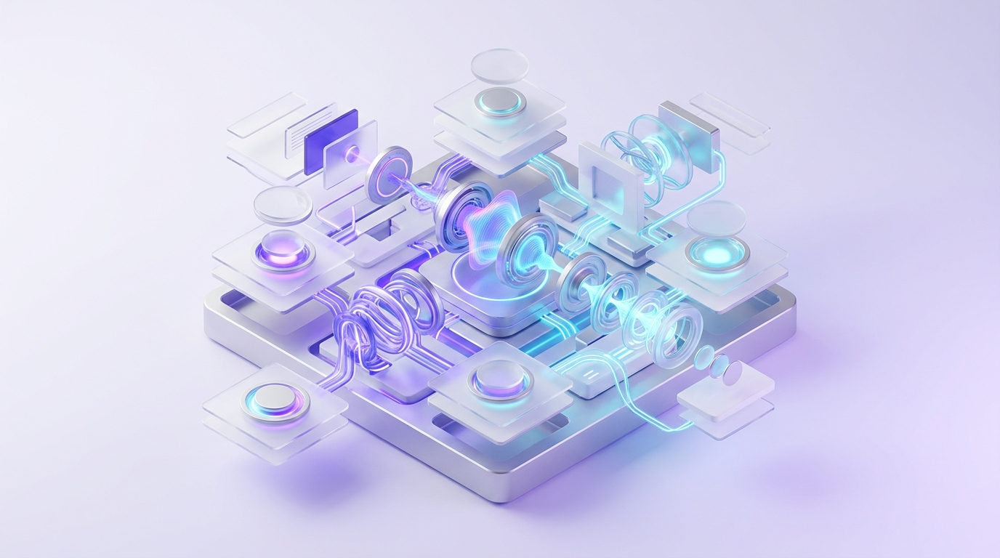

# DESIGN:OS Voice UX

> Production-ready Voice User Interface (VUI) & Conversational AI Knowledge Base, Interaction State Machines, Latency Budgets, and Audited Usability Testing Protocols.
> Part of the [DESIGN:OS](https://github.com/jangtrinh) open-source ecosystem.

[](./LICENSE)
[](./04-AUDIT-REPORT.md)
[-brightgreen.svg)](./README.md)
[-orange.svg)](./vi/README.md)

🌐 **Languages**: **English (Primary)** | [Tiếng Việt (Bản tiếng Việt)](./vi/README.md)



---

## 🗺️ Knowledge Architecture

```mermaid
graph TD
    A["DESIGN:OS Voice UX"] --> B["01. Foundations"]
    A --> C["02. Interaction Patterns"]
    A --> D["03. Conversational Design System"]
    A --> E["04. Benchmarks & Tooling"]
    A --> F["05. 5-Persona Debate"]
    A --> G["06. Checklists & Testing"]
    A --> H["07. Interactive Pedagogy"]

    B --> B1["Mental Models & Affordance"]
    B --> B2["Conversational Psychology"]
    B --> B3["NN/g VUI Heuristics"]

    C --> C1["Turn-Taking & Barge-In"]
    C --> C2["Error Recovery & Repair"]
    C --> C3["Earcons & Audio Feedback"]
    C --> C4["Multimodal Handshake"]

    D --> D1["Persona & Tone of Voice"]
    D --> D2["Prompt & Dialog Engineering"]
    D --> D3["Latency Budgets & Pacing"]

    E --> E1["Industry Benchmarks"]
    E --> E2["Open Source Frameworks"]

    F --> F1["Architect vs UX vs Security"]

    G --> G1["Design Review Checklist"]
    G --> G2["Wizard of Oz Usability Protocol"]

    H --> H1["10 Core Specifications"]
    H --> H2["7 Canonical Sources"]
    H --> H3["Interactive Academy Demo"]
```



---

## 📋 Audit Pack & Governance Documents

- **[`01-MANIFEST.md`](./01-MANIFEST.md)**: Inventory of all 28 core specifications with Purpose, Audience, Lifecycle Status, and Empirical Evidence.
- **[`02-AUDIT-BRIEF.md`](./02-AUDIT-BRIEF.md)**: Operational context, reference voice architectures (WebRTC / Native S2S), and 5 fatal failure modes.
- **[`03-AUDIT-RUBRIC.md`](./03-AUDIT-RUBRIC.md)**: 100-Point scoring rubric across 4 pillars and 6 non-negotiable Hard-Fail Gates.
- **[`04-AUDIT-REPORT.md`](./04-AUDIT-REPORT.md)**: Official verification report (92/100 Points, Tier 1 Production Ready certification).
- **[`CONTEXT.md`](./CONTEXT.md)**: Canonical domain glossary and standardized terminology (Canonical Terms vs Anti-terms).

---

## 📚 Core Specifications

### [01. Foundations (VUI Cognitive Foundations)](./01-foundations/)
- **[`mental-models-and-affordance.md`](./01-foundations/mental-models-and-affordance.md)**: Bridging Don Norman's *Gulf of Execution* in invisible interfaces. Acoustic signifiers, ephemeral audio dynamics, and mental model scaffolding.
- **[`conversational-psychology.md`](./01-foundations/conversational-psychology.md)**: Grice's 4 Conversational Maxims, turn construction units, and Cowan's working memory capacity (4-chunk limit).
- **[`vui-heuristics.md`](./01-foundations/vui-heuristics.md)**: Translating Nielsen Norman Group's (NN/g) 10 Usability Heuristics into audio-first conversational environments.

---

### [02. Interaction Patterns (Conversational Mechanics)](./02-interaction-patterns/)
- **[`turn-taking-and-barge-in.md`](./02-interaction-patterns/turn-taking-and-barge-in.md)**: Natural interruption handling (<80ms acoustic onset), Semantic End-of-Turn prediction, state rollback, and Audible Boundary Truncation.
- **[`error-recovery-and-repair.md`](./02-interaction-patterns/error-recovery-and-repair.md)**: Conversational repair architecture, 3-tier progressive re-prompting, and non-blaming error culture.
- **[`audio-feedback-and-earcons.md`](./02-interaction-patterns/audio-feedback-and-earcons.md)**: Earcon acoustics, sonic branding, and frequency allocation across core assistant states (Listening, Thinking, Speaking).
- **[`multimodal-handshake.md`](./02-interaction-patterns/multimodal-handshake.md)**: Voice + GUI orchestration, Hands-busy/Eyes-free contexts, and selective Visual Offloading.

---

### [03. Conversational Design System (Production Standards)](./03-conversational-design-system/)
- **[`persona-and-tone.md`](./03-conversational-design-system/persona-and-tone.md)**: 4-axis persona framework, avoiding the Uncanny Valley, mitigating the ELIZA effect, and functional empathy.
- **[`prompt-and-dialog-engineering.md`](./03-conversational-design-system/prompt-and-dialog-engineering.md)**: Writing for the ear, Voice LLM System Prompt architecture, and SSML prosodic markers.
- **[`latency-budgets.md`](./03-conversational-design-system/latency-budgets.md)**: Conversational latency budgeting (<400ms target), conversational acoustic fillers, and streaming playback pipelines.

---

### [04. Benchmarks & Tooling (Empirical Field Research)](./04-benchmarks-and-case-studies/)
- **[`industry-benchmarks.md`](./04-benchmarks-and-case-studies/industry-benchmarks.md)**: Technical and UX comparative breakdown of OpenAI Realtime Voice, Google Gemini Live, Apple Siri, Hume AI EVI, and Tesla/CarPlay VUI.
- **[`open-source-repos-and-tools.md`](./04-benchmarks-and-case-studies/open-source-repos-and-tools.md)**: Architecture analysis of LiveKit Agents, Pipecat AI, Silero VAD, and Red Hat PatternFly Conversation Design.

---

### [05. 5-Persona Debate (Strategic Trade-offs)](./05-debate-and-tradeoffs/)
- **[`5-persona-debate.md`](./05-debate-and-tradeoffs/5-persona-debate.md)**: 5-way debate between Architect, Security Engineer, Performance Specialist, UX Lead, and Devil's Advocate on speech-to-speech models, privacy, and voice anti-patterns.

---

### [06. Checklists & Usability Testing (QA & Protocols)](./06-checklists-and-heuristics/)
- **[`vui-design-checklist.md`](./06-checklists-and-heuristics/vui-design-checklist.md)**: 25-item production release acceptance checklist.
- **[`usability-testing-protocol.md`](./06-checklists-and-heuristics/usability-testing-protocol.md)**: Wizard of Oz (WoZ) test protocol, 4-phase test script, metrics (TCR, CER, SAS), and automated CI/CD audio test suites (Auto-T1, Auto-T2, Auto-T3).

---

### [07. Interactive Pedagogy (Academy & Evidence-Based Learning)](./07-interactive-pedagogy/)
Operationalizing Voice UX knowledge into interactive, slide-by-slide learning curricula (Learn Mode vs. Test Mode). Backed by 7 canonical industry sources.
- **[`README.md`](./07-interactive-pedagogy/README.md)**: Master index, interactive pedagogy framework, and cross-source evidence matrix.
- **[`01-learning-principles.md`](./07-interactive-pedagogy/01-learning-principles.md)**: Mayer's Multimedia Learning Theory, Active Learning (Freeman et al. PNAS), and the 6-stage pedagogy loop.
- **[`02-conversation-design-rules.md`](./07-interactive-pedagogy/02-conversation-design-rules.md)**: Cognitive load, Cowan's 4-chunk working memory ceiling, The One Breath Test (<25 words), and Gricean Maxims.
- **[`03-turn-taking-latency-repair.md`](./07-interactive-pedagogy/03-turn-taking-latency-repair.md)**: 200ms conversational cadence, Sub-100ms barge-in with Audible Boundary Truncation, acoustic fillers, and non-blaming repair.
- **[`04-feedback-scaffolding.md`](./07-interactive-pedagogy/04-feedback-scaffolding.md)**: 4-tier progressive hint ladder (Nudge → Principle → Next Step → Solution) and Alexa 3-tier progressive reprompting.
- **[`05-exercises-simulations.md`](./07-interactive-pedagogy/05-exercises-simulations.md)**: 5 pedagogical primitives: Locate, Tune, Repair, Predict, and Adversarial Sandbox.
- **[`06-assessment-mastery.md`](./07-interactive-pedagogy/06-assessment-mastery.md)**: Free vs. Pro tiering and 5 quantitative certification rubrics with telemetry benchmarks.
- **[`07-accessibility-inclusive-voice.md`](./07-interactive-pedagogy/07-accessibility-inclusive-voice.md)**: Earcon + Haptic + Visual trio feedback and Apple HIG audio session management (Audio Ducking).
- **[`08-ai-voice-safety-trust.md`](./07-interactive-pedagogy/08-ai-voice-safety-trust.md)**: Mandatory AI disclosure (EU AI Act), calibrated uncertainty (<0.75 confidence routing), and audio privacy.
- **[`09-source-comparison-matrix.md`](./07-interactive-pedagogy/09-source-comparison-matrix.md)**: Cross-vendor comparison matrix (Apple, Google, Alexa, OpenAI, LiveKit, Brilliant, Uxcel).
- **[`10-evidence-cards.md`](./07-interactive-pedagogy/10-evidence-cards.md)**: Official empirical evidence ledger (EVID-PD01 to EVID-PD10).
- **[`sources/`](./07-interactive-pedagogy/sources/)**: Canonical extracts from Apple HIG, Google CxD, Amazon Alexa, OpenAI Realtime, LiveKit, Brilliant, and Uxcel.

---

## 🎮 Interactive Academy Demo Player

An executable interactive prototype is available at [`demo/index.html`](./demo/index.html).

The player implements the Interactive Pedagogy specifications through an Uxcel/Brilliant-inspired micro-learning architecture featuring two distinct modes:

| Mode | Pedagogical Focus | Interaction Model |
|---|---|---|
| **📖 Learn Mode** | Guided exploration of acoustic mental models. | Interactive Graphic UI Visuals (Floor Timeline, Waveform Endpointing, Latency Waterfall, Barge-in States). |
| **🎯 Test Mode** | Formative skill assessment without passive text. | Direct tactile challenges (Timeline Error Spotter, Waveform Boundary Setter, Pipeline Node Repair, Debounce Filter Tuning). |

To run the interactive player locally:
```bash
open demo/index.html
```

---

## 🎯 VUI Maturity Levels

1. **Level 1 — Command & Control (Unidirectional Dispatch)**:
   - Static, rigid trigger commands (*"Turn on lights"*, *"Set timer 5 minutes"*).
   - Zero conversational context; no cross-turn memory.
2. **Level 2 — Slot-Filling Dialogue (Form-Based)**:
   - Decision-tree or static form-filling dialogue (e.g., origin → destination → departure date).
   - Brittle error handling requiring exact keyword corrections.
3. **Level 3 — Cascaded Conversational Agent (Sequential Multi-Turn)**:
   - Cascaded STT → LLM → TTS architecture.
   - Rich natural language understanding across multiple turns; however, latency is high (1–2s) and barge-in is clumsy.
4. **Level 4 — Native Speech-to-Speech Agent (Real-Time Duplex)**:
   - Continuous bidirectional audio stream (Full-Duplex) with sub-400ms latency.
   - Semantic interruption handling, prosody awareness, and expressive vocal inflections.
