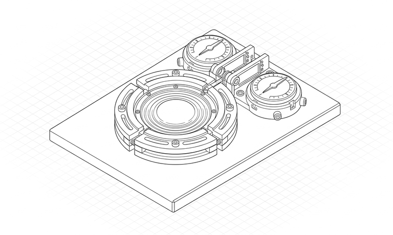

# DESIGN:OS Voice UX & AI Agent Architecture (`design-os-voice-ux`)

**Production engineering handbook, full-duplex barge-in state machines, sub-500ms latency budgets, and 6-dimension audit rubric for real-time voice AI agents.**

Design and audit voice AI experiences that handle interruptions gracefully, mask tool-call latency with natural earcons/fillers, and degrade cleanly across noisy mobile networks.

<p align="center">
  
</p>

<p align="center">
  <a href="LICENSE"></a>
  
  <a href="commands/doctor.md"></a>
  <a href="https://jangtrinh.github.io/design-os-voice-ux/"></a>
  <a href="https://buymeacoffee.com/jangtrinh"></a>
</p>

<p align="center">
  <a href="#quickstart">Quickstart</a> · <a href="#what-it-makes">What it makes</a> · <a href="#installation">Install</a> · <a href="#how-it-works">How it works</a> · <a href="#commands--diagnostics">Commands</a> · <a href="#quality-bar--limitations">Limits</a>
</p>

---

## Why this exists

Most voice AI demos work in a quiet room when the user speaks in complete sentences and waits politely, then collapse in production when users interrupt (`barge-in`), pause mid-thought, or trigger slow tool calls. **`design-os-voice-ux`** codifies the systems engineering and interaction design required for sub-500ms full-duplex voice agents.

| Dimension | Generic AI / Manual Workflow | DESIGN:OS Voice UX (`DESIGN:OS`) |
| :--- | :--- | :--- |
| **Turn-Taking & Barge-In** | Half-duplex walkie-talkie pipelines that talk over the user | Full-duplex FSM with VAD debounce and <200ms TTS cancellation |
| **Latency Budgeting** | Unbounded 3-second silences while waiting for LLM + TTS | Stage-by-stage p50/p95 latency budgets (VAD + STT + LLM TTFT + TTS first byte < 500ms) |
| **Tool-Call Handling** | Dead air while an external API executes | Tiered acoustic fillers, progress earcons, and async state confirmation |
| **Modality Handoff** | Forcing voice to read out 16-digit URLs or tables | Multimodal voice + visual card synchronization for high-density data |
| **Privacy & Telemetry** | Opaque cloud telemetry or unverified third-party APIs | **Zero telemetry** — 100% local execution ([`PRIVACY.md`](PRIVACY.md) audited) |

---

## Quickstart

### 1. Install the plugin or CLI

**In Claude Code:**

```text
/plugin marketplace add jangtrinh/design-os-voice-ux
/plugin install design-os-voice-ux@design-os-voice-ux
```

**Or from your terminal (Codex, Gemini CLI, Antigravity, OpenCode, or standalone CLI):**

```bash
git clone https://github.com/jangtrinh/design-os-voice-ux.git
cd design-os-voice-ux
python3 scripts/self_check.py
```

### 2. Ask in plain English

Open your project in your AI coding agent and describe what you need:

> "Audit our WebRTC voice agent architecture against the 6-dimension Voice UX rubric (latency, barge-in FSM, turn-taking, and error recovery)."

> "Design a full-duplex barge-in finite state machine with acoustic echo cancellation guards and <200ms TTS cut-off."

> "Create a tool-call latency choreography spec for a voice banking agent when downstream API calls take 800ms–2500ms."

### 3. Verify your setup

```bash
python3 scripts/self_check.py
```

---

## What it makes

Every deliverable produced by `design-os-voice-ux` is backed by a deterministic verification gate rather than freehand AI guesswork.

<p align="center">
  <br>
  <sub>Prompt: <code>"Audit our WebRTC voice agent architecture against the 6-dimension Voice UX rubric (latency, barge-in FSM, turn-taking, and error recovery)."</code></sub>
</p>

| Deliverable / Mode | Best for | Output Format | Verification Gate |
| :--- | :--- | :--- | :--- |
| **Full-Duplex Barge-In FSM** | Specifying exact state transitions across `LISTENING`, `THINKING`, `SPEAKING`, and `INTERRUPTED` | `State Machine Spec + Mermaid` | `Zero deadlocks or double-talk states` |
| **Sub-500ms Latency Budget** | Allocating millisecond budgets across transport, VAD, ASR, LLM, and streaming TTS | `Latency Budget Table` | `p50 <= 500ms / p95 <= 900ms gate` |
| **6-Dimension Voice UX Audit** | Scoring an existing voice agent across turn-taking, prosody, repair, and safety | `Scored Audit Report` | `6-dimension rubric verification` |

---

## Installation

Choose the setup that matches your AI coding agent. Every option installs the same canonical skill (`skills/design-os-voice-ux/SKILL.md`) and `/doctor` diagnostic suite.

### Claude Code

Run these two commands inside Claude Code:

```text
/plugin marketplace add jangtrinh/design-os-voice-ux
/plugin install design-os-voice-ux@design-os-voice-ux
```

### OpenAI Codex

Install to your personal Codex skills directory:

```bash
git clone https://github.com/jangtrinh/design-os-voice-ux.git /tmp/design-os-voice-ux
mkdir -p ~/.codex/skills/design-os-voice-ux ~/.codex/prompts
cp -R /tmp/design-os-voice-ux/skills/design-os-voice-ux/* ~/.codex/skills/design-os-voice-ux/
cp /tmp/design-os-voice-ux/prompts/doctor.md ~/.codex/prompts/design-os-voice-ux-doctor.md
rm -rf /tmp/design-os-voice-ux
```

### Gemini CLI & Google Antigravity

```bash
git clone https://github.com/jangtrinh/design-os-voice-ux.git /tmp/design-os-voice-ux
mkdir -p ~/.gemini/skills/design-os-voice-ux
cp -R /tmp/design-os-voice-ux/skills/design-os-voice-ux/* ~/.gemini/skills/design-os-voice-ux/
rm -rf /tmp/design-os-voice-ux
```

### OpenCode, Cursor, Windsurf & Other Agent Harnesses

```bash
git clone https://github.com/jangtrinh/design-os-voice-ux.git /tmp/design-os-voice-ux
mkdir -p ~/.agents/skills/design-os-voice-ux
cp -R /tmp/design-os-voice-ux/skills/design-os-voice-ux/* ~/.agents/skills/design-os-voice-ux/
rm -rf /tmp/design-os-voice-ux
```

<details>
<summary>Verify or uninstall</summary>

**Verify installation:**

```bash
python3 scripts/self_check.py
```

Or run `/doctor` inside Claude Code / Codex to inspect installed skill paths, plugin manifests, and gate health.

**Uninstall:**

```bash
rm -rf ~/.claude/skills/design-os-voice-ux ~/.codex/skills/design-os-voice-ux ~/.gemini/skills/design-os-voice-ux ~/.agents/skills/design-os-voice-ux
```

</details>

---

## Usage & Prompt Cookbook

Once installed, `skills/design-os-voice-ux/SKILL.md` activates automatically when your prompt matches its domain triggers. Browse [`docs/cookbook.md`](docs/cookbook.md) for copy-paste prompt recipes.

**Generate & Scaffold**

```text
"Audit our WebRTC voice agent architecture against the 6-dimension Voice UX rubric (latency, barge-in FSM, turn-taking, and error recovery)."
```

**Audit & Verify**

```text
"Design a full-duplex barge-in finite state machine with acoustic echo cancellation guards and <200ms TTS cut-off."
```

**Export & Automate**

```text
"Create a tool-call latency choreography spec for a voice banking agent when downstream API calls take 800ms–2500ms."
```

---

## Commands & Diagnostics

| Command | Environment | What it does |
| :--- | :--- | :--- |
| `/doctor` | Claude Code / Codex | Read-only diagnostic check of installed skill paths, plugin manifests, and runtime prerequisites |
| `python3 scripts/self_check.py` | Terminal / CI | Deterministic offline verification of manifests, skill contracts, and governance files |
| `python3 scripts/self_check.py` | Terminal / CI | Verify Voice UX skill contracts, rubric references, and AI-Ready repository delivery files |

---

## How it works

1. **Intent Routing** — Your AI agent matches your request against `skills/design-os-voice-ux/SKILL.md` frontmatter triggers.
2. **Progressive Context Loading** — Only the entry-point `SKILL.md` router loads initially; detailed recipes and scripts load on demand.
3. **Deterministic Execution** — Domain scripts and contracts execute locally with reproducible inputs and outputs.
4. **Gate Verification** — `scripts/self_check.py` and domain verifiers (`python3 scripts/self_check.py`) validate the artifact before completion.
5. **Zero-Telemetry Delivery** — Verified files are written directly to your workspace with zero external network calls.

```text
User Prompt / CLI Invocation
            │
            ▼
┌───────────────────────────────────────────────┐
│ skills/design-os-voice-ux/SKILL.md
│ Progressive disclosure router & hard rules    │
└───────────┬───────────────────────────────────┘
            │ loads on demand
            ▼
┌───────────────────────────────────────────────┐
│ python3 scripts/self_check.py
│ Deterministic build & contract enforcement    │
└───────────┬───────────────────────────────────┘
            │ verifies
            ▼
┌───────────────────────────────────────────────┐
│ python3 scripts/self_check.py + /doctor       │
│ Zero-telemetry local verification gate        │
└───────────────────────────────────────────────┘
```

### What loads when

`design-os-voice-ux` uses progressive context disclosure so your agent's context window stays fast and focused:

| File | Loaded when |
| :--- | :--- |
| `skills/design-os-voice-ux/SKILL.md` | Always (~100–150 lines) — routing rules, triggers, and execution workflow |
| `docs/cookbook.md` | When selecting multi-step prompt recipes or domain patterns |
| `commands/doctor.md` / `prompts/doctor.md` | Only when running `/doctor` diagnostics |
| `llms.txt` | When indexed by AI answer engines, RAG pipelines, or repo crawlers |

---

## File structure

```text
design-os-voice-ux/
├── .claude-plugin/
│   ├── plugin.json                 # Claude Code plugin manifest
│   └── marketplace.json            # Claude Code marketplace catalog
├── .codex-plugin/
│   └── plugin.json                 # OpenAI Codex plugin & interface manifest
├── .agents/
│   └── plugins/marketplace.json    # Cross-agent local plugin registry
├── .factory-plugin/
│   ├── plugin.json                 # Factory / Droid plugin manifest
│   └── marketplace.json            # Factory marketplace metadata
├── skills/
│   └── design-os-voice-ux/
│       └── SKILL.md                # Canonical agent skill entrypoint
├── commands/
│   └── doctor.md                   # /doctor diagnostic slash command
├── prompts/
│   └── doctor.md                   # Codex diagnostic prompt mirror
├── scripts/
│   └── self_check.py               # Deterministic repository & skill self-check
├── docs/
│   ├── cookbook.md                 # Copy-paste prompt recipes by job
│   └── llms.txt                    # GEO / LLM discovery index
├── PRIVACY.md                      # Zero-telemetry & local-first privacy commitment
├── SECURITY.md                     # Vulnerability disclosure & security policy
├── CONTRIBUTING.md                 # Contribution workflow & verification rules
├── CODE_OF_CONDUCT.md              # Contributor Covenant code of conduct
├── CHANGELOG.md                    # Release history
├── llms.txt                        # Root LLM indexing manifest
├── LICENSE                         # MIT License
└── README.md
```

---

## Quality bar & Limitations

### It's working if...

- `python3 scripts/self_check.py` prints `ok: design-os-voice-ux self-check passed (design-os-voice-ux)` and exits `0`.
- `python3 scripts/self_check.py` passes with zero contract or test regressions.
- Your AI coding agent loads `skills/design-os-voice-ux/SKILL.md` automatically when given any prompt from [`docs/cookbook.md`](docs/cookbook.md).
- Network traffic during execution remains zero (guaranteed by [`PRIVACY.md`](PRIVACY.md)).

### When not to use

- Asynchronous voice-note transcription apps where real-time conversational turn-taking is not required.
- Training raw acoustic speech-to-text (ASR) neural network weights from scratch.
- Purely text-based chat interfaces with no audio/speech modality.

---

## DESIGN:OS Ecosystem

`design-os-voice-ux` is one of the 13 open-source engines in the **`DESIGN:OS`** ecosystem:

| Engine | Live Docs | Repository | Layer |
| :--- | :--- | :--- | :--- |
| **DESIGN:OS CLI** | [jangtrinh.github.io/design-os](https://jangtrinh.github.io/design-os/) | [`jangtrinh/design-os`](https://github.com/jangtrinh/design-os) | `cli` |
| **Knowledge Builder** | [jangtrinh.github.io/design-os-knowledge-builder](https://jangtrinh.github.io/design-os-knowledge-builder/) | [`jangtrinh/design-os-knowledge-builder`](https://github.com/jangtrinh/design-os-knowledge-builder) | `compiler` |
| **Figma Plugin & CLI** | [jangtrinh.github.io/design-os-figma-plugin](https://jangtrinh.github.io/design-os-figma-plugin/) | [`jangtrinh/design-os-figma-plugin`](https://github.com/jangtrinh/design-os-figma-plugin) | `plugin` |
| **SVG Animation Engine** | [jangtrinh.github.io/design-os-svg-animation](https://jangtrinh.github.io/design-os-svg-animation/) | [`jangtrinh/design-os-svg-animation`](https://github.com/jangtrinh/design-os-svg-animation) | `engine` |
| **3D Blender Agent** | [jangtrinh.github.io/design-os-3d-blender](https://jangtrinh.github.io/design-os-3d-blender/) | [`jangtrinh/design-os-3d-blender`](https://github.com/jangtrinh/design-os-3d-blender) | `3d / cad` |
| **OPAH ONE Drone** | [jangtrinh.github.io/design-os-drone-showcase](https://jangtrinh.github.io/design-os-drone-showcase/) | [`jangtrinh/design-os-drone-showcase`](https://github.com/jangtrinh/design-os-drone-showcase) | `hardware` |
| **GitHub Pages Engine** | [jangtrinh.github.io/design-os-github-page](https://jangtrinh.github.io/design-os-github-page/) | [`jangtrinh/design-os-github-page`](https://github.com/jangtrinh/design-os-github-page) | `pages` |
| **Apple Design OS** | [jangtrinh.github.io/design-os-apple](https://jangtrinh.github.io/design-os-apple/) | [`jangtrinh/design-os-apple`](https://github.com/jangtrinh/design-os-apple) | `swiftui` |
| **Agent Teacher** | [jangtrinh.github.io/design-os-pedagogy](https://jangtrinh.github.io/design-os-pedagogy/) | [`jangtrinh/design-os-pedagogy`](https://github.com/jangtrinh/design-os-pedagogy) | `pedagogy` |
| **Origami CAD** | [jangtrinh.github.io/design-os-origami](https://jangtrinh.github.io/design-os-origami/) | [`jangtrinh/design-os-origami`](https://github.com/jangtrinh/design-os-origami) | `packaging` |
| **Voice UX Architecture** | [jangtrinh.github.io/design-os-voice-ux](https://jangtrinh.github.io/design-os-voice-ux/) | [`jangtrinh/design-os-voice-ux`](https://github.com/jangtrinh/design-os-voice-ux) | `voice-ai` |
| **Code2Flow** | [jangtrinh.github.io/design-os-code2flow](https://jangtrinh.github.io/design-os-code2flow/) | [`jangtrinh/design-os-code2flow`](https://github.com/jangtrinh/design-os-code2flow) | `ast / audit` |
| **Generative UI** | [jangtrinh.github.io/design-os-generative-ui](https://jangtrinh.github.io/design-os-generative-ui/) | [`jangtrinh/design-os-generative-ui`](https://github.com/jangtrinh/design-os-generative-ui) | `runtime` |

---

## Contributing, Governance & License

- **Contributing**: See [`CONTRIBUTING.md`](CONTRIBUTING.md) for pull request guidelines and verification gates (`python3 scripts/self_check.py`).
- **Code of Conduct**: Governed by [`CODE_OF_CONDUCT.md`](CODE_OF_CONDUCT.md).
- **Security & Privacy**: Zero telemetry — see [`SECURITY.md`](SECURITY.md) and [`PRIVACY.md`](PRIVACY.md).
- **Changelog & LLM Index**: Track releases in [`CHANGELOG.md`](CHANGELOG.md) and machine-readable index in [`llms.txt`](llms.txt).
- **License**: [MIT](LICENSE) © [Jang Trinh](https://github.com/jangtrinh).

---

If `design-os-voice-ux` saves you time, a star on GitHub helps other engineers and AI agents find it.

<p align="left">
  <a href="https://buymeacoffee.com/jangtrinh">
    
  </a>
</p>
