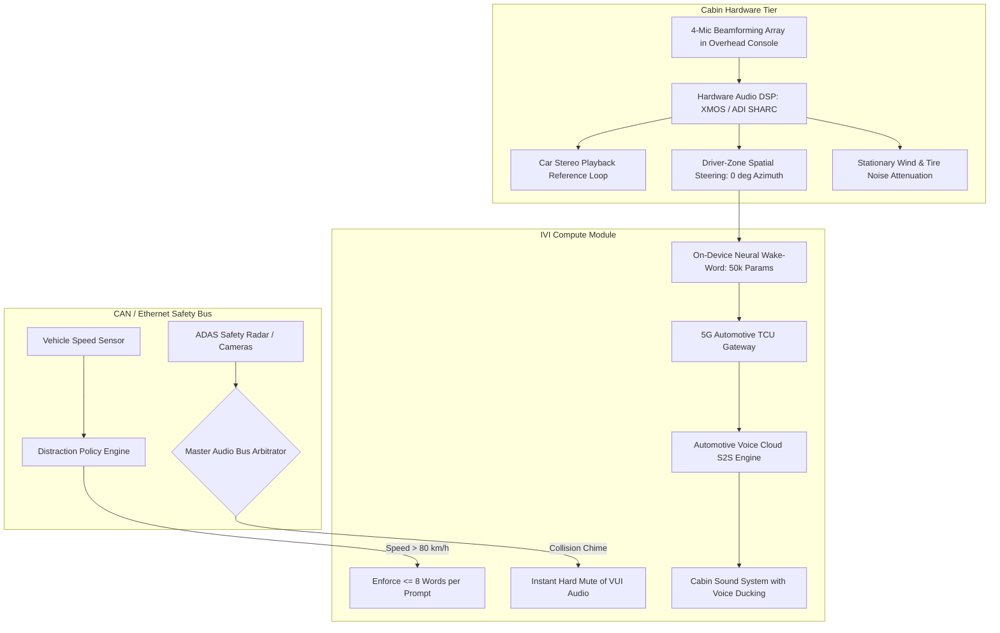

# Voice AI Reference Architectures

> Production blueprint topologies for WebRTC Native S2S, Carrier SIP Telephony, and Embedded Automotive Voice Systems.

---

## 1. Real-Time WebRTC Speech-to-Speech (S2S) Architecture

Engineered for browser and mobile applications demanding $< 800\text{ms}$ end-to-end turnaround and natural conversational prosody.

```mermaid
graph TD
    subgraph Client_Tier [Client Device (Browser / iOS / Android)]
        Mic[Microphone 16/48kHz] --> AFE[Acoustic Front-End: AEC + NS + AGC]
        AFE --> LocalVAD[Lightweight Edge VAD]
        LocalVAD --> PeerConn[WebRTC PeerConnection]
        PeerConn --> MediaTrack[(Opus RTP Media Track)]
        PeerConn --> DataChannel[(WebRTC DataChannel: Events & Control)]
        Speaker[Loudspeaker / Headset] <-- Playout[Audio Playout + Cosine Ramp]
        Playout <-- PeerConn
    end

    subgraph Edge_Gateway_Tier [Global WebRTC Media Gateway]
        MediaTrack --> TURN[TURN / STUN Ingress]
        TURN --> Gateway[Voice Edge Gateway: LiveKit / Daily / Janus]
        Gateway --> Decoupler[Audio Buffer Decoupler]
        DataChannel --> EventRouter[Barge-in & Truncation Event Bus]
    end

    subgraph Core_AI_Tier [Inference & Orchestration Cluster]
        Decoupler --> S2S[Native Speech-to-Speech Model<br/>OpenAI Realtime / Moshi / Gemini Live]
        EventRouter --> S2S
        S2S --> ToolDispatcher{Tool Call Emitted?}
        ToolDispatcher -->|Yes| FastFiller[Synthesize Contextual Acoustic Filler < 250ms]
        ToolDispatcher -->|Async| ExternalAPI[EHR / Database / REST API]
        ExternalAPI --> S2S
        FastFiller --> PlayoutStream[Stream Audio Chunks 20ms]
        S2S --> PlayoutStream
        PlayoutStream --> Gateway
    end
```

### Key Performance Specifications
- **Client Buffer Delay**: $20\text{--}40\text{ms}$.
- **Network Ingress Transport**: SRTP over UDP with in-band FEC.
- **Barge-in Interrupt Route**: Client-side data channel packet bypasses audio queue; halts server audio generation in $\le 45\text{ms}$.

---

## 2. Carrier-Grade SIP Trunking & AI IVR Architecture

Engineered for enterprise contact centers connecting PSTN telephone networks to conversational AI backends.

```mermaid
graph TD
    subgraph Telco_Network [Public Switched Telephone Network (PSTN)]
        Caller[Customer Mobile / Landline] --> Carrier[Telco Carrier: Verizon / AT&T / Vodafone]
        Carrier --> SIPTrunk[SIP Trunk Carrier: Twilio / Telnyx / Bandwidth]
    end

    subgraph Enterprise_DMZ [Enterprise Perimeter & Security]
        SIPTrunk --> SBC[Session Border Controller - SBC<br/>AudioCodes Mediant / Ribbon SBC SWe]
        SBC --> TLS_SRTP[SIP TLS 1.3 Signaling + SRTP Media]
        SBC --> CallRecording[Compliance Dual-Channel Recorder - HIPAA / PCI-DSS]
    end

    subgraph Telephony_AI_Gateway [Telephony Ingestion Tier]
        TLS_SRTP --> Gateway[SIP / RTP Bridge: FreeSWITCH / LiveKit SIP]
        Gateway --> Transcoder[Codec Transcoder: G.711u/a <-> 24kHz Opus]
        Gateway --> DTMFParser[RFC 4733 Out-of-Band DTMF Demultiplexer]
    end

    subgraph Agent_Orchestrator [Conversational Engine & CRM CTI]
        Transcoder --> ASR_S2S[Streaming ASR / S2S Voice Agent]
        DTMFParser --> DialogState[Conversational State Machine]
        DialogState --> Escalate{Human Handoff Triggered?}
        Escalate -->|Yes| SIPRefer[SIP REFER with Encrypted UUI Context]
        SIPRefer --> SBC
        SBC --> ContactCenter[Genesys Cloud / Amazon Connect / Cisco Webex]
        ContactCenter --> ScreenPop[Agent Desktop Screen Pop via CTI Webhook]
    end
```

### Key Telephony Specifications
- **Signaling Protocol**: SIP 2.0 (RFC 3261).
- **Audio Codec**: G.711 $\mu$-law ($64\text{ kbps}$) with automatic neural upsampling to $16\text{kHz}$.
- **DTMF Response Latency**: $\le 50\text{ms}$ audio cut upon keypad detection.
- **Handoff Mechanism**: SIP `REFER` with base64-encoded User-to-User Information (UUI) payload.

---

## 3. Embedded In-Cabin Automotive Voice Architecture

Engineered for ISO 15005 compliance, driver safety prioritization, and extreme acoustic noise resistance.



### Key Automotive Specifications
- **Cabin Ambient SNR**: Operational down to $-10\text{ dB}$ SNR at $110\text{ km/h}$.
- **Safety Preemption Latency**: Level 0 collision warning overrides voice playback in $0\text{ms}$ via hardware audio arbitrator bus.
- **Eyes-Free Compliance**: All driving interactions pass the NHTSA 2.0-second visual glance ceiling.
