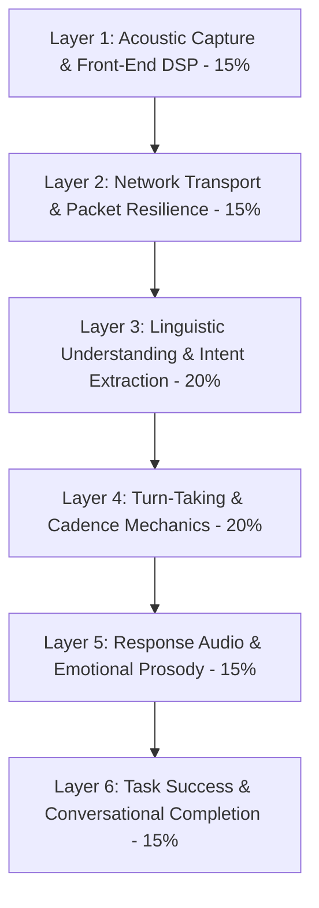

# Voice Quality Scorecard (VQS) & Unified Evaluation Rubric

> The definitive 6-layer quantitative evaluation framework for production-grade conversational Voice AI systems.

---

## 1. The Multi-Layer Voice Quality Hierarchy

A low Word Error Rate (WER) does not guarantee a successful voice product. If a system transcribes text with $98\%$ accuracy but takes $2.5\text{ seconds}$ to reply or talks over the user during interruptions, the experience is perceived as broken.

---

## 2. Quantitative Scoring Matrix

$$\text{VQS} = \sum_{i=1}^{6} w_i \cdot S_i \quad \left(\sum w_i = 1.0\right)$$

### Layer 1: Acoustic Capture & Front-End DSP ($w_1 = 0.15$)
- **Signal-to-Noise Ratio (SNR)**: $\ge 15\text{ dB}$ ($5\text{ pts}$).
- **POLQA Speech Quality (ITU-T P.863)**: $\ge 4.0\text{ MOS}$ ($5\text{ pts}$).
- **Echo Return Loss Enhancement (ERLE)**: $\ge 35\text{ dB}$ with zero false self-barge-ins ($5\text{ pts}$).

### Layer 2: Network Transport & Jitter Resilience ($w_2 = 0.15$)
- **End-to-End Network RTT**: $\le 60\text{ms}$ ($5\text{ pts}$).
- **Packet Loss Recovery via FEC/PLC**: $100\%$ audio continuity under $8\%$ burst packet loss ($5\text{ pts}$).
- **Jitter Buffer Adaptation**: Zero buffer starvation/overflow clicks on cell handover ($5\text{ pts}$).

### Layer 3: Linguistic Understanding & Intent Extraction ($w_3 = 0.20$)
- **Word Error Rate (WER)**: $\le 6.5\%$ on clean audio; $\le 9.0\%$ on far-field audio ($8\text{ pts}$).
- **Intent Classification F1-Score**: $\ge 0.94$ across multi-turn dialogs ($6\text{ pts}$).
- **Entity Slot Extraction F1-Score**: $\ge 0.92$ on alphanumeric codes, dates, and names ($6\text{ pts}$).

### Layer 4: Turn-Taking & Cadence Mechanics ($w_4 = 0.20$)
- **End-of-Utterance Latency (VAD to First Audio)**: $\le 750\text{ms}$ p90 ($8\text{ pts}$).
- **Barge-in Audio Halt Latency**: $\le 90\text{ms}$ with cosine fade-out ($6\text{ pts}$).
- **False Interruption Rate**: $< 2.0\%$ during user cognitive pauses ($6\text{ pts}$).

### Layer 5: Response Audio & Emotional Prosody ($w_5 = 0.15$)
- **Synthetic Speech Naturalness**: $\ge 4.2\text{ MOS}$ ($5\text{ pts}$).
- **Affective Grounding**: Automatic tempo/pitch adaptation to user emotional state ($5\text{ pts}$).
- **Paralinguistic Acoustic Fillers**: Injected within $\le 300\text{ms}$ during long tool execution ($5\text{ pts}$).

### Layer 6: Task Success & Completion ($w_6 = 0.15$)
- **Task Completion Rate (TCR)**: $\ge 88\%$ unassisted completion ($6\text{ pts}$).
- **Conversational Error Recovery (CER)**: $\ge 80\%$ recovery within 2 reprompt turns ($5\text{ pts}$).
- **Fallback Escalation Ratio**: $\le 6\%$ unexpected fallback drops ($4\text{ pts}$).

---

## 3. Certification Rating Thresholds

| Score Range | Certification Tier | Deployment Readiness |
|---|---|---|
| **$90\text{--}100$ Points** | **Tier 1: Enterprise Production Ready** | Approved for high-volume automated telephony, healthcare triage, and automotive deployment. |
| **$78\text{--}89$ Points** | **Tier 2: Qualified Operational** | Approved for customer service, appointment scheduling, and internal tooling. |
| **$65\text{--}77$ Points** | **Tier 3: Beta / Supervised** | Requires human-in-the-loop oversight; unapproved for autonomous financial/medical actions. |
| **$< 65$ Points** | **Hard Fail** | Rejected. Severe acoustic, latency, or conversational integrity defects present. |

---

## 4. The 6 Non-Negotiable Hard-Fail Gates

Even if a system achieves a numeric score of $92/100$, violating any of these 6 gates results in an **unconditional immediate fail**:

1. **Identity Transparency Failure**: Omitting upfront AI disclosure on turn 1 (EU AI Act violation).
2. **Infinite Error Loop**: Repeating the exact same error message $>2$ times without progressive escalation.
3. **Runaway Latency**: End-to-end turnaround $>1,800\text{ms}$ without acoustic filler.
4. **Dangerous Self-Barge-in**: Loudspeaker echo triggering autonomous self-interruption loop.
5. **Acoustic Toxic Positivity**: Responding with cheerful enthusiasm during bereavement or medical crisis.
6. **Uncontrolled Emergency Escape**: Failing to transfer cardiac/stroke symptoms to human emergency staff.
