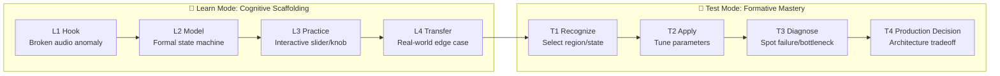

# 🎓 Voice UX Academy Curriculum

> Master manifest, micro-lesson specifications, interactive widget architecture, and certification rubrics for Voice UX Engineers & Conversational Designers.

---

## 🏛️ Curriculum Architecture

The Academy implements an **Uxcel & Brilliant-inspired micro-learning architecture**. Every lesson is strictly structured into an **8-slide invariant**:
- **4 Learn Slides**: `L1 Hook` → `L2 Model` → `L3 Practice` → `L4 Transfer`.
- **4 Test Slides**: `T1 Recognize` → `T2 Apply` → `T3 Diagnose` → `T4 Production Decision`.
- **100% Visual**: Every single slide couples conceptual instruction with an interactive Graphic UI widget (Floor Timeline, Waveform Scrubber, Latency Waterfall, Barge-in Simulator, Pipeline Repair Board, Earcon Synth).
- **Zero Passive Text**: Theoretical explanations are limited to <25 words per breath and demonstrated through live acoustic/visual simulations.



---

## 🗺️ Tracks & Module Overview

| Track | Module ID | Title | Lessons | XP | Focus |
|---|---|---|---|---|---|
| **Free** | `m01` | Foundations of Voice UX | 2 | 200 | Voice turn state machine, Voice vs GUI affordance |
| **Free** | `m02` | Conversational Psychology & Memory | 2 | 220 | Cowan 4-chunk memory ceiling, One Breath test, Gricean maxims |
| **Free** | `m03` | Turn-Taking & Endpointing Mechanics | 3 | 390 | 200ms conversational cadence, Sub-100ms barge-in, Repair ladder |
| **Pro** | `m04` | Audio Feedback & Multimodal Systems | 2 | 280 | Earcon+Haptic triad, Apple Audio Session ducking, Screen handshake |
| **Pro** | `m05` | Agentic Voice AI & Streaming Latency | 2 | 320 | Sub-800ms waterfall economics, Tool-calling fillers, Speculation |
| **Pro** | `m06` | Voice Safety, Ethics & Calibrated Trust | 1 | 140 | Mandatory AI disclosure (EU AI Act), Uncertainty routing |
| **Pro** | `m07` | Usability Testing & Audio Benchmarks | 1 | 150 | Wizard of Oz audio protocol, Automated Audio CI/CD test suites |
| **Pro** | `m08` | Production Capstone Studio | 1 | 500 | Healthcare Clinical Triage & Appointment Booking Voice Agent |

---

## 📦 Directory Structure

```
curriculum/
├── README.md                     # This document
├── curriculum.yaml               # Master curriculum manifest & progression graph
├── schemas/
│   ├── curriculum.schema.json    # JSON Schema for curriculum.yaml
│   ├── lesson.schema.json        # JSON Schema enforcing 8-slide invariant
│   └── telemetry.schema.json     # Schema for learner telemetry & scoring
├── widgets/
│   └── widget-registry.yaml      # Catalog of interactive visual widgets
└── lessons/
    ├── m01/                      # Module 01: Foundations
    │   ├── m01-l01.yaml          # Lesson 01: Anatomy of a Voice Turn
    │   └── m01-l02.yaml          # Lesson 02: Voice vs GUI Asymmetry
    ├── m02/                      # Module 02: Conversational Psychology
    │   ├── m02-l01.yaml          # Lesson 03: Cowan 4-Chunk Memory & One Breath Test
    │   └── m02-l02.yaml          # Lesson 04: Gricean Maxims in S2S
    ├── m03/                      # Module 03: Turn-Taking Mechanics
    │   ├── m03-l01.yaml          # Lesson 05: 200ms Cadence & VAD Endpointing
    │   ├── m03-l02.yaml          # Lesson 06: Sub-100ms Barge-In & Boundary Truncation
    │   └── m03-l03.yaml          # Lesson 07: Conversational Repair & Progressive Recovery
    ├── m04/                      # Module 04: Audio & Multimodal
    │   ├── m04-l01.yaml          # Lesson 08: Earcons, Haptics & Acoustic States
    │   └── m04-l02.yaml          # Lesson 09: Multimodal Voice-Screen Handshake
    ├── m05/                      # Module 05: Agentic Voice AI
    │   ├── m05-l01.yaml          # Lesson 10: Streaming Latency Budgets & Waterfall Economics
    │   └── m05-l02.yaml          # Lesson 11: Tool Calling, Fillers & Speculative Execution
    ├── m06/                      # Module 06: Safety & Ethics
    │   └── m06-l01.yaml          # Lesson 12: AI Disclosure, Privacy & Calibrated Uncertainty
    ├── m07/                      # Module 07: Usability Testing
    │   └── m07-l01.yaml          # Lesson 13: Wizard of Oz Testing & Audio Telemetry
    └── m08/                      # Module 08: Capstone Studio
        └── m08-capstone.yaml     # Capstone: Healthcare Appointment Assistant
```

---

## ⚡ 5 Invariants Enforced by Schema

1. **Exact Slide Count**: Each lesson must contain exactly 8 slides (`l1` to `l4`, `t1` to `t4`).
2. **Fixed Progression Order**: `L1 Hook → L2 Model → L3 Practice → L4 Transfer → T1 Recognize → T2 Apply → T3 Diagnose → T4 Production Decision`.
3. **Mandatory Graphic UI Visual**: Every slide must bind to a registered widget from `widgets/widget-registry.yaml`.
4. **4-Tier Hint Ladder**: Every test slide must provide progressive hints (`1: Nudge`, `2: Principle`, `3: Next Step`, `4: Solution`) with defined telemetry penalties.
5. **Pass Criteria**: Learners must achieve $\ge 80\%$ on tests and pass the `T4 Production Decision` to complete the lesson.
