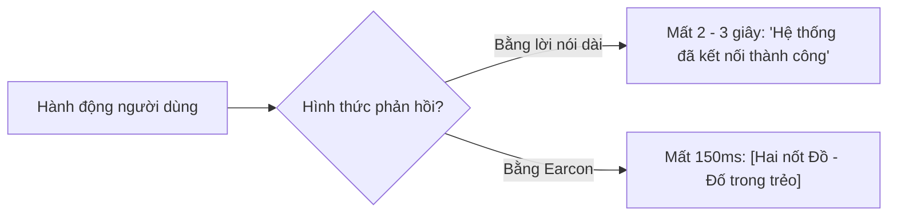

# Thiết Kế Âm Hiệu & Phản Hồi Âm Thanh (Earcons & Sonic Feedback)

> Trong một giao diện không có pixel, âm thanh chính là vật liệu thiết kế duy nhất. Một hệ thống VUI chuyên nghiệp sử dụng âm hiệu (Earcons) để truyền tải thông điệp nhanh hơn gấp 4 lần so với việc dùng lời nói.

---

## 1. Earcon Là Gì? (Auditory Icons vs Earcons)

* **Auditory Icons (Âm thanh ẩn dụ đời thực)**: Âm thanh bắt chước sự vật tự nhiên (ví dụ: tiếng sột soạt của giấy khi thả file vào thùng rác trên macOS).
* **Earcons (Âm hiệu biểu trưng)**: Những chuỗi nốt nhạc ngắn, có cấu trúc trừu tượng (nhịp điệu, cao độ, âm sắc) được quy ước để biểu thị một hành động hoặc trạng thái kỹ thuật số (ví dụ: âm báo nhận tin nhắn của Slack, tiếng khởi động của máy tính Mac).




---

## 2. 4 Tín Hiệu Trạng Thái Bắt Buộc Trong VUI (The Core Acoustic States)

Một thiết kế VUI tiêu chuẩn phải định nghĩa bộ âm thanh độc bản cho 4 trạng thái cốt lõi:

| Trạng Thái | Thời Lượng Tối Đa | Đặc Tính Âm Học | Mục Tiêu Nhận Thức | Ví Dụ Tiêu Biểu |
|------------|-------------------|-----------------|--------------------|-----------------|
| **1. Wake / Listening** | 100 - 150ms | Nốt thăng dần (Ascending pitch), âm sắc sáng (bright timbre) | Báo hiệu micro đã mở, người dùng an tâm cất tiếng. | Âm bíp "tít" của Google Assistant khi gọi "Hey Google". |
| **2. Thinking / Processing** | Lặp lại mỗi 1.5s (Ambient pulse) | Tần số thấp (low frequency: 150-250Hz), âm lượng nhỏ (-18dB) | Giữ kết nối tâm lý khi máy tra cứu dữ liệu, tránh việc người dùng tưởng bị rớt mạng. | Tiếng nhịp thở nhẹ hoặc tiếng vù nhẹ tuần hoàn. |
| **3. Acknowledged / Success** | 150 - 250ms | Hợp âm trưởng (Major chord), kết thúc dứt khoát | Xác nhận lệnh đã được thực thi mà không cần máy phải nói: *"Xong rồi"*. | Tiếng "ding" thanh thoát của Apple Pay khi chạm thẻ. |
| **4. Error / Blocked** | 200 - 300ms | Nốt giáng (Descending tone), âm sắc trầm, mềm mại | Báo hiệu có rào cản nhưng không làm người dùng hoảng sợ. | Tiếng "thump" nhẹ nhàng khi gõ sai mật khẩu trên macOS. |

---

## 3. Nguyên Tắc Thiết Kế Âm Thanh Cho Trải Nghiệm Người Dùng (Sonic UX Rules)

1. **Quy luật về độ dài (Under 300ms Rule)**: Hầu hết các earcon báo trạng thái không được vượt quá 300ms. Âm thanh kéo dài sẽ xung đột với giọng nói của người dùng hoặc làm chậm luồng tương tác.
2. **Khử ô nhiễm thính giác (Auditory Fatigue Prevention)**:
   - Các âm thanh lặp lại thường xuyên (như tiếng mở micro hàng trăm lần mỗi ngày) phải có tần số êm dịu, không sử dụng sóng sine đơn điệu nhọn hoắt gây mỏi tai.
   - Giảm âm lượng dần nếu cùng một âm thanh phát ra liên tục trong một khoảng thời gian ngắn.
3. **Phù hợp với môi trường thực tế (Contextual Acoustics)**:
   - Trong xe hơi: Tần số âm thanh phải né dải tần 100-300Hz (nơi tiếng ồn lốp xe và động cơ hoạt động mạnh nhất).
   - Qua tai nghe (Earphones): Sử dụng âm thanh stereo hoặc spatial audio nhẹ nhàng, tránh âm lượng đột ngột làm đau màng nhĩ.
4. **Phối hợp Đa Giác Quan (Haptic + Sonic Pairing)**:
   - Trên các thiết bị cầm tay (Smartphone, Smartwatch), mỗi earcon nên đi kèm một xung rung phản hồi xúc giác (Haptic Tap) đồng bộ về mặt thời gian (<20ms lệch pha) để tăng độ chân thực.

---

## 4. Bảng Tra Cứu Tần Số & Âm Lượng Cho Voice Designer

```
0 dBFS   ───────────────────────────────────────────── [Ngưỡng vỡ tiếng - Cấm chạm tới]
-6 dBFS  ═════════════════════════════════════════════ [Âm thanh khẩn cấp / Cảnh báo nguy hiểm]
-12 dBFS ───────────────────────────────────────────── [Giọng nói đàm thoại chính (TTS Voice)]
-16 dBFS ───────────────────────────────────────────── [Earcons xác nhận thành công / Bắt đầu]
-24 dBFS ───────────────────────────────────────────── [Âm đệm xử lý nền (Thinking ambient pulse)]
-∞ dBFS  ───────────────────────────────────────────── [Im lặng hoàn toàn]
```
