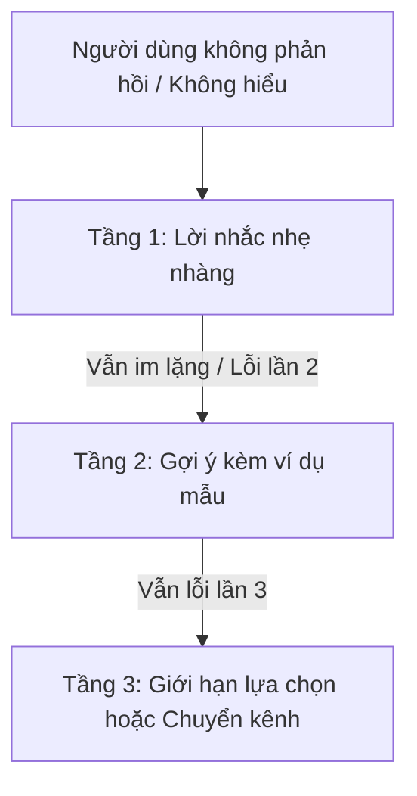

# Khắc Phục Lỗi & Thương Lượng Ý Nghĩa Đàm Thoại (Error Recovery & Conversational Repair)

> Trong giao tiếp con người, việc nghe nhầm hay ngập ngừng xảy ra liên tục nhưng hiếm khi làm đổ vỡ cuộc trò chuyện, bởi con người sử dụng cơ chế "Tự sửa chữa" (Conversational Repair). Một VUI xuất sắc không phải là hệ thống không bao giờ hiểu sai, mà là hệ thống biết cách gỡ lỗi một cách duyên dáng.

---

## 1. Phân Loại Lỗi Trong Giao Diện Giọng Nói

| Loại Lỗi | Nguyên Nhân Thực Tế | Trải Nghiệm Của Người Dùng |
|----------|----------------------|----------------------------|
| **1. No Input (Im lặng)** | Người dùng chưa nghĩ ra câu trả lời, môi trường ồn làm át micro, hoặc họ không biết phải nói gì. | Người dùng bối rối, ngần ngại. |
| **2. Low Confidence (Nghe không rõ)** | Tạp âm nền lớn, người dùng nói quá nhỏ, phát âm không chuẩn địa phương. | Người dùng tưởng hệ thống đơ. |
| **3. Misrecognition (Nhận dạng sai từ)** | STT nhận nhầm từ (ví dụ: *"Hà Nội"* thành *"Hà Nam"*). | Người dùng ngạc nhiên vì máy làm sai lệnh. |
| **4. Unhandled Intent (Không hiểu ý định)** | Hệ thống hiểu từng từ ngữ nhưng không có tính năng tương ứng trong logic phần mềm. | Người dùng thất vọng vì kỳ vọng bị hụt hẫng. |

---

## 2. Kỹ Thuật Gợi Ý Lũy Tiến 3 Bước (3-Tier Progressive Re-prompting)

Khi người dùng im lặng hoặc hệ thống không thể xử lý, tuyệt đối không lặp lại nguyên văn câu hỏi cũ 3 lần liên tiếp. Hãy áp dụng chiến lược tăng dần tính cụ thể:




### Ví Dụ Kịch Bản Đặt Phòng Khách Sạn:

- **Lần lỗi 1 (Tầng 1 - Gentle Nudge)**:
  - *Mục tiêu*: Giúp người dùng biết máy vẫn đang đợi mà không gây áp lực.
  - *Câu thoại*: `"Bạn muốn đặt phòng ở thành phố nào?"`
- **Lần lỗi 2 (Tầng 2 - Scaffolded Example)**:
  - *Mục tiêu*: Thu hẹp phạm vi và cung cấp mẫu câu trả lời chuẩn.
  - *Câu thoại*: `"Bạn có thể nói tên thành phố như Đà Nẵng, Nha Trang, hoặc Phú Quốc."`
- **Lần lỗi 3 (Tầng 3 - Safe Fallback / Channel Switch)**:
  - *Mục tiêu*: Dừng vòng lặp bế tắc, đưa ra lối thoát an toàn.
  - *Câu thoại*: `"Hình như đường truyền không ổn định. Mình vừa gửi link chọn khách sạn qua màn hình điện thoại của bạn, hoặc bạn muốn gặp nhân viên hỗ trợ không?"`

---

## 3. Nguyên Tắc "Không Đổ Lỗi Cho Người Dùng" (Never Blame the User)

Một lỗi vi phạm phổ biến nhất trong thiết kế hội thoại là chuyển áp lực sang người dùng bằng những câu thoại khó chịu:

* ❌ **Tuyệt đối tránh**:
  - `"Bạn nói quá nhỏ, tôi không nghe thấy."` (Khiến người dùng cảm thấy bị chỉ trích).
  - `"Câu lệnh của bạn không hợp lệ."` (Ngôn ngữ lập trình viên).
  - `"Tôi không hiểu bạn đang nói cái gì cả."` (Thô lỗ, cộc cằn).
* ✅ **Mẫu câu chuẩn UX**:
  - `"Xin lỗi, khu vực xung quanh hơi ồn nên mình chưa nghe rõ. Bạn có thể nói lại điểm đến được không?"` (Nhận trách nhiệm về phía hệ thống/môi trường).
  - `"Mình nghe chưa trọn vẹn. Bạn muốn xem lịch bay hay kiểm tra giá vé?"`

---

## 4. Các Mẫu Đàm Thoại Thương Lượng Ý Nghĩa (Repair Patterns)

### Mẫu 1: Xác Nhận Ngầm (Implicit Confirmation)
Dùng khi độ tin cậy của thuật ngữ cao (>85%). Không làm gián đoạn luồng đàm thoại, tự sửa nếu người dùng phát hiện sai:
```
User: "Chuyển 500 nghìn cho mẹ."
Agent: "Đang chuyển 500 nghìn cho Mẹ. Bạn dùng tài khoản Vietcombank hay Techcombank?"
(Nếu sai người nhận, người dùng chỉ cần cất tiếng ngắt lời: "Không, cho Ba cơ!")
```

### Mẫu 2: Xác Nhận Tường Minh (Explicit Confirmation)
Dùng khi độ tin cậy ở mức trung bình (50-75%) hoặc giao dịch rủi ro cao (chuyển số tiền lớn, xóa file):
```
Agent: "Bạn muốn chuyển 50 triệu đồng cho Nguyễn Văn A, đúng không?"
User: "Đúng rồi."
Agent: "Đã hoàn tất chuyển khoản."
```

### Mẫu 3: Thu Hẹp Nhánh Chọn Lọc (Disambiguation)
Khi có 2 thực thể trùng tên hoặc mơ hồ:
```
User: "Gọi cho Tuấn."
Agent: "Bạn muốn gọi cho Tuấn Marketing hay Tuấn Anh trai?"
User: "Tuấn Marketing."
Agent: "Đang gọi cho Tuấn Marketing..."
```
