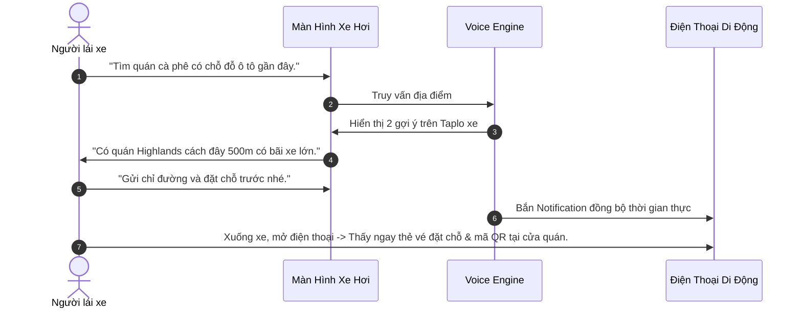

# Tương Tác Phối Hợp Giọng Nói & Màn Hình (Multimodal Voice + Screen Handshake)

> "Giao diện tối ưu không phải là chỉ có giọng nói (Voice-only), cũng không phải chỉ có màn hình (GUI-only). Đó là sự phối hợp nhịp nhàng giữa hai giác quan: Miệng nói - Tai nghe - Mắt nhìn - Tay chạm." — Cheryl Platz, *Design Beyond Devices*.

---

## 1. Ma Trận Ngữ Cảnh Sử Dụng (Contextual Attention Matrix)

Việc quyết định đưa thông tin qua Kênh Giọng Nói hay Kênh Thị Giác phụ thuộc hoàn toàn vào mức độ rảnh rỗi của mắt và tay người dùng:

```
                      MẮT RẢNH (Eyes-Free)       MẮT BẬN (Eyes-Busy)
                  ┌──────────────────────────┬──────────────────────────┐
TAY RẢNH          │ VÙNG ĐA PHƯƠNG THỨC      │ VÙNG GIỌNG NÓI ĐƠN LẺ    │
(Hands-Free)      │ (Smart Display / Tablet) │ (Lái xe, Nấu ăn, Chạy bộ)│
                  │ -> Nói lệnh, nhìn chi tiết│ -> 100% Âm thanh, không  │
                  │    chạm nếu cần lướt     │    bắt nhìn màn hình     │
                  ├──────────────────────────┼──────────────────────────┤
TAY BẬN           │ VÙNG TRỢ LỰC GIỌNG NÓI   │ VÙNG CẤM NGUY HIỂM       │
(Hands-Busy)      │ (Gõ phím, Bế con)        │ (Phẫu thuật, Sửa máy bay)│
                  │ -> Ra lệnh bằng giọng,   │ -> Chỉ cảnh báo khẩn cấp,│
                  │    mắt liếc xác nhận     │    tuyệt đối không làm   │
                  │                          │    phân tâm              │
                  └──────────────────────────┴──────────────────────────┘
```

---

## 2. Nguyên Tắc Phân Tải Hiển Thị (Visual Offloading Rules)

Khi hệ thống có màn hình (Smart TV, Smartphone, Xe hơi thông minh, Loa thông minh có màn hình như Echo Show hay Nest Hub):

### Quy Tắc 1: Voice Nói Ý Chính, Màn Hình Trưng Bày Chi Tiết
* ❌ **Sai lầm (Đọc lại toàn bộ màn hình)**:
  - Trợ lý ảo đọc to 10 dòng văn bản hiển thị trên màn hình. Người dùng đọc bằng mắt nhanh gấp 3 lần tốc độ nghe, nên họ sẽ cảm thấy cực kỳ sốt ruột.
* ✅ **Chuẩn UX (Phân vai nhịp nhàng)**:
  - **Giọng nói (Tóm lược & Kêu gọi)**: *"Mình tìm thấy 3 chuyến bay buổi sáng phù hợp nhất. Giá vé rẻ nhất là 1 triệu 2 của Vietnam Airlines."*
  - **Màn hình (Bảng so sánh chi tiết)**: Hiển thị thẻ card so sánh giờ bay, số hiệu chuyến bay, hành lý đi kèm của cả 3 hãng.

### Quy Tắc 2: Khi Nào BẮT BUỘC Phải Đẩy Lên Màn Hình?
1. **Dữ liệu dạng bảng hoặc so sánh song song**: So sánh thông số kỹ thuật 2 dòng máy tính.
2. **Danh sách dài hơn 3 mục**: Danh sách kết quả tìm kiếm nhà hàng, danh bạ điện thoại.
3. **Thông tin bảo mật cao**: Số thẻ ngân hàng, mật khẩu OTP (đọc to bằng giọng nói nơi công cộng sẽ vi phạm an toàn riêng tư).
4. **Bản đồ điều hướng phức tạp**: Sơ đồ nút giao thông ngã 5 phức tạp cần sự định vị không gian thị giác.

---

## 3. Quy Ước Bàn Giao Đa Kênh (The Handoff Protocol)

Khi người dùng chuyển dịch giữa các thiết bị (ví dụ: đang lái xe ra lệnh qua loa ô tô, khi đến nơi bước xuống xe mở điện thoại):




### Tiêu Chuẩn Thiết Kế Giao Tiếp Đa Kênh:
- **Đồng bộ trạng thái tức thì (State Continuity)**: Nếu người dùng đang nói dở trên đồng hồ thông minh, họ có thể hoàn tất thanh toán trên điện thoại mà không cần bắt đầu lại từ đầu.
- **Dấu hiệu định hướng trực quan (Visual Anchors)**: Khi loa thông minh cất tiếng nói về một món hàng, màn hình phải ngay lập tức làm nổi bật (highlight border) món hàng đó để ánh mắt người dùng bắt kịp nhịp nói của máy.
