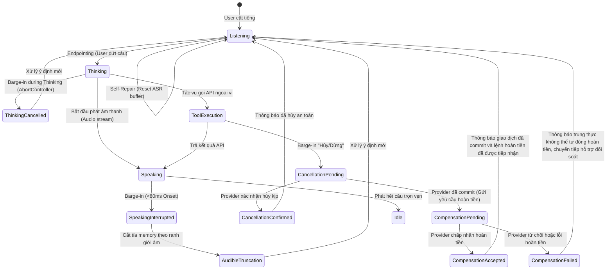
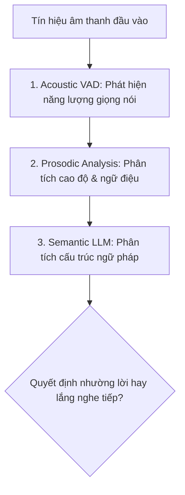

# Nghệ Thuật Luân Phiên Lượt Lời & Ngắt Lời (Turn-Taking, Barge-In & State Rollback)

> Khác biệt căn bản giữa một "cỗ máy phát thanh" và một "người đàm thoại thực thụ" nằm ở khả năng cảm nhận thời điểm người đối diện cất tiếng và nhường lời ngay lập tức.

---

## 1. Bản Chất Của Tương Tác Hai Chiều (Full-Duplex vs Half-Duplex)

Trong nhiều thập kỷ, các hệ thống VUI truyền thống (như IVR tổng đài điện thoại, bộ đàm bộ đội) hoạt động ở chế độ **Half-Duplex** (Bán song công):
- Một bên nói, một bên chỉ được nghe.
- Người dùng bị khóa micro khi máy đang phát âm thanh.
- Gây ra sự ức chế cùng cực khi máy đọc sai hoặc nói quá dài dòng.

Trong kỷ nguyên Voice AI hiện đại (Speech-to-Speech như OpenAI Realtime, Gemini Live), tiêu chuẩn vàng là **Full-Duplex** (Song công toàn phần):
- Micro luôn lắng nghe liên tục trong khi loa vẫn đang phát.
- Hệ thống có khả năng triệt tiêu tiếng vọng âm thanh (**Acoustic Echo Cancellation - AEC**) để không tự nghe lại giọng của chính mình.

- Micro luôn lắng nghe liên tục trong khi loa vẫn đang phát.
- Hệ thống có khả năng triệt tiêu tiếng vọng âm thanh (**Acoustic Echo Cancellation - AEC**) để không tự nghe lại giọng của chính mình.

### Mô Hình Máy Trạng Thái Ngắt Lời 4 Tầng (4-State Interruption Matrix)

Barge-in không chỉ xảy ra khi bot đang nói (Speaking). Hệ thống phải xử lý ngắt lời trên toàn bộ 4 trạng thái vòng đời tương tác:

| Trạng Thái Hệ Thống | Hành Vi Ngắt Lời Của Người Dùng | Phản Ứng Kỹ Thuật & UX Của Voice Agent |
|---|---|---|
| **1. Listening (Đang nghe)** | Người dùng tự sửa câu nói dở (*"Đặt vé đi Huế... à không, đi Đà Nẵng"*). | Reset bộ đệm ASR cục bộ, bóc tách thực thể mới nhất, gia hạn silence timeout thêm 600ms. |
| **2. Thinking (Đang suy luận)** | Người dùng đổi ý hoặc nói thêm (*"Thôi không cần tìm nữa đâu"*). | Hủy lập tức luồng inference LLM (AbortController signal), chuyển sang xử lý lệnh mới, tiết kiệm chi phí token. |
| **3. Speaking (Đang phát loa)** | Người dùng cất tiếng ngắt lời thông tin bot đang đọc. | Kích hoạt Interruption-Onset (<80ms), ngắt luồng audio ra loa, thực hiện Audible Boundary Truncation. |
| **4. Tool/API Execution** | Người dùng hô *"Dừng lại"* khi bot đang gọi API thanh toán/đặt vé. | Chuyển sang trạng thái `cancellation-pending`, gửi tín hiệu hủy tới provider và đối soát (reconciliation): Nếu provider hủy kịp -> báo hủy thành công. Nếu provider đã commit -> chuyển sang `compensation-pending`. Cấm tự ý thông báo đang hoàn tiền trước khi provider xác nhận tiếp nhận hoàn tiền; nếu thất bại/từ chối, chuyển sang quy trình hỗ trợ tra soát kèm mã giao dịch. |

---

## 2. Hai Thất Bại Kinh Điển Của Cơ Chế Ngắt Lời (Barge-In Failure Modes)

### Lỗi 1: Cỗ Xe Tăng Băng Băng (The Barrel-Ahead)
- **Hiện tượng**: Người dùng liên tục nói: *"Khoan đã", "Dừng lại", "Sai rồi"* nhưng trợ lý ảo vẫn tiếp tục đọc vanh vách hết danh sách dài 2 phút.
- **Hậu quả UX**: Người dùng cảm thấy bất lực, đập bàn phím hoặc cúp máy ngay lập tức.

### Lỗi 2: Trợ Lý Hoang Tưởng (The Neurotic / Jumpy Agent)
- **Hiện tượng**: VAD (Voice Activity Detection) được cài đặt quá nhạy cảm. Người dùng chỉ thở dài, hắng giọng, tiếng trẻ con khóc ở xa, hoặc một tiếng *"Ừm"* đệm nhịp, máy liền giật mình im bặt và xin lỗi: *"Tôi xin lỗi, bạn vừa nói gì cơ?"*.
- **Hậu quả UX**: Làm gãy vụn mạch suy nghĩ của người dùng, biến cuộc trò chuyện thành một cơn ác mộng giật cục.

---

## 3. Nhận Diện Điểm Dừng Ngữ Nghĩa (Semantic End-of-Turn Detection)

Để giải quyết tình trạng "nhạy cảm quá đà", hệ thống Voice UX hiện đại không chỉ dựa vào khoảng lặng vật lý (Silence Duration) mà kết hợp **3 lớp phân tích tín hiệu**:

1. **Acoustic VAD (Năng lượng âm thanh)**: Xác định có giọng người thật (khử tiếng gõ bàn phím, tiếng còi xe).
2. **Prosodic Analysis (Âm sắc & Ngữ điệu)**:
   - Nếu cao độ đi lên ở cuối từ (Rising pitch) -> Người dùng đang ngập ngừng suy nghĩ (ví dụ: *"Tôi muốn mua một vé bay đi... ừm..."*). Hệ thống phải kiên nhẫn đợi thêm 800ms - 1.2s.
   - Nếu cao độ đi xuống dứt khoát (Falling pitch) -> Người dùng đã kết thúc câu trọn vẹn. Hệ thống có thể phản hồi sau 250ms.
3. **Semantic Completion (Ngữ nghĩa hoàn chỉnh)**:
   - Mô hình ngôn ngữ đánh giá câu nói: `"Tôi muốn gửi tiền cho anh Nam số tiền là..."` -> Rõ ràng chưa hết câu, không được cướp lời!

---

## 4. Kỹ Thuật Phục Hồi Trạng Thái (State Rollback Protocol)

Khi người dùng ngắt lời, điều gì sẽ xảy ra với bộ nhớ và ngữ cảnh đàm thoại?

* **Kịch bản sai lầm**: Trợ lý ảo lưu toàn bộ câu nói dang dở của mình vào lịch sử chat. Lượt sau, mô hình AI bị ảo giác hoặc tự mâu thuẫn với câu nói chưa kịp đọc hết của chính mình.
* **Kịch bản chuẩn mực (Rollback Protocol)**:
  1. **Xác định điểm bị cắt (Truncation Point)**: Hệ thống ghi nhận chính xác giây thứ mấy và từ ngữ nào mà loa bị dừng lại.
  2. **Cắt tỉa bộ nhớ đệm (History Pruning)**: Lịch sử đàm thoại chỉ lưu lại phần thực tế mà người dùng đã nghe được.
  3. **Ưu tiên ý định mới (New Intent Dominance)**: Ý định trong câu ngắt lời của người dùng sẽ ghi đè lên tác vụ cũ hoặc trở thành một nhánh phụ mới trong cây đối thoại.

### Bảng Chỉ Số Đo Lường Hiệu Quả Barge-In:
| Chỉ Số | Ý Nghĩa | Ngưỡng Kỳ Vọng UX |
|--------|---------|-------------------|
| **Barge-In Latency** | Thời gian từ lúc người dùng phát âm đến lúc loa ngắt hẳn | **< 100ms** (lý tưởng < 60ms) |
| **False Interruption Rate** | Tỷ lệ máy dừng nói do tiếng ồn môi trường hoặc tiếng thở | **< 2%** |
| **Cut-off Frustration Score** | Điểm khảo sát người dùng về việc bị cướp lời | **< 5/100** |

---

## 5. Ngoại Lệ Bắt Buộc CẤM Ngắt Lời (Non-Bargeable Compliance & Safety Prompts)

Mặc dù Barge-in là quyền năng tối cao của người dùng trong 95% tình huống, có **3 trường hợp bắt buộc phải KHÓA ngắt lời** để bảo đảm an toàn sinh mạng và pháp lý:

1. **Cảnh báo an toàn khẩn cấp (Emergency Alerts)**:
   - *Ví dụ*: Cảnh báo xe sắp va chạm (*"Chú ý phanh gấp!"*), cảnh báo cháy nổ hoặc sơ cứu khẩn cấp.
2. **Xác nhận giao dịch tài chính giá trị lớn (Irreversible High-Value Transactions)**:
   - *Quy tắc*: **BẮT BUỘC xác nhận tường minh (Explicit Confirmation)**. Không bao giờ tự động thực thi sau tiếng bíp đếm ngược.
   - *Ví dụ*: *"Bạn đang chuyển năm mươi triệu đồng cho tài khoản Nguyễn Văn A. Bạn có đồng ý thực hiện giao dịch này không?"*
3. **Tuyên bố miễn trừ trách nhiệm y tế & pháp lý (Legal Disclaimers)**:
   - *Ví dụ*: Thông điệp cảnh báo tác dụng phụ nguy hiểm của thuốc theo luật định.

### Quy Trình Kỹ Thuật Khi Gặp Câu Thoại Non-Bargeable:
- **Nguyên tắc cốt lõi**: Khóa ngắt lời thông thường (không để bot chuyển đề tài dở dang), **NHƯNG LUÔN DUY TRÌ MICRO Ở TRẠNG THÁI LẮNG NGHE LỆNH HỦY (Cancellation Listener)**.
- Nếu người dùng hô to: *"HỦY", "DỪNG LẠI", "KHÔNG PHẢI"*, hệ thống **ngay lập tức hủy bỏ giao dịch/tác vụ** và dừng phát thông báo. Tuyệt đối không tắt micro làm mất quyền kiểm soát của người dùng.
- Kích hoạt song song đèn viền màn hình (Visual Alert) và rung phản hồi (Haptic) để đồng bộ đa giác quan.
