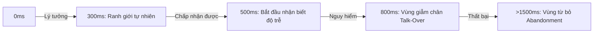
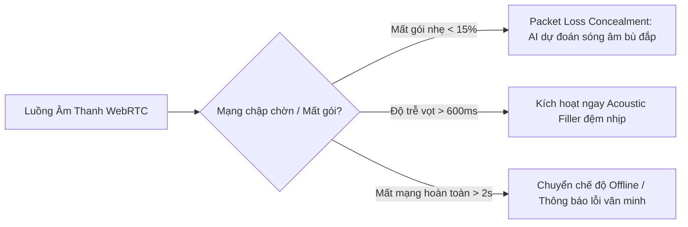

# Ngân Sách Độ Trễ & Nhịp Độ Đàm Thoại (Latency Budgets & Conversational Pacing)

> Trong giao diện đồ họa (GUI), độ trễ 1 giây chỉ là một vòng xoay loading spinner trên màn hình. Nhưng trong giao diện giọng nói (VUI), 1 giây im lặng hoàn toàn là một khoảng trống chết chóc (*The Dead Air*), khiến người dùng tưởng cuộc gọi đã bị rớt hoặc máy bị đơ.

---

## 1. Các Vực Thẳm Độ Trễ Trong Đàm Thoại (The 3 Latency Cliffs)

Dựa trên các nghiên cứu tâm sinh lý thính giác và phân tích hành vi người dùng trong tương tác thời gian thực:

### Chi Tiết Phản Ứng Tâm Lý Theo Từng Ngưỡng:

1. **0 - 300ms (The Conversational Sweet Spot)**:
   - Tương đương tốc độ phản xạ của hai người bạn thân đang trò chuyện say nổi.
   - Người dùng quên mất mình đang tương tác với AI; mức độ tin cậy và gắn kết cảm xúc đạt cực đại.
2. **300 - 500ms (Noticeable but Tolerable)**:
   - Người dùng nhận ra có một nhịp khựng nhẹ, nhưng vẫn trong ngưỡng kiên nhẫn đối với các câu hỏi tra cứu kiến thức.
3. **500 - 800ms (The Talk-Over Danger Zone)**:
   - Não bộ người dùng bắt đầu nghi ngờ: *"Nó có nghe mình không nhỉ?"*.
   - Người dùng có xu hướng cất tiếng lặp lại câu hỏi (`"Này?", "Alo?"`), đúng lúc đó máy cất tiếng trả lời -> Dẫn đến hiện tượng hai bên cùng nói đè lên nhau (*Audio Collision*).
4. **> 800ms (The Disengagement Cliff)**:
   - Trải nghiệm đàm thoại bị phá vỡ hoàn toàn, tụt dốc trở thành trải nghiệm gọi bộ đàm hoặc để lại tin nhắn thoại.

---

## 2. So Sánh Hai Kiến Trúc Kỹ Thuật (Cascaded vs Speech-to-Speech)

```mermaid
graph TD
    subgraph Cascaded ["1. Pipeline Tách Rời (STT -> LLM -> TTS)"]
        A1[Âm thanh vào] -->|150ms| B1[STT chuyển thành chữ]
        B1 -->|400-800ms| C1[LLM sinh từ đầu tiên TTFT]
        C1 -->|200-300ms| D1[TTS tổng hợp âm thanh]
        D1 --> E1["TỔNG ĐỘ TRỄ: 750ms - 1300ms (Rất cao)"]
    end

    subgraph NativeS2S ["2. Mô Hình Gốc Âm Thanh (Speech-to-Speech)"]
        A2[Âm thanh vào] -->|Audio Tokens| B2[LLM Audio-Native: Gemini Live / OpenAI Realtime]
        B2 -->|Streaming WebRTC| C2["TỔNG ĐỘ TRỄ: 250ms - 400ms (Siêu mượt)"]
    end
```

---

## 3. Chiến Lược Lấp Khoảng Trống (Conversational Fillers & Bridging Strategies)

Khi hệ thống bắt buộc phải thực hiện các tác vụ tốn thời gian (như gọi API ngân hàng, tra cứu cơ sở dữ liệu lớn - RAG mất 1.5s - 3s), Voice UX Designer phải áp dụng chiến lược **Bắc Cầu Âm Thanh (Audio Bridging)**:

### 1. Phản Ứng Đệm Tức Thì (Instant Acoustic Acknowledgment)
- Trong vòng **150ms** đầu tiên sau khi người dùng dứt câu, phát một nốt âm hiệu cực nhẹ (*Subtle Earcon*) hoặc một từ đệm ngắn:
  - *"Dạ,"*
  - *"Được chứ,"*
  - *"Vâng,"*
- Giúp người dùng biết lệnh đã được thu trọn vẹn, ngăn chặn việc họ nói lại.

### 2. Câu Lấp Chỗ Trống Có Ý Nghĩa (Informative Fillers)
- Thay vì để im lặng vô tuyến (Dead air), trợ lý ảo phát biểu một câu tường thuật hành động:
  - *"Để mình kiểm tra số dư tài khoản của bạn ngay..."*
  - *"Đang tìm các chuyến bay giá tốt nhất cho bạn..."*

### 3. Âm Nền Tuần Hoàn (Subtle Ambient Pulse)
- Nếu tác vụ kéo dài trên 2 giây, kích hoạt một nhịp âm thanh tần số thấp (~200Hz) nhẹ nhàng ở mức -24dB.
- Cứ sau mỗi 3 giây, nếu chưa có kết quả, cập nhật tiến độ: *"Vẫn đang kết nối với máy chủ, bạn đợi thêm một chút nhé..."*

---

## 4. Bảng Phân Bổ Ngân Sách Độ Trễ Mẫu (Latency Budget Breakdown)

Để đạt mục tiêu phản hồi dưới **400ms** trong hệ thống thực tế:

| Khâu Xử Lý | Mục Tiêu Thời Gian | Giải Pháp Tối Ưu UX & Kỹ Thuật |
|------------|-------------------|--------------------------------|
| **Client Audio Capture & VAD** | 50ms | Chạy VAD cục bộ (On-device WebAssembly / Silero VAD) |
| **Network Transport (WebRTC)** | 60ms | Sử dụng giao thức WebRTC UDP thay vì HTTP/WebSockets |
| **Model Time-to-First-Audio** | 200ms | Mô hình Speech-to-Speech streaming hoặc LLM nhỏ suy luận nhanh |
| **Audio Buffering & Playback** | 40ms | Bộ đệm jitter buffer thích ứng (Adaptive Jitter Buffer) |
| **TỔNG CỘNG** | **350ms** | Đạt chuẩn đàm thoại tự nhiên tuyệt hảo |

---

## 5. Ứng Phó Với Mạng Chập Chờn & Mất Gói Tin (Network Jitter & Packet Loss Concealment)

Trong môi trường di động thực tế (4G/5G sóng yếu, người dùng đi vào thang máy hoặc tầng hầm), độ trễ mạng có thể dao động từ 60ms vọt lên 400ms bất ngờ:

### Chiến Lược Giảm Thiểu Tác Động UX:
1. **Packet Loss Concealment (PLC)**: Sử dụng các thuật toán nội suy dạng sóng âm (Waveform Interpolation) để "lấp" các mili-giây âm thanh bị rớt, ngăn tiếng nổ lốp đốp hoặc giật cục gây chói tai người nghe.
2. **Adaptive Jitter Buffer (Bộ đệm thích ứng)**:
   - Khi mạng ổn định: Thu hẹp buffer về **20-30ms** để giữ độ trễ siêu thấp.
   - Khi mạng biến động: Tự động nới buffer lên **80-100ms** để chống giật tiếng, ưu tiên độ tròn vành rõ chữ hơn là đuổi theo tốc độ tức thời.
3. **Graceful Fallback**: Nếu đường truyền rớt dưới 30kbps, hệ thống tự động ngắt kênh video/hình ảnh, dồn toàn bộ băng thông ưu tiên duy trì luồng âm thanh thoại (Opus Codec ở mức 16kbps).
