# DESIGN:OS Voice UX

> Production-ready Voice & Conversational AI Knowledge Base, State Machines, Latency Budgets, and Audited Usability Protocols.
> Thuộc hệ sinh thái mã nguồn mở **DESIGN:OS**.

🌐 **Ngôn ngữ**: [English (Bản chính)](../README.md) | **Tiếng Việt (Bản dịch)**

---

## 🗺️ Bản Đồ Tri Thức (Knowledge Architecture)

```mermaid
graph TD
    A[Voice UX Knowledge Base] --> B[01. Foundations]
    A --> C[02. Interaction Patterns]
    A --> D[03. Conversational Design System]
    A --> E[04. Benchmarks & Repos]
    A --> F[05. 5-Persona Debate]
    A --> G[06. Checklists & Testing]

    B --> B1[Mental Models & Affordance]
    B --> B2[Conversational Psychology]
    B --> B3[NN/g VUI Heuristics]

    C --> C1[Turn-Taking & Barge-In]
    C --> C2[Error Recovery & Repair]
    C --> C3[Earcons & Audio Feedback]
    C --> C4[Multimodal Handshake]

    D --> D1[Persona & Tone of Voice]
    D --> D2[Prompt & Dialog Engineering]
    D --> D3[Latency Budgets & Pacing]

    E --> E1[Industry Benchmarks]
    E --> E2[Open Source Frameworks]

    F --> F1[Architect vs UX vs Security]

    G --> G1[Design Review Checklist]
    G --> G2[Wizard of Oz Usability Protocol]
```

## 📋 Bộ Công Cụ Kiểm Định & Quản Trị (Audit Pack & Governance)
- **[01-MANIFEST.md](./01-MANIFEST.md)**: Bảng kiểm kê 28 tài liệu, phân định Mục đích, Đối tượng, Trạng thái & Cơ sở chứng cứ.
- **[02-AUDIT-BRIEF.md](./02-AUDIT-BRIEF.md)**: Bản tóm tắt bối cảnh sản phẩm thực tế, voice stack & 5 điểm thất bại cần soi lỗi.
- **[03-AUDIT-RUBRIC.md](./03-AUDIT-RUBRIC.md)**: Bộ tiêu chí đánh giá 100 điểm & 6 cửa chặn sinh tử (Hard-Fail Gates).
- **[04-AUDIT-REPORT.md](./04-AUDIT-REPORT.md)**: Báo cáo kiểm định toàn diện chất lượng Voice UX Knowledge Base (Đạt 92/100 Điểm - Tier 1 Production Ready).
- **[CONTEXT.md](./CONTEXT.md)**: Bảng từ điển thuật ngữ chuẩn hóa chuyên ngành VUI.

---

## 📚 Mục Lục Tài Liệu Chuyên Sâu

---

### [01. Foundations (Nền Tảng Thiết Kế VUI)](./01-foundations/)
- **[mental-models-and-affordance.md](./01-foundations/mental-models-and-affordance.md)**: Giải quyết "Vực thẳm thực thi" (*Gulf of Execution*) khi giao diện hoàn toàn vô hình. Dấu hiệu âm thanh (*Acoustic Signifiers*) và tính chất thoáng qua của âm thanh (*Transience*).
- **[conversational-psychology.md](./01-foundations/conversational-psychology.md)**: 4 Phương châm của Grice (*Gricean Maxims*), cấu trúc lượt lời (*Turn Structure*), và giới hạn 4 khối nhớ ngắn hạn (*Cowan's 4-chunk capacity*).
- **[vui-heuristics.md](./01-foundations/vui-heuristics.md)**: Chuyển dịch 10 nguyên lý kinh điển của Nielsen Norman Group sang không gian hội thoại giọng nói.

---

### [02. Interaction Patterns (Mô Thức Tương Tác Giọng Nói)](./02-interaction-patterns/)
- **[turn-taking-and-barge-in.md](./02-interaction-patterns/turn-taking-and-barge-in.md)**: Kỹ thuật ngắt lời tự nhiên (*Barge-in*), nhận diện điểm dừng ngữ nghĩa (*Semantic End-of-Turn*) thay thế VAD tĩnh, và phục hồi trạng thái ngữ cảnh (*State Rollback*).
- **[error-recovery-and-repair.md](./02-interaction-patterns/error-recovery-and-repair.md)**: Các tầng phục hồi đàm thoại (*Conversational Repair*), kỹ thuật gợi ý lũy tiến 3 bước (*Progressive Re-prompting*), và nguyên tắc "Không đổ lỗi cho người dùng".
- **[audio-feedback-and-earcons.md](./02-interaction-patterns/audio-feedback-and-earcons.md)**: Thiết kế âm hiệu (*Earcons*), âm thanh phản hồi trạng thái (*Listening, Thinking, Speaking*), và nhận diện thương hiệu âm thanh (*Sonic Branding*).
- **[multimodal-handshake.md](./02-interaction-patterns/multimodal-handshake.md)**: Tương tác phối hợp Giọng nói + Màn hình (*Voice + GUI*), nguyên lý xử lý ngữ cảnh rảnh tay/bận mắt (*Hands-busy, Eyes-free*), và phân tải hiển thị (*Visual Offloading*).

---

### [03. Conversational Design System (Hệ Thống Thiết Kế Hội Thoại)](./03-conversational-design-system/)
- **[persona-and-tone.md](./03-conversational-design-system/persona-and-tone.md)**: Định hình cá tính đàm thoại, tránh "Thung lũng kỳ lạ" (*Uncanny Valley*) và bẫy nhân hóa quá đà (*ELIZA Effect*).
- **[prompt-and-dialog-engineering.md](./03-conversational-design-system/prompt-and-dialog-engineering.md)**: Cấu trúc System Prompt dành riêng cho Voice Agent, kiểm soát ngữ điệu và tốc độ bằng SSML / Prosody Markers.
- **[latency-budgets.md](./03-conversational-design-system/latency-budgets.md)**: Ngân sách độ trễ đàm thoại (ngưỡng 300ms, 500ms, 800ms), cơ chế âm thanh lấp chỗ trống (*Conversational Fillers*) và luồng streaming.

---

### [04. Benchmarks & Repositories (Khảo Sát Thực Tế & Công Nghệ)](./04-benchmarks-and-case-studies/)
- **[industry-benchmarks.md](./04-benchmarks-and-case-studies/industry-benchmarks.md)**: So sánh mổ xẻ trải nghiệm UX thực tế của OpenAI Realtime Voice, Google Gemini Live, Apple Siri, Hume AI Empathic Voice, và hệ thống VUI trên xe ô tô (Tesla / Apple CarPlay).
- **[open-source-repos-and-tools.md](./04-benchmarks-and-case-studies/open-source-repos-and-tools.md)**: Tổng hợp kiến trúc, pattern library từ các repo nổi bật: LiveKit Agents, Pipecat AI, Voiceflow, PatternFly Conversation Design.

---

### [05. 5-Persona Debate (Tranh Luận Chuyên Sâu)](./05-debate-and-tradeoffs/)
- **[5-persona-debate.md](./05-debate-and-tradeoffs/5-persona-debate.md)**: 5 chuyên gia tranh luận đa chiều về các nan đề lớn nhất trong VUI:
  1. *Architect*: Pipeline tách rời (STT-LLM-TTS) vs Mô hình gốc âm thanh (Speech-to-Speech).
  2. *Security & Privacy*: Micro luôn lắng nghe (*Ambient Always-on*) vs Nút kích hoạt vật lý.
  3. *Performance*: Độ trễ siêu thấp <300ms vs Độ chính xác tra cứu thông tin (RAG / Tool-calling).
  4. *UX*: Giả lập cảm xúc con người (*Empathetic Voice*) vs Trung thực về bản chất máy móc.
  5. *Devil's Advocate*: Phản biện triệt để: Khi nào giao diện giọng nói là một lựa chọn tồi tệ?

---

### [06. Checklists & Usability Testing (Bộ Công Cụ Thực Chiến)](./06-checklists-and-heuristics/)
- **[vui-design-checklist.md](./06-checklists-and-heuristics/vui-design-checklist.md)**: Checklist 25 tiêu chuẩn nghiệm thu trước khi đưa Voice Agent ra thị trường.
- **[usability-testing-protocol.md](./06-checklists-and-heuristics/usability-testing-protocol.md)**: Quy trình kiểm thử người dùng bằng phương pháp "Phù thủy xứ Oz" (*Wizard of Oz Testing*), kịch bản test và các chỉ số đo lường hiệu quả đàm thoại.

---

## 🎓 Chương Trình Đào Tạo Voice UX Academy

Hệ thống bài học tương tác thực chứng được quy hoạch chi tiết trong thư mục [`curriculum/`](../curriculum/).

Học viện được thiết kế theo cấu trúc micro-learning phong cách Uxcel & Brilliant với 2 chế độ:

| Chế độ | Trọng tâm Sư phạm | Mô hình Tương tác |
|---|---|---|
| **📖 Phần Học (Learn Mode)** | Khám phá mô hình tâm trí âm học có hướng dẫn. | Graphic UI Visuals động (Floor Timeline, Waveform Endpointing, Latency Waterfall, Barge-in States). |
| **🎯 Phần Test (Test Mode)** | Đánh giá năng lực thực chiến không dùng lý thuyết thụ động. | Thử thách xúc giác trực tiếp (Timeline Error Spotter, Waveform Boundary Setter, Pipeline Node Repair, Debounce Filter Tuning). |

---

## 🎯 4 Cấp Độ Trưởng Thành Của Voice Interface (VUI Maturity Levels)

1. **Level 1 - Command & Control (Ra lệnh một chiều)**:
   - Các lệnh ngắn tĩnh, cú pháp gò bó (`"Bật đèn"`, `"Hẹn giờ 5 phút"`).
   - Hệ thống không có ngữ cảnh đàm thoại, không nhớ lượt nói trước.
2. **Level 2 - Slot-Filling Dialogue (Điền mẫu thông tin)**:
   - Giao tiếp dạng cây quyết định hoặc mẫu định sẵn (ví dụ: đặt vé máy bay: Điểm đi -> Điểm đến -> Ngày giờ).
   - Xử lý lỗi thô cứng, người dùng phải nói đúng từ khóa.
3. **Level 3 - Cascaded Conversational Agent (Đàm thoại LLM dạng tuần tự)**:
   - Sử dụng chuỗi STT -> LLM -> TTS.
   - Có khả năng hiểu ngôn ngữ tự nhiên sâu, hiểu ngữ cảnh nhiều lượt (multi-turn), nhưng độ trễ còn cao (1-2s) và khó ngắt lời mượt mà.
4. **Level 4 - Native Speech-to-Speech Agent (Đàm thoại hai chiều thời gian thực)**:
   - Luồng âm thanh hai chiều (Full Duplex), độ trễ dưới 400ms.
   - Hiểu ngắt lời (barge-in) dựa trên ngữ nghĩa, cảm nhận ngữ điệu người nói và phản hồi với âm sắc biểu cảm tự nhiên.
